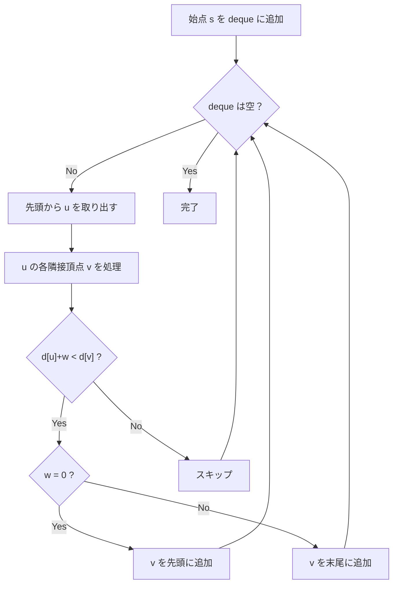

## 0-1 BFS とは

**0-1 BFS** は、辺の重みが $0$ または $1$ のみであるグラフにおいて、単一始点最短経路を $O(V + E)$ で求めるアルゴリズムである。

通常の BFS は重みなしグラフ (全辺の重みが 1) を扱うが、0-1 BFS では重み 0 の辺も扱える。Dijkstra法 ($O((V+E) \log V)$) より高速に動作する。

### 核心アイデア

両端キュー (deque) を用いて:
- 重み $0$ の辺で到達した頂点はキューの**先頭**に追加
- 重み $1$ の辺で到達した頂点はキューの**末尾**に追加

これにより、キュー内の距離値が単調非減少に保たれ、正しい最短距離が計算される。

## アルゴリズムの動作

### 基本方針

1. $d[s] = 0$ とし、始点 $s$ を deque の先頭に入れる
2. deque の先頭から頂点 $u$ を取り出す
3. $u$ の各隣接頂点 $v$ について:
   - $d[u] + w(u,v) < d[v]$ なら $d[v]$ を更新
   - $w(u,v) = 0$ なら $v$ を deque の先頭に追加
   - $w(u,v) = 1$ なら $v$ を deque の末尾に追加
4. deque が空になるまで繰り返す



### なぜ正しいか

deque の先頭に重み 0 の辺で到達した頂点を追加することで、deque 内の距離値は常に最大 2 種類の値 (現在の距離と現在の距離 +1) のみとなる。これは BFS のキューと同じ性質であり、先頭から取り出す頂点の距離が最小であることが保証される。

## 実装

```python title="bfs_01.py"
from collections import deque

def bfs_01(n: int, graph: list[list[tuple[int, int]]], start: int) -> list[int]:
    INF = float('inf')
    dist = [INF] * n
    dist[start] = 0
    dq = deque([start])

    while dq:
        u = dq.popleft()
        for v, w in graph[u]:
            if dist[u] + w < dist[v]:
                dist[v] = dist[u] + w
                if w == 0:
                    dq.appendleft(v)
                else:
                    dq.append(v)

    return dist
```

## 正当性の証明

### 命題: 0-1 BFS は正しい最短距離を計算する

**証明 (概略):**

**deque の単調性:** deque 内の距離値は常に高々 2 種類で、先頭が最小であることを示す。

初期状態で deque には距離 0 の始点のみ入っている。距離 $d$ の頂点を取り出して処理するとき:
- 重み 0 の辺: 距離 $d$ の頂点が先頭に追加される (最小値は変わらない)
- 重み 1 の辺: 距離 $d + 1$ の頂点が末尾に追加される

したがって deque には距離 $d$ と $d + 1$ の頂点のみが存在し、先頭が常に最小。

この性質から、各頂点は最短距離で最初に取り出されることが保証される (Dijkstra法と同じ論法)。 $\square$

## 計算量

| 項目 | 計算量 |
|------|--------|
| 時間計算量 | $O(V + E)$ |
| 空間計算量 | $O(V)$ |

各頂点と各辺を定数回処理するため、$O(V + E)$。

### 他の手法との比較

| 手法 | 時間計算量 | 適用条件 |
|------|-----------|---------|
| BFS | $O(V + E)$ | 全辺の重み 1 |
| 0-1 BFS | $O(V + E)$ | 全辺の重み 0 or 1 |
| Dijkstra法 | $O((V+E) \log V)$ | 非負重み |
| Dial's Algorithm | $O(V + E + C)$ | 整数重み (最大 $C$) |

## 応用

### グリッド上の問題

グリッド上で「同じ色のマスへの移動はコスト 0、異なる色へはコスト 1」のような問題に適用できる。

### ネットワークの最短経路

一部の接続が無料 (コスト 0) で他が有料 (コスト 1) のネットワークにおける最短経路問題。

### 壁の破壊問題

迷路で壁を破壊するのにコスト 1、通路はコスト 0 という設定の問題。

## まとめ

| 項目 | 内容 |
|------|------|
| 入力 | 辺の重みが 0 or 1 のグラフ $G$、始点 $s$ |
| 出力 | 各頂点への最短距離 $d[v]$ |
| 時間計算量 | $O(V + E)$ |
| 空間計算量 | $O(V)$ |
| 核心 | deque による重み 0 の辺の優先処理 |
| 利点 | Dijkstra法より高速な線形時間 |
| 前提 | 全辺の重みが 0 または 1 |
