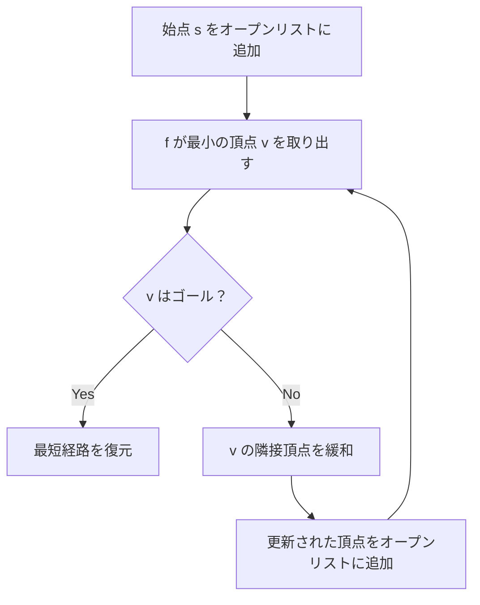

## A*探索とは

**A*探索** (A-star search) は、ヒューリスティック関数を用いて始点からゴールまでの最短経路を効率的に求めるアルゴリズムである。1968年にピーター・ハート、ニルス・ニルソン、バートラム・ラファエルによって提案された。

Dijkstra法がゴールの方向を考慮せずに全方向に探索するのに対し、A*探索はゴールへの推定距離を考慮して探索の優先順位を決める。

### 問題設定

重み付きグラフ $G = (V, E, w)$ ($w \geq 0$) と始点 $s$、ゴール $t$ が与えられたとき、$s$ から $t$ への最短経路を求める。

## アルゴリズムの動作

### 評価関数

A*探索は各頂点 $v$ に対して以下の評価関数を用いる:

$$
f(v) = g(v) + h(v)
$$

- $g(v)$: 始点 $s$ から頂点 $v$ までの実際のコスト (既知)
- $h(v)$: 頂点 $v$ からゴール $t$ までの推定コスト (**ヒューリスティック関数**)
- $f(v)$: $v$ を経由する $s \to t$ パスの推定総コスト

### 基本方針

1. 始点 $s$ をオープンリスト (優先度付きキュー) に入れる
2. $f(v)$ が最小の頂点 $v$ を取り出す
3. $v$ がゴールなら終了
4. $v$ の各隣接頂点について $g$ 値を更新し、オープンリストに入れる
5. キューが空になるまで繰り返す



## ヒューリスティック関数の性質

### 許容性 (Admissibility)

ヒューリスティック $h$ が**許容的**であるとは、全ての頂点 $v$ について:

$$
h(v) \leq \delta(v, t)
$$

すなわち、$h(v)$ が真の最短距離を過大評価しないことを意味する。

### 無矛盾性 (Consistency)

ヒューリスティック $h$ が**無矛盾** (consistent, monotone) であるとは、全ての辺 $(u, v)$ について:

$$
h(u) \leq w(u, v) + h(v)
$$

すなわち三角不等式を満たすことである。無矛盾なヒューリスティックは必ず許容的である。

### 代表的なヒューリスティック

グリッド上の経路探索で使われる代表的なヒューリスティック:

| ヒューリスティック | 式 | 使用場面 |
|-------------------|---|---------|
| マンハッタン距離 | $|x_1 - x_2| + |y_1 - y_2|$ | 4方向移動 |
| ユークリッド距離 | $\sqrt{(x_1-x_2)^2 + (y_1-y_2)^2}$ | 任意方向移動 |
| チェビシェフ距離 | $\max(|x_1-x_2|, |y_1-y_2|)$ | 8方向移動 |

## 実装

```python title="a_star.py"
import heapq

def a_star(graph: list[list[tuple[int, int]]], start: int, goal: int,
           heuristic: list[int]) -> tuple[int, list[int]]:
    INF = float('inf')
    n = len(graph)
    g = [INF] * n
    g[start] = 0
    parent = [-1] * n
    # (f, g, vertex)
    pq = [(heuristic[start], 0, start)]
    closed = [False] * n

    while pq:
        f, gv, u = heapq.heappop(pq)
        if closed[u]:
            continue
        closed[u] = True

        if u == goal:
            # Reconstruct path
            path = []
            v = goal
            while v != -1:
                path.append(v)
                v = parent[v]
            return g[goal], path[::-1]

        for v, w in graph[u]:
            if not closed[v] and g[u] + w < g[v]:
                g[v] = g[u] + w
                parent[v] = u
                heapq.heappush(pq, (g[v] + heuristic[v], g[v], v))

    return -1, []  # unreachable
```

## 正当性の証明

### 命題: 許容的なヒューリスティックを用いた A*探索は最適解を返す

**証明 (概略):**

A*がゴール $t$ を取り出したとき、$g(t) = \delta(s, t)$ を示す。

背理法で $g(t) > \delta(s, t)$ と仮定する。最短パス上のオープンリスト内の頂点 $v$ を考える。

$h$ が許容的なので:

$$
f(v) = g(v) + h(v) \leq \delta(s, v) + \delta(v, t) = \delta(s, t) < g(t) = f(t)
$$

しかし A* は $f$ が最小の頂点を取り出すので、$t$ より先に $v$ が取り出されるはずで矛盾。 $\square$

### 最適性

A*は許容的なヒューリスティックを使う限り、同じ情報を使うどのアルゴリズムよりも少ない頂点展開で最適解を見つける (最適効率性)。

## 計算量

| 項目 | 計算量 |
|------|--------|
| 最悪時間計算量 | $O((V + E) \log V)$ |
| 空間計算量 | $O(V)$ |

最悪の場合は Dijkstra法と同じだが、良いヒューリスティックがあれば探索空間が大幅に削減される。

## Dijkstra法との関係

$h(v) = 0$ (全頂点) とすると、A*探索は Dijkstra法と同じになる。Dijkstra法は A*探索の特殊ケースと見なせる。

## 応用

### ゲーム AI の経路探索

ゲームにおけるキャラクターの移動経路計算に広く使われている。

### ナビゲーションシステム

地図上の最短経路探索。ユークリッド距離をヒューリスティックとして使用する。

### パズル解法

15パズルやルービックキューブなど、状態空間探索に適用される。

## まとめ

| 項目 | 内容 |
|------|------|
| 入力 | 重み付きグラフ $G$、始点 $s$、ゴール $t$、ヒューリスティック $h$ |
| 出力 | $s$ から $t$ への最短経路 |
| 時間計算量 | $O((V + E) \log V)$ (最悪) |
| 空間計算量 | $O(V)$ |
| 核心 | $f = g + h$ による優先度付き探索 |
| 条件 | $h$ が許容的であれば最適解を保証 |
| 応用 | ゲームAI、ナビゲーション、パズル解法 など |
