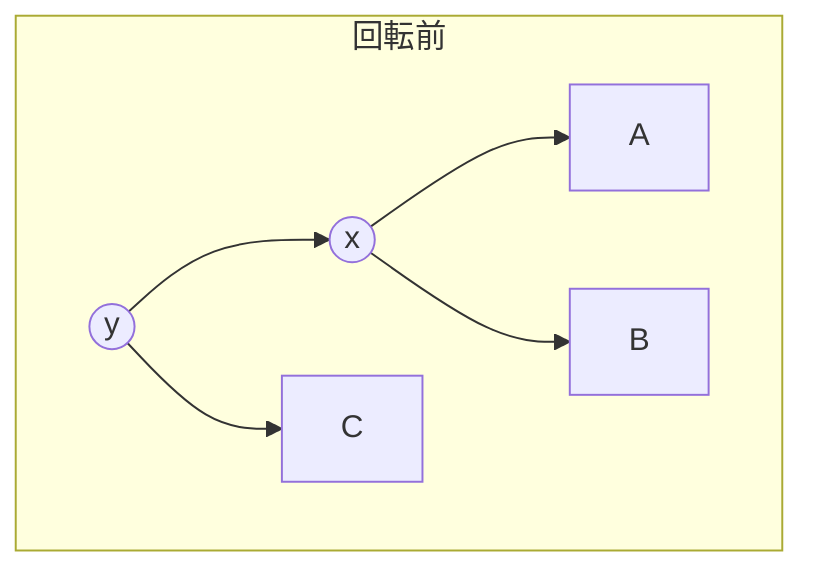
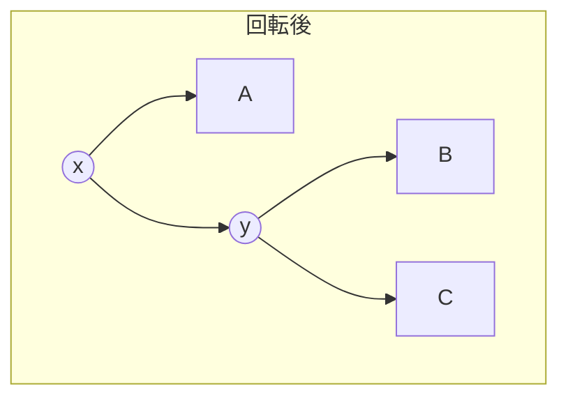

## AVL木とは

**AVL木** は、1962年にAdelson-Velsky と Landis によって提案された、最初の自己平衡二分探索木である。任意のノードについて、左部分木と右部分木の高さの差 (平衡係数) が $-1$, $0$, $1$ のいずれかであることを保証する。

### 定義

二分探索木 $T$ が **AVL木** であるとは、任意のノード $v$ について以下が成り立つことである。

$$
|\text{bf}(v)| \leq 1
$$

ここで **平衡係数 (balance factor)** $\text{bf}(v)$ は次のように定義される。

$$
\text{bf}(v) = h(\text{left}(v)) - h(\text{right}(v))
$$

$h(T)$ は部分木 $T$ の高さであり、空の木の高さは $-1$ とする。

### AVL木の高さ

**定理:** $n$ ノードのAVL木の高さ $h$ は $O(\log n)$ である。

具体的には $h < 1.4405 \log_2(n + 2)$ が成り立つ。

**証明の概略:**

高さ $h$ のAVL木が持つ最小ノード数 $N(h)$ を考える。片方の部分木は高さ $h-1$、もう片方は高さ $h-2$ (最もアンバランスな場合) なので、

$$
N(h) = N(h-1) + N(h-2) + 1
$$

$N(0) = 1$, $N(1) = 2$ とすると、この漸化式はフィボナッチ数列に類似しており、

$$
N(h) = F_{h+3} - 1
$$

が成り立つ ($F_k$ はフィボナッチ数)。フィボナッチ数の性質から $N(h) \geq \phi^h$ ($\phi = \frac{1+\sqrt{5}}{2}$) であり、$n \geq N(h)$ から $h = O(\log n)$ が導かれる。 $\square$

## 回転操作

AVL木は挿入・削除の後に平衡係数が $\pm 2$ になったノードで**回転 (rotation)** を行い、平衡を回復する。

### 右回転 (Right Rotation)

ノード $y$ の左の子 $x$ を新しい根に引き上げる操作。





```python title="right_rotate.py"
def right_rotate(y):
    x = y.left
    B = x.right
    x.right = y
    y.left = B
    update_height(y)
    update_height(x)
    return x
```

### 左回転 (Left Rotation)

右回転の対称操作。ノード $x$ の右の子 $y$ を新しい根に引き上げる。

```python title="left_rotate.py"
def left_rotate(x):
    y = x.right
    B = y.left
    y.left = x
    x.right = B
    update_height(x)
    update_height(y)
    return y
```

### 4つのケース

不均衡の原因に応じて、以下の4つのケースに分類される。

| ケース | 条件 | 回転 |
|--------|------|------|
| LL | $\text{bf}(z) = 2$, $\text{bf}(z.\text{left}) \geq 0$ | 右回転 |
| LR | $\text{bf}(z) = 2$, $\text{bf}(z.\text{left}) < 0$ | 左回転 → 右回転 |
| RR | $\text{bf}(z) = -2$, $\text{bf}(z.\text{right}) \leq 0$ | 左回転 |
| RL | $\text{bf}(z) = -2$, $\text{bf}(z.\text{right}) > 0$ | 右回転 → 左回転 |

二重回転 (LR, RL) は、まず子ノードで単回転を行い、その後親ノードで逆向きの単回転を行う。

## 挿入

1. 通常のBSTの挿入を行う
2. 挿入したノードから根に向かって、各ノードの高さと平衡係数を更新
3. $|\text{bf}| = 2$ のノードを発見したら、適切な回転を行う

```python title="avl_insert.py"
def insert(node, key):
    # Standard BST insert
    if node is None:
        return Node(key)
    if key < node.key:
        node.left = insert(node.left, key)
    elif key > node.key:
        node.right = insert(node.right, key)
    else:
        return node

    update_height(node)
    bf = balance_factor(node)

    # LL case
    if bf > 1 and key < node.left.key:
        return right_rotate(node)
    # RR case
    if bf < -1 and key > node.right.key:
        return left_rotate(node)
    # LR case
    if bf > 1 and key > node.left.key:
        node.left = left_rotate(node.left)
        return right_rotate(node)
    # RL case
    if bf < -1 and key < node.right.key:
        node.right = right_rotate(node.right)
        return left_rotate(node)

    return node
```

## 削除

1. 通常のBSTの削除を行う
2. 削除したノードから根に向かって平衡を確認
3. 挿入と異なり、削除では**複数の回転** が必要になる場合がある

## 計算量

| 操作 | 計算量 |
|------|--------|
| 探索 | $O(\log n)$ |
| 挿入 | $O(\log n)$ |
| 削除 | $O(\log n)$ |
| 空間 | $O(n)$ |

挿入は高々1回の回転 (または二重回転) で平衡を回復できる。削除は根までの各ノードで回転が必要になる可能性があるが、パスの長さは $O(\log n)$ なので全体として $O(\log n)$ である。

## まとめ

| 項目 | 内容 |
|------|------|
| 提案者 | Adelson-Velsky, Landis (1962) |
| 平衡条件 | $\|\text{bf}\| \leq 1$ |
| 高さ保証 | $O(\log n)$ (最悪でも $1.44 \log_2 n$) |
| 回転操作 | 単回転 (LL, RR), 二重回転 (LR, RL) |
| 利点 | 厳密なバランスにより探索が高速 |
| 欠点 | 赤黒木と比べて挿入・削除の回転回数が多い場合がある |
