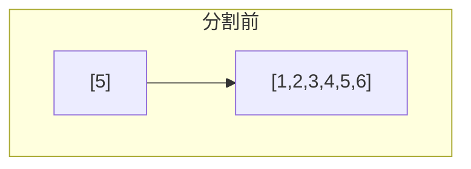
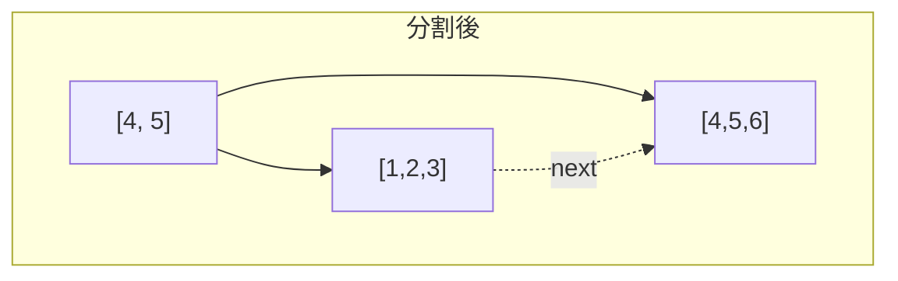

## B+木とは

**B+木 (B+ Tree)** はB木の変種であり、以下の特徴を持つ。

1. **全てのデータ (レコード) は葉ノードにのみ格納** される
2. **内部ノードはインデックス** (ルーティング用のキー) のみを持つ
3. **葉ノードはリンクリスト** でつながっている

これにより、範囲探索が効率的に行えるため、リレーショナルデータベース (MySQL InnoDB, PostgreSQL) で事実上の標準インデックス構造となっている。

### B木との違い

| 特性 | B木 | B+木 |
|------|-----|------|
| データの位置 | 全ノード | 葉のみ |
| 内部ノード | キー + データ | キーのみ (ガイド) |
| 葉の連結 | なし | リンクリスト |
| 範囲探索 | 非効率 | 効率的 |

### 定義

次数 $m$ のB+木は以下の性質を満たす。

1. 根以外の内部ノードは $\lceil m/2 \rceil$ ~ $m$ 個の子を持つ
2. 根は 2 ~ $m$ 個の子を持つ (葉でない場合)
3. 全ての葉は同じ深さにある
4. 葉ノードは $\lceil (m-1)/2 \rceil$ ~ $m-1$ 個のキーを持つ
5. 葉ノードは次の葉へのポインタを持つ

## 探索

### 点探索

B+木の点探索は常に根から葉まで辿る。内部ノードのキーはルーティングにのみ使われる。

```python title="bplus_search.py"
def search(node, key):
    # Navigate to leaf
    while not node.is_leaf:
        i = 0
        while i < len(node.keys) and key >= node.keys[i]:
            i += 1
        node = node.children[i]

    # Search in leaf
    for i, k in enumerate(node.keys):
        if k == key:
            return node.values[i]
    return None
```

### 範囲探索

B+木の大きな利点は範囲探索の効率性である。

1. 開始キーのある葉まで辿る: $O(\log n)$
2. リンクリストを辿って終了キーまでスキャン: $O(k)$ ($k$ は結果の件数)

```python title="range_search.py"
def range_search(root, low, high):
    # Navigate to leaf containing 'low'
    node = root
    while not node.is_leaf:
        i = 0
        while i < len(node.keys) and low >= node.keys[i]:
            i += 1
        node = node.children[i]

    # Scan leaves
    result = []
    while node is not None:
        for i, k in enumerate(node.keys):
            if k > high:
                return result
            if k >= low:
                result.append(node.values[i])
        node = node.next_leaf
    return result
```

## 挿入

### 手順

1. 適切な葉を探す
2. 葉にキーを挿入
3. 葉が溢れたら分割し、**中央のキーのコピーを親に挿入**

B木の分割では中央のキーが親に「移動」するが、B+木では中央のキーが葉にも残り、親には「コピー」が送られる。





## 削除

1. 葉からキーを削除
2. 葉のキー数が下限未満の場合:
   - 兄弟から借りられる場合は借用
   - 借りられない場合は兄弟と併合

内部ノードのキーは単なるルーティング情報なので、葉の削除時にすぐ更新する必要はない (ただし、左端のキーが削除された場合は更新が必要なこともある)。

## 計算量

| 操作 | 計算量 |
|------|--------|
| 点探索 | $O(\log_m n)$ |
| 範囲探索 | $O(\log_m n + k)$ |
| 挿入 | $O(\log_m n)$ |
| 削除 | $O(\log_m n)$ |

ここで $m$ は次数、$k$ は範囲探索の結果件数。

## データベースにおけるB+木

### なぜB+木が選ばれるか

1. **高いファンアウト**: 内部ノードにデータを持たないため、1ページに多くのキーを格納でき、木が浅くなる
2. **効率的な範囲探索**: 葉のリンクリストにより、ORDER BY や BETWEEN 句が高速
3. **安定した性能**: 全探索が葉まで辿るため、アクセス回数が予測可能
4. **順次アクセスの最適化**: 葉を順番にスキャンするシーケンシャルI/Oが可能

### 実際のシステムでの利用

- **MySQL InnoDB**: プライマリキーのクラスタードインデックスがB+木
- **PostgreSQL**: デフォルトのインデックス構造がB+木
- **SQLite**: テーブルストレージ自体がB+木

## まとめ

| 項目 | 内容 |
|------|------|
| 構造 | 全データが葉、内部はインデックスのみ |
| 葉の連結 | リンクリストで接続 |
| 高さ | $O(\log_m n)$ |
| 範囲探索 | $O(\log_m n + k)$ |
| 主な用途 | RDBMS のインデックス |
| 利点 | 高ファンアウト、効率的な範囲探索 |
