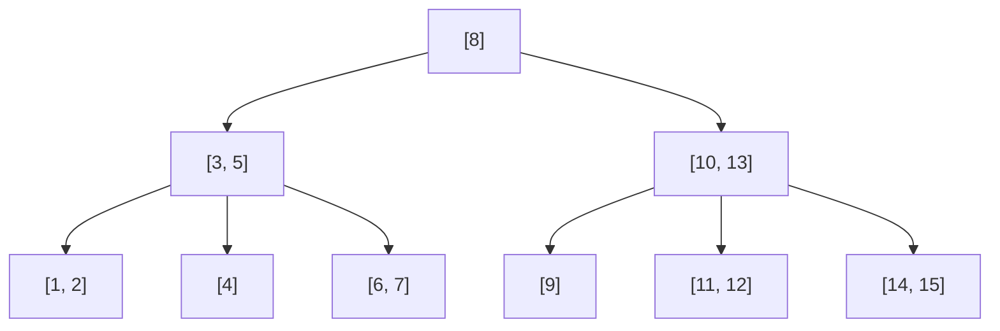
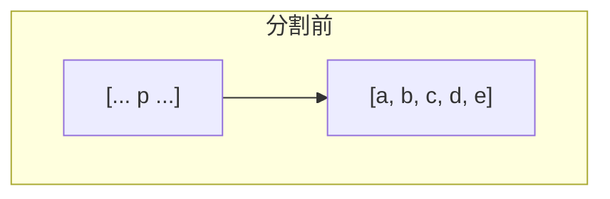
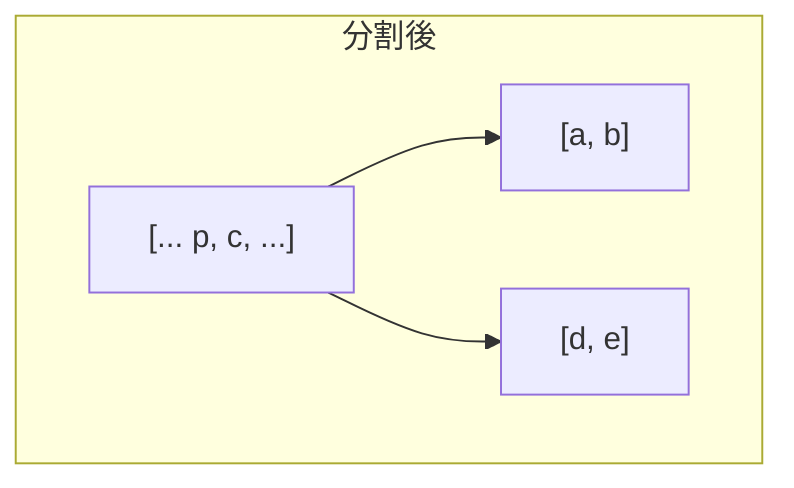

## B木とは

**B木 (B-Tree)** は、1972年にBayerとMcCreightによって提案された多分岐の自己平衡探索木である。ディスクアクセスを最小化するために設計されており、データベースやファイルシステムで広く使用されている。

### 定義

次数 (最小次数) $t \geq 2$ のB木は以下の性質を満たす。

1. 全ての葉は同じ深さにある
2. 根以外の各ノードは少なくとも $t - 1$ 個、高々 $2t - 1$ 個のキーを持つ
3. 根は少なくとも 1 個のキーを持つ (空でない場合)
4. $k$ 個のキーを持つ内部ノードは $k + 1$ 個の子を持つ
5. 各ノードのキーは昇順にソートされている
6. 子 $c_i$ の部分木に含まれる全てのキーは $\text{key}_{i-1}$ と $\text{key}_i$ の間にある

### 具体例 ($t = 2$, 2-3-4木)

$t = 2$ の場合、各ノードは 1~3 個のキーと 2~4 個の子を持つ。これは **2-3-4木** とも呼ばれる。



## 高さの上界

**定理:** $n$ 個のキーを持つ次数 $t$ のB木の高さ $h$ は以下を満たす。

$$
h \leq \log_t \frac{n + 1}{2}
$$

**証明:** 高さ $h$ のB木の最小ノード数を数える。根は少なくとも 1 個のキーを持ち、他の各ノードは少なくとも $t - 1$ 個のキーを持つ。深さ $d$ のノード数は少なくとも $2t^{d-1}$ 個 ($d \geq 1$)。

$$
n \geq 1 + 2(t-1) \sum_{i=1}^{h} t^{i-1} = 1 + 2(t^h - 1) = 2t^h - 1
$$

従って $t^h \leq (n+1)/2$、すなわち $h \leq \log_t((n+1)/2)$。 $\square$

$t = 1000$, $n = 10^9$ の場合、$h \leq 3$ である。これがB木がディスクベースのシステムで有効な理由である。

## 探索

B木の探索は二分探索木の一般化である。各ノードでキーの配列を走査 (または二分探索) し、適切な子に進む。

```python title="btree_search.py"
def search(node, key):
    i = 0
    while i < len(node.keys) and key > node.keys[i]:
        i += 1
    if i < len(node.keys) and key == node.keys[i]:
        return (node, i)
    if node.is_leaf:
        return None
    return search(node.children[i], key)
```

## 挿入

B木の挿入は常に葉に対して行われる。ノードが満杯 ($2t - 1$ 個のキー) の場合、**分割 (split)** を行う。

### 分割

満杯のノードを中央のキーで2つに分割し、中央のキーを親に押し上げる。





### 先行分割 (Preemptive Split)

挿入のために根から葉へ辿る際、途中の満杯のノードを**事前に分割** しておく方法がある。これにより、挿入時に分割の連鎖が上に伝播することを防ぎ、1パスで挿入が完了する。

```python title="btree_insert.py"
def insert(tree, key):
    root = tree.root
    if len(root.keys) == 2 * tree.t - 1:
        # Root is full: create new root and split
        new_root = BTreeNode(leaf=False)
        new_root.children.append(root)
        split_child(new_root, 0, tree.t)
        tree.root = new_root
    insert_non_full(tree.root, key, tree.t)

def insert_non_full(node, key, t):
    if node.is_leaf:
        # Insert key in sorted position
        bisect.insort(node.keys, key)
    else:
        i = len(node.keys) - 1
        while i >= 0 and key < node.keys[i]:
            i -= 1
        i += 1
        if len(node.children[i].keys) == 2 * t - 1:
            split_child(node, i, t)
            if key > node.keys[i]:
                i += 1
        insert_non_full(node.children[i], key, t)
```

## 削除

削除は挿入より複雑であり、以下のケースに分かれる。

1. **葉ノードのキー**: そのまま削除
2. **内部ノードのキー**: 先行キー (左の子の最大値) または後続キー (右の子の最小値) で置き換え
3. **キー数が最小のノード**: 兄弟からの借用、または兄弟との併合 (merge)

## 計算量

| 操作 | ディスクアクセス | CPU時間 |
|------|----------------|---------|
| 探索 | $O(\log_t n)$ | $O(t \log_t n)$ |
| 挿入 | $O(\log_t n)$ | $O(t \log_t n)$ |
| 削除 | $O(\log_t n)$ | $O(t \log_t n)$ |

$t$ を大きくするとディスクアクセスは減るが、各ノード内の操作コストが増える。実際のシステムでは、$t$ をディスクページサイズに合わせて選択する。

## まとめ

| 項目 | 内容 |
|------|------|
| 提案者 | Bayer, McCreight (1972) |
| ノード構造 | 多分岐 ($t$ ~ $2t$ 個の子) |
| 全葉の深さ | 一定 (完全バランス) |
| 高さ | $O(\log_t n)$ |
| 応用 | データベース、ファイルシステム |
| 利点 | ディスクアクセスの最小化 |
