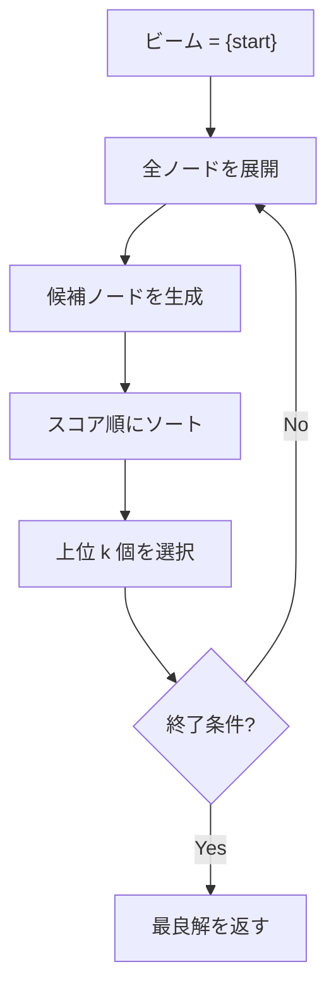
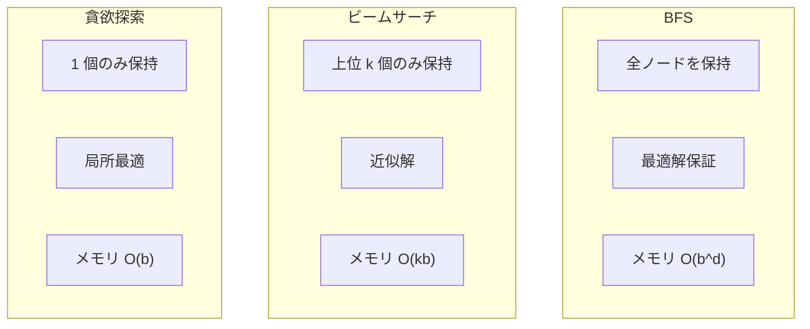

## ビームサーチとは

ビームサーチ (Beam Search) は、**幅優先探索 (BFS) の各レベルで保持するノード数を一定数 (ビーム幅) に制限する**近似探索アルゴリズムである。全てのノードを探索する代わりに、有望な候補だけを残すことで計算量を大幅に削減する。

### 位置づけ

| アルゴリズム | 保持ノード数 | 最適性 | 完全性 |
|------------|------------|--------|--------|
| BFS | 全て | Yes | Yes |
| 貪欲最良優先探索 | 1 | No | No |
| ビームサーチ | $k$ (ビーム幅) | No | No |

ビームサーチは BFS と貪欲探索の中間に位置する。ビーム幅 $k = 1$ なら貪欲探索、$k = \infty$ なら BFS と等価である。

## アルゴリズム

### 手順

1. 初期ノードをビームに入れる
2. ビーム内の全ノードを展開し、全候補ノードを生成
3. 候補をスコア順にソートし、上位 $k$ 個だけを新しいビームとする
4. 終了条件を満たすまで 2-3 を繰り返す



### 実装

```python title="beam_search.py"
def beam_search(start, expand, score, is_goal, beam_width: int, max_depth: int):
    beam = [start]

    for depth in range(max_depth):
        candidates = []
        for node in beam:
            if is_goal(node):
                return node
            candidates.extend(expand(node))

        if not candidates:
            break

        # Select top-k by score
        candidates.sort(key=score)
        beam = candidates[:beam_width]

    # Return best node found
    return min(beam, key=score) if beam else None
```

## ビーム幅の影響

### ビーム幅が小さい場合 ($k = 1, 2$)

- 計算が高速
- 局所最適に陥りやすい
- メモリ使用量が少ない

### ビーム幅が大きい場合 ($k = 100, 1000$)

- より良い解が見つかりやすい
- 計算時間が増加
- BFS に近づく

### 適切なビーム幅の選び方

問題と計算資源に応じてチューニングする。一般的なガイドライン:

- 時間制限がある場合: 制限時間内で可能な最大のビーム幅を使う
- 解の品質が重要: 大きめのビーム幅を使う
- リアルタイム性が重要: 小さめのビーム幅を使う

## 計算量

### 時間計算量

各深さで $k$ 個のノードを展開し、各ノードが平均 $b$ 個の子ノードを生成するとする。深さ $d$ まで探索する場合:

$$
O(d \cdot k \cdot b \cdot \log(k \cdot b))
$$

ソートに $O(kb \log kb)$ がかかる。$k$ と $b$ が定数なら $O(d)$。

### 空間計算量

$$
O(k \cdot b)
$$

ビーム幅 $k$ と分岐率 $b$ に比例。BFS の $O(b^d)$ と比較して劇的に少ない。

## 応用

### 自然言語処理

機械翻訳やテキスト生成で広く使われている。

- **機械翻訳**: デコーダが各タイムステップで単語を選ぶ際に、上位 $k$ 個の候補文を保持
- **音声認識**: 音素列から単語列への変換
- **テキスト要約**: 要約文の生成

### 競技プログラミング

制限時間内でできるだけ良い解を求めるヒューリスティック問題で活用される。

- スケジューリング問題
- パズル探索
- 組合せ最適化

### その他

- **コンパイラ最適化**: 命令スケジューリング
- **ゲーム AI**: 先読み探索

## 変種

### Stochastic Beam Search

上位 $k$ 個を決定論的に選ぶ代わりに、スコアに基づく確率で $k$ 個をサンプリングする。多様性が増し、局所最適を回避しやすくなる。

### Diverse Beam Search

ビームをグループに分け、各グループが互いに異なる解を探索するように制約する。

### Beam Stack Search

枝刈りされたノードをスタックに保存し、ビーム内の探索が行き詰まったら戻って再探索する。最適性を保証できる場合がある。

## BFS・A* との比較



## まとめ

| 項目 | 内容 |
|------|------|
| 種類 | 近似探索 (ヒューリスティック) |
| ビーム幅 $k$ | 保持するノード数の上限 |
| 時間計算量 | $O(d \cdot k \cdot b \cdot \log(kb))$ |
| 空間計算量 | $O(k \cdot b)$ |
| 最適性 | 保証なし |
| 完全性 | 保証なし |
| 利点 | 計算量が制御可能、実用的に良い解 |
| 欠点 | 最適解を逃す可能性 |
