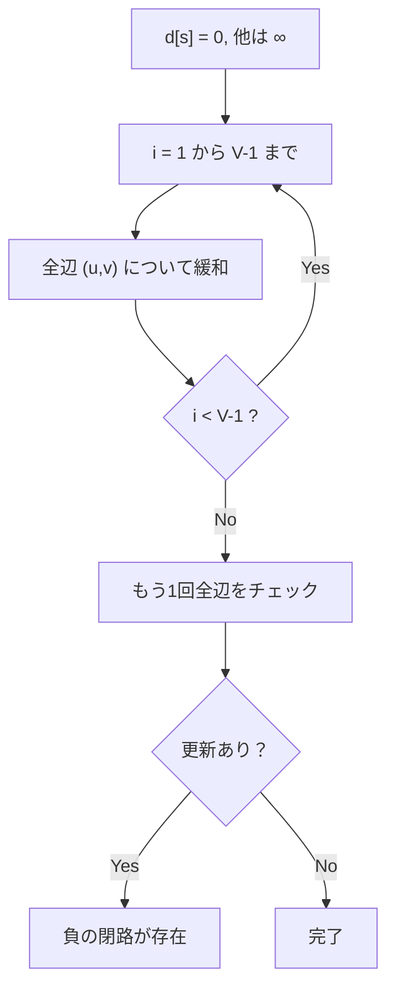

## Bellman-Ford法とは

**Bellman-Ford法** は、負の重みを持つ辺が存在するグラフにおいても、単一始点から全頂点への最短経路を求められるアルゴリズムである。さらに、**負の閉路 (negative cycle)** の検出も可能である。

時間計算量は $O(VE)$ であり、Dijkstra法より遅いが、負の辺を扱えるという利点がある。

### 問題設定

重み付き有向グラフ $G = (V, E, w)$ と始点 $s \in V$ が与えられたとき、$s$ から各頂点 $v$ への最短距離を求める。辺の重みは負であってもよい。

## アルゴリズムの動作

### 基本方針

全ての辺に対する緩和操作を $|V| - 1$ 回繰り返す。

1. $d[s] = 0$、他の全頂点は $d[v] = \infty$ で初期化
2. $|V| - 1$ 回のイテレーションで、各イテレーションにおいて全辺 $(u, v)$ を走査し緩和を行う
3. $|V|$ 回目のイテレーションでさらに緩和できる辺があれば、負の閉路が存在する

### なぜ $|V| - 1$ 回で十分か

最短パスは高々 $|V| - 1$ 本の辺からなる (閉路を含まないため)。$k$ 回目のイテレーション後、高々 $k$ 本の辺からなる最短パスが正しく計算される。したがって $|V| - 1$ 回のイテレーションで全ての最短距離が確定する。



## 実装

```python title="bellman_ford.py"
def bellman_ford(n: int, edges: list[tuple[int, int, int]], start: int) -> tuple[list[float], bool]:
    INF = float('inf')
    dist = [INF] * n
    dist[start] = 0

    # V-1 iterations
    for i in range(n - 1):
        for u, v, w in edges:
            if dist[u] < INF and dist[u] + w < dist[v]:
                dist[v] = dist[u] + w

    # Check for negative cycle
    has_negative_cycle = False
    for u, v, w in edges:
        if dist[u] < INF and dist[u] + w < dist[v]:
            has_negative_cycle = True
            break

    return dist, has_negative_cycle
```

## 正当性の証明

### 命題: $k$ 回のイテレーション後、高々 $k$ 本の辺からなる最短パスの距離が正しく計算される

**証明 (帰納法):**

$k$ についての帰納法。

**基底 ($k = 0$):** $d[s] = 0$ であり、0 本の辺からなるパス (始点自身) の距離は正しい。

**帰納段階:** $k$ 回のイテレーション後に高々 $k$ 本の辺からなる最短パスが正しいと仮定する。

頂点 $v$ への高々 $k+1$ 本の辺からなる最短パスを $s \to \cdots \to u \to v$ とする。このパスの $s \to u$ 部分は高々 $k$ 本の辺からなる。帰納法の仮定より、$k$ 回目のイテレーション後に $d[u]$ は正しい。

$k+1$ 回目のイテレーションで辺 $(u, v)$ を緩和するとき:

$$
d[v] \leq d[u] + w(u, v) = \delta_k(s, u) + w(u, v) = \delta_{k+1}(s, v)
$$

ここで $\delta_k(s, v)$ は高々 $k$ 本の辺を使った最短距離。逆に $d[v] \geq \delta_{k+1}(s, v)$ は緩和操作の定義から明らか。よって等号が成立する。 $\square$

### 系: 負の閉路がなければ、$|V| - 1$ 回のイテレーションで全最短距離が確定する

負の閉路がない場合、最短パスは高々 $|V| - 1$ 本の辺からなるため。

## 計算量

| 項目 | 計算量 |
|------|--------|
| 時間計算量 | $O(VE)$ |
| 空間計算量 | $O(V)$ |

$|V| - 1$ 回のイテレーションで $|E|$ 本の辺をそれぞれ処理するため、$O(VE)$。

## Dijkstra法との比較

| 観点 | Dijkstra法 | Bellman-Ford法 |
|------|-----------|---------------|
| 負の辺 | 不可 | 可 |
| 負の閉路検出 | 不可 | 可 |
| 時間計算量 | $O((V+E) \log V)$ | $O(VE)$ |
| アプローチ | 貪欲法 | 動的計画法 |

## 応用

### 負の閉路検出

$|V|$ 回目のイテレーションで更新が発生すれば負の閉路が存在する。為替取引における裁定取引 (arbitrage) の検出などに応用される。

### SPFA との関係

SPFA (Shortest Path Faster Algorithm) はBellman-Ford法の最適化版で、更新された頂点のみをキューで管理する。平均的には高速だが、最悪計算量は同じ $O(VE)$ である。

### 差分制約系

変数間の差の制約 $x_j - x_i \leq w_{ij}$ を辺の重みとしてグラフを構築し、Bellman-Ford法で解ける。

## まとめ

| 項目 | 内容 |
|------|------|
| 入力 | 重み付き有向グラフ $G$、始点 $s$ |
| 出力 | 各頂点への最短距離、負の閉路の有無 |
| 時間計算量 | $O(VE)$ |
| 空間計算量 | $O(V)$ |
| 核心 | 全辺の緩和を $V-1$ 回繰り返す |
| 利点 | 負の辺・負の閉路に対応 |
| 応用 | 負の閉路検出、差分制約系、SPFA の基礎 |
