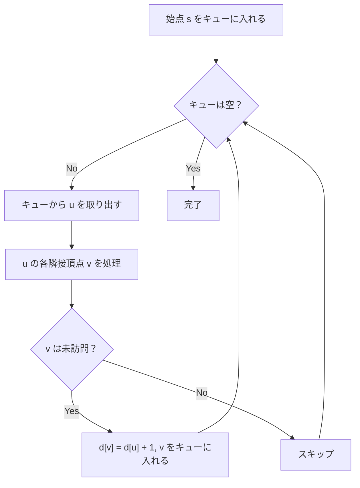

## BFS とは

**BFS (Breadth-First Search, 幅優先探索)** は、グラフの頂点を始点から近い順に探索するアルゴリズムである。キュー (FIFO) を用いて、始点からの距離が小さい頂点から順に処理する。

重みなしグラフにおける最短経路問題を $O(V + E)$ で解くことができる。

### 問題設定

グラフ $G = (V, E)$ と始点 $s \in V$ が与えられたとき、$s$ から各頂点 $v$ への最短距離 $d(s, v)$ を求める。ここで距離はエッジの本数で測る (重みなしグラフ)。

## アルゴリズムの動作

### 基本方針

BFS は以下のように動作する:

1. 始点 $s$ をキューに入れ、$d[s] = 0$ とする
2. キューから頂点 $u$ を取り出す
3. $u$ の各隣接頂点 $v$ について、未訪問なら $d[v] = d[u] + 1$ としてキューに入れる
4. キューが空になるまで 2-3 を繰り返す



### 直感的な理解

BFS は「波紋の広がり」に例えられる。始点に石を投げると波紋が同心円状に広がっていく。波紋が到達した順番が、始点からの最短距離に対応する。

## 実装

```python title="bfs.py"
from collections import deque

def bfs(graph: list[list[int]], start: int) -> list[int]:
    n = len(graph)
    dist = [-1] * n  # -1 means unvisited
    dist[start] = 0
    queue = deque([start])

    while queue:
        u = queue.popleft()
        for v in graph[u]:
            if dist[v] == -1:
                dist[v] = dist[u] + 1
                queue.append(v)

    return dist
```

## 正当性の証明

### 命題: BFS は重みなしグラフの最短距離を正しく計算する

**証明:**

$d[v]$ を BFS が計算した距離、$\delta(s, v)$ を真の最短距離とする。

**$d[v] \geq \delta(s, v)$ の証明:**

BFS が $d[v]$ を設定するとき、始点から $v$ への長さ $d[v]$ のパスが存在する (キューに入れた経路をたどればよい)。最短距離の定義より $\delta(s, v) \leq d[v]$。

**$d[v] \leq \delta(s, v)$ の証明 (帰納法):**

$\delta(s, v) = k$ である頂点について帰納法を行う。

- $k = 0$: $v = s$ であり、$d[s] = 0 = \delta(s, s)$。
- $k \geq 1$: $\delta(s, v) = k$ とする。最短パス上で $v$ の直前の頂点を $u$ とすると、$\delta(s, u) = k - 1$。帰納法の仮定より $d[u] = k - 1$。$u$ がキューから取り出されたとき、辺 $(u, v)$ を処理する。この時点で $d[v]$ が未設定なら $d[v] = d[u] + 1 = k$。既に設定済みなら $d[v] \leq k$ (先に発見されている)。いずれにせよ $d[v] \leq k = \delta(s, v)$。

以上より $d[v] = \delta(s, v)$ が成り立つ。 $\square$

### キューの単調性

BFS のキュー内の頂点の距離値は単調非減少である。すなわち、キューから取り出される順番で距離値は広義単調増加する。

これは帰納法で証明できる。距離 $k$ の頂点がすべてキューに入った後に距離 $k+1$ の頂点がキューに入るからである。

## 計算量

| 項目 | 計算量 |
|------|--------|
| 時間計算量 | $O(V + E)$ |
| 空間計算量 | $O(V)$ |

各頂点と各辺をちょうど 1 回ずつ処理するため、時間計算量は $O(V + E)$ である。キューに格納される頂点数は最大 $O(V)$ である。

## 応用

### 最短経路の復元

距離だけでなく経路自体を求めたい場合は、各頂点の親 (predecessor) を記録する。

```python title="bfs_path.py"
from collections import deque

def bfs_path(graph: list[list[int]], start: int, goal: int) -> list[int]:
    n = len(graph)
    dist = [-1] * n
    parent = [-1] * n
    dist[start] = 0
    queue = deque([start])

    while queue:
        u = queue.popleft()
        if u == goal:
            break
        for v in graph[u]:
            if dist[v] == -1:
                dist[v] = dist[u] + 1
                parent[v] = u
                queue.append(v)

    # Reconstruct path
    if dist[goal] == -1:
        return []  # unreachable
    path = []
    v = goal
    while v != -1:
        path.append(v)
        v = parent[v]
    return path[::-1]
```

### 二部グラフ判定

BFS で各頂点に色 (0 または 1) を塗り分け、隣接頂点が同じ色になるかを確認すれば、二部グラフかどうかを判定できる。

### 多始点 BFS

複数の始点から同時に BFS を開始することで、各頂点から最も近い始点までの距離を一度に求められる。全始点をまずキューに入れればよい。

## まとめ

| 項目 | 内容 |
|------|------|
| 入力 | グラフ $G = (V, E)$、始点 $s$ |
| 出力 | 各頂点への最短距離 $d[v]$ |
| 時間計算量 | $O(V + E)$ |
| 空間計算量 | $O(V)$ |
| 核心 | キューによる近い順の探索 |
| 応用 | 最短経路、二部グラフ判定、多始点 BFS など |
