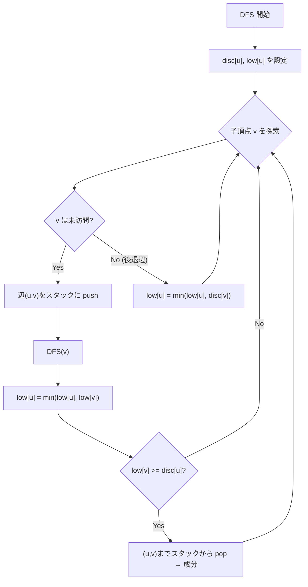

## 二重頂点連結成分とは

無向連結グラフにおいて、**関節点 (articulation point, cut vertex)** とは、その頂点を削除するとグラフが非連結になる頂点のことである。

グラフが**二重頂点連結 (biconnected, 2-vertex-connected)** であるとは、頂点数が 3 以上で関節点が存在しないことである。つまり、任意の1頂点を削除してもグラフは連結のままである。

**二重頂点連結成分 (biconnected component)** とは、極大な二重頂点連結部分グラフである。二重辺連結成分と異なり、二重頂点連結成分は**辺の集合**として定義され、1つの辺が複数の成分に属することはないが、1つの頂点 (関節点) が複数の成分に属することはある。

## 関節点の検出条件

DFS 木における頂点 $u$ が関節点であるための条件:

- **$u$ が DFS 木の根の場合**: $u$ の子が 2 つ以上
- **$u$ が根でない場合**: ある子 $v$ について $\text{low}[v] \geq \text{disc}[u]$

### 直感的な理解

$\text{low}[v] \geq \text{disc}[u]$ は、$v$ の部分木から $u$ を経由せずに $u$ より上の頂点に到達できないことを意味する。したがって $u$ を削除すると $v$ の部分木が切り離される。

## アルゴリズムの流れ

DFS 中に辺スタックを管理し、$\text{low}[v] \geq \text{disc}[u]$ となるたびに、スタックから辺 $(u, v)$ まで pop した辺集合が1つの二重頂点連結成分を構成する。



## 実装

```python title="biconnected_components.py"
def biconnected_components(n: int, edges: list[tuple[int, int]]):
    adj = [[] for _ in range(n)]
    for i, (u, v) in enumerate(edges):
        adj[u].append((v, i))
        adj[v].append((u, i))

    disc = [-1] * n
    low = [-1] * n
    timer = [0]
    edge_stack = []
    components = []
    articulation_points = set()

    def dfs(u: int, parent: int):
        disc[u] = low[u] = timer[0]
        timer[0] += 1
        children = 0

        for v, idx in adj[u]:
            if disc[v] == -1:
                children += 1
                edge_stack.append((u, v))
                dfs(v, u)
                low[u] = min(low[u], low[v])

                if (parent == -1 and children > 1) or (parent != -1 and low[v] >= disc[u]):
                    articulation_points.add(u)

                if low[v] >= disc[u]:
                    comp = []
                    while edge_stack:
                        e = edge_stack.pop()
                        comp.append(e)
                        if e == (u, v):
                            break
                    components.append(comp)
            elif v != parent and disc[v] < disc[u]:
                edge_stack.append((u, v))
                low[u] = min(low[u], disc[v])

    for i in range(n):
        if disc[i] == -1:
            dfs(i, -1)

    return articulation_points, components
```

## 二重辺連結との違い

| | 二重辺連結 | 二重頂点連結 |
|---|---|---|
| 削除対象 | 辺 | 頂点 |
| 検出対象 | 橋 | 関節点 |
| 成分の単位 | 頂点集合 | 辺集合 |
| 共有 | なし | 関節点を共有 |
| 条件 | $\text{low}[v] > \text{disc}[u]$ | $\text{low}[v] \geq \text{disc}[u]$ |

## 計算量

| 操作 | 計算量 |
|------|--------|
| DFS | $O(V + E)$ |
| **合計** | $O(V + E)$ |

## ブロックカットツリー

二重頂点連結成分と関節点を交互に並べたツリー構造を**ブロックカットツリー** (block-cut tree) と呼ぶ。このツリーは元のグラフの連結性に関する問題を効率的に解くために利用される。

## まとめ

| 項目 | 内容 |
|------|------|
| 入力 | 無向連結グラフ |
| 出力 | 関節点 + 二重頂点連結成分 |
| 時間計算量 | $O(V + E)$ |
| 空間計算量 | $O(V + E)$ |
| 核心 | DFS + low-link + 辺スタック |
| 応用 | ブロックカットツリー、ネットワーク信頼性 |
