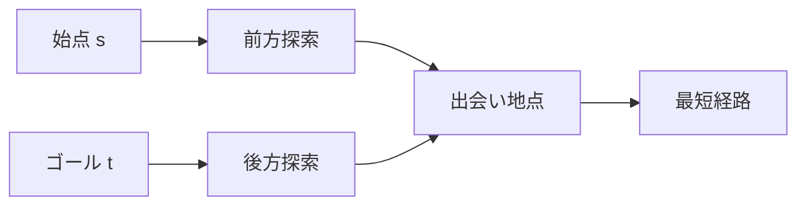

## 双方向BFS とは

**双方向BFS (Bidirectional BFS)** は、始点とゴールの両方から同時に BFS を実行し、2 つの探索が出会った時点で最短経路を求めるアルゴリズムである。

通常の BFS に比べて探索する頂点数を大幅に削減できる場合がある。

### 動機

通常の BFS は始点から半径 $d$ (最短距離) の「球」を探索する。頂点の分岐度を $b$ とすると、探索する頂点数は約 $O(b^d)$ である。

双方向 BFS では、始点側とゴール側の両方から半径 $d/2$ の球を探索する。探索する頂点数は約 $O(b^{d/2})$ が 2 つで、$2 \cdot O(b^{d/2})$ となり、$O(b^d)$ と比べて指数的に小さくなる。

## アルゴリズムの動作

### 基本方針

1. 始点 $s$ のキューとゴール $t$ のキューを用意
2. 交互に (またはキューが小さい方を) 1 層ずつ BFS する
3. 一方の探索で訪問した頂点が、他方ですでに訪問済みなら出会い地点 (meeting point)
4. 最短距離 = 始点側の距離 + ゴール側の距離



### 注意点

無向グラフまたは逆辺が利用可能な有向グラフでのみ使える。ゴール側からの探索には逆辺が必要になるためである。

## 実装

```python title="bidirectional_bfs.py"
from collections import deque

def bidirectional_bfs(graph: list[list[int]], start: int, goal: int) -> int:
    if start == goal:
        return 0

    n = len(graph)
    dist_s = [-1] * n  # distance from start
    dist_t = [-1] * n  # distance from goal

    dist_s[start] = 0
    dist_t[goal] = 0

    queue_s = deque([start])
    queue_t = deque([goal])

    while queue_s or queue_t:
        # Expand from start side
        if queue_s:
            u = queue_s.popleft()
            for v in graph[u]:
                if dist_s[v] == -1:
                    dist_s[v] = dist_s[u] + 1
                    queue_s.append(v)
                if dist_t[v] >= 0:
                    return dist_s[v] + dist_t[v]

        # Expand from goal side
        if queue_t:
            u = queue_t.popleft()
            for v in graph[u]:
                if dist_t[v] == -1:
                    dist_t[v] = dist_t[u] + 1
                    queue_t.append(v)
                if dist_s[v] >= 0:
                    return dist_s[v] + dist_t[v]

    return -1  # unreachable
```

## 計算量の分析

分岐度 $b$、最短距離 $d$ のグラフにおいて:

| 手法 | 探索頂点数 |
|------|-----------|
| 通常の BFS | $O(b^d)$ |
| 双方向 BFS | $O(b^{d/2})$ |

**例:** $b = 10$, $d = 6$ の場合:
- 通常: $10^6 = 1{,}000{,}000$
- 双方向: $2 \times 10^3 = 2{,}000$

探索空間が 500 分の 1 に削減される。

### 時間・空間計算量

| 項目 | 計算量 |
|------|--------|
| 時間計算量 | $O(b^{d/2})$ (実用的) |
| 最悪時間計算量 | $O(V + E)$ |
| 空間計算量 | $O(b^{d/2})$ |

最悪の場合は通常の BFS と同じ $O(V + E)$ だが、多くの実用的なケースで大幅に高速化される。

## 正当性

### 命題: 双方向 BFS は最短距離を正しく計算する

**証明 (概略):**

BFS の性質より、始点からの距離 $d_s[v]$ とゴールからの距離 $d_t[v]$ はそれぞれ正しく計算される。

2 つの探索が出会った頂点 $m$ において、$d_s[m] + d_t[m]$ は $s \to m \to t$ というパスの長さを与える。

このパスが最短であることを示す必要がある。BFS は層ごとに探索するため、出会い時点で未探索の頂点を経由するパスは少なくとも同等以上の長さになることが保証される。 $\square$

## 応用

### ソーシャルネットワーク

2 人のユーザー間の最短接続 ("Six Degrees of Separation") を効率的に求められる。

### パズル

ルービックキューブや 15 パズルなど、始状態と目標状態の両方から探索する場合に有効。

### ワード変換問題

1 文字ずつ変更して単語を変換する問題 (Word Ladder) は双方向 BFS の典型的な応用例。

## まとめ

| 項目 | 内容 |
|------|------|
| 入力 | グラフ $G = (V, E)$、始点 $s$、ゴール $t$ |
| 出力 | $s$ から $t$ への最短距離 |
| 時間計算量 | $O(b^{d/2})$ (実用的) |
| 空間計算量 | $O(b^{d/2})$ |
| 核心 | 両方向から BFS を行い出会い地点で合流 |
| 利点 | 探索空間の指数的削減 |
| 制約 | 逆方向の探索が必要 (無向グラフまたは逆辺) |
