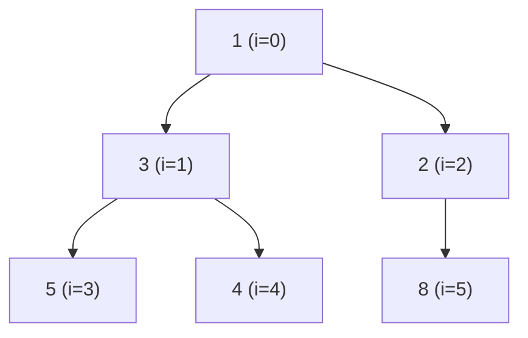

## Binary Heap とは

Binary Heap (二分ヒープ) は、**完全二分木** の構造を持ち、**ヒープ条件** を満たすデータ構造である。Priority Queue (優先度付きキュー) の最も基本的な実装として広く使われている。

### ヒープ条件

**最小ヒープ (Min-Heap)** の場合:

$$
\text{heap}[\text{parent}(i)] \leq \text{heap}[i] \quad (\forall i \geq 1)
$$

すなわち、どの節点の値も、その子の値以下である。根が常に最小値を持つ。

**最大ヒープ (Max-Heap)** は不等号の向きが逆になる。

### 配列による表現

完全二分木は配列で効率的に表現できる。インデックス $i$ の節点に対して:

- 親: $\lfloor (i - 1) / 2 \rfloor$
- 左の子: $2i + 1$
- 右の子: $2i + 2$

ポインタが不要でキャッシュ効率も良い。



配列表現: `[1, 3, 2, 5, 4, 8]`

## 基本操作

### Insert (挿入)

1. 配列の末尾に新しい要素を追加する
2. ヒープ条件が壊れていれば、親と比較しながら上方向にスワップする (**Sift Up**)

```python title="binary_heap.py"
def insert(self, val):
    self.heap.append(val)
    i = len(self.heap) - 1
    # Sift up
    while i > 0:
        parent = (i - 1) // 2
        if self.heap[parent] <= self.heap[i]:
            break
        self.heap[parent], self.heap[i] = self.heap[i], self.heap[parent]
        i = parent
```

### Extract Min (最小値の取り出し)

1. 根 (最小値) を取り出す
2. 配列の末尾の要素を根に移動する
3. ヒープ条件が壊れていれば、子と比較しながら下方向にスワップする (**Sift Down**)

```python title="binary_heap.py"
def extract_min(self):
    if not self.heap:
        raise IndexError("Heap is empty")
    min_val = self.heap[0]
    last = self.heap.pop()
    if self.heap:
        self.heap[0] = last
        # Sift down
        i = 0
        n = len(self.heap)
        while True:
            smallest = i
            left = 2 * i + 1
            right = 2 * i + 2
            if left < n and self.heap[left] < self.heap[smallest]:
                smallest = left
            if right < n and self.heap[right] < self.heap[smallest]:
                smallest = right
            if smallest == i:
                break
            self.heap[i], self.heap[smallest] = self.heap[smallest], self.heap[i]
            i = smallest
    return min_val
```

### 完全な実装

```python title="min_heap.py"
class MinHeap:
    def __init__(self):
        self.heap = []

    def insert(self, val):
        self.heap.append(val)
        i = len(self.heap) - 1
        while i > 0:
            parent = (i - 1) // 2
            if self.heap[parent] <= self.heap[i]:
                break
            self.heap[parent], self.heap[i] = self.heap[i], self.heap[parent]
            i = parent

    def extract_min(self):
        if not self.heap:
            raise IndexError("Heap is empty")
        min_val = self.heap[0]
        last = self.heap.pop()
        if self.heap:
            self.heap[0] = last
            self._sift_down(0)
        return min_val

    def peek_min(self):
        if not self.heap:
            raise IndexError("Heap is empty")
        return self.heap[0]

    def _sift_down(self, i):
        n = len(self.heap)
        while True:
            smallest = i
            left = 2 * i + 1
            right = 2 * i + 2
            if left < n and self.heap[left] < self.heap[smallest]:
                smallest = left
            if right < n and self.heap[right] < self.heap[smallest]:
                smallest = right
            if smallest == i:
                break
            self.heap[i], self.heap[smallest] = self.heap[smallest], self.heap[i]
            i = smallest

    def size(self):
        return len(self.heap)

    def is_empty(self):
        return len(self.heap) == 0
```

## 計算量

| 操作 | 時間計算量 |
|------|------------|
| insert | $O(\log n)$ |
| extract_min | $O(\log n)$ |
| peek_min | $O(1)$ |
| heapify (配列からの構築) | $O(n)$ |

### Insert / Extract の計算量

完全二分木の高さは $\lfloor \log_2 n \rfloor$ である。Sift Up / Sift Down はそれぞれ木の高さ分だけスワップするので $O(\log n)$。

### Heapify の $O(n)$ 構築

$n$ 個の要素を 1 つずつ insert すると $O(n \log n)$ かかるが、**ボトムアップ法** で構築すれば $O(n)$ で済む。

```python title="heapify.py"
def heapify(arr):
    n = len(arr)
    # Start from the last non-leaf node
    for i in range(n // 2 - 1, -1, -1):
        sift_down(arr, i, n)
```

#### $O(n)$ の証明

深さ $d$ の節点は高々 $\lceil n / 2^{d+1} \rceil$ 個あり、各節点で Sift Down に要するスワップ回数は高々 $h - d$ ($h$ は木の高さ) である。

$$
\sum_{d=0}^{h} \frac{n}{2^{d+1}} \cdot (h - d) = \frac{n}{2} \sum_{k=0}^{h} \frac{k}{2^k} \leq \frac{n}{2} \cdot 2 = n
$$

最後の不等式は $\sum_{k=0}^{\infty} k/2^k = 2$ による。したがって Heapify は $O(n)$ である。 $\square$

## 応用

### ダイクストラ法

グラフの最短経路問題を解くダイクストラ法では、「次に処理すべき最小距離の頂点」を効率的に取り出すために Priority Queue を用いる。Binary Heap を使うと全体で $O((V + E) \log V)$ になる。

### ヒープソート

Binary Heap を使ったソートアルゴリズム。$O(n \log n)$ で動作し、追加メモリが $O(1)$ という特長がある。

### K 番目に小さい要素

データストリームから K 番目に小さい要素を効率的に求めるには、サイズ $K$ の最大ヒープを使う。

## まとめ

| 項目 | 内容 |
|------|------|
| データ構造 | Binary Heap (二分ヒープ) |
| 構造 | 完全二分木 (配列で表現) |
| ヒープ条件 | 親 $\leq$ 子 (最小ヒープ) |
| insert | $O(\log n)$ |
| extract_min | $O(\log n)$ |
| peek_min | $O(1)$ |
| heapify | $O(n)$ |
| 主な応用 | ダイクストラ法、ヒープソート、中央値の管理 |
