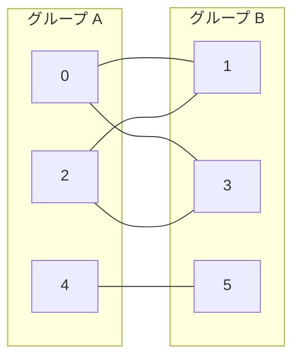

## 二部グラフとは

グラフ $G = (V, E)$ が**二部グラフ (bipartite graph)** であるとは、頂点集合 $V$ を 2 つの互いに素な集合 $A, B$ に分割でき、全ての辺が $A$ と $B$ の間にのみ存在する場合をいう。

$$
V = A \cup B, \quad A \cap B = \emptyset, \quad \forall (u,v) \in E: (u \in A \land v \in B) \lor (u \in B \land v \in A)
$$

直感的には、頂点を 2 色で塗り分けたとき、同じ色の頂点間に辺がないグラフである。

### 具体例



## 二部グラフの判定条件

### 定理

グラフ $G$ が二部グラフである必要十分条件は、$G$ が奇数長の閉路を含まないことである。

**証明 (必要性):**

$G$ が二部グラフであると仮定する。任意の閉路 $v_0, v_1, \ldots, v_k = v_0$ を考える。隣接する頂点は異なるグループに属するので、$v_0$ から出発すると色が交互に切り替わる。$v_k = v_0$ に戻ったとき元の色でなければならないので、$k$ は偶数である。

**証明 (十分性):**

$G$ が奇数長の閉路を含まないと仮定する。各連結成分について、任意の頂点 $s$ を選び BFS を行う。$s$ からの距離が偶数の頂点をグループ $A$、奇数の頂点をグループ $B$ に入れる。

もし同じグループの頂点 $u, v$ 間に辺があれば、$s$ から $u$, $v$ への最短路と辺 $(u,v)$ を組み合わせて奇数長の閉路が構成されるが、これは仮定に矛盾する。$\square$

## BFS による判定アルゴリズム

### アルゴリズムの概要

1. 全頂点を「未着色」で初期化する
2. 未着色の頂点 $s$ を選び、色 $0$ を塗る
3. $s$ をキューに入れ、BFS を開始する
4. キューから頂点 $u$ を取り出し、各隣接頂点 $v$ について:
   - $v$ が未着色なら $1 - \text{color}(u)$ で着色してキューに追加
   - $v$ が $u$ と同じ色なら二部グラフでないと判定
5. 全頂点が処理されたら二部グラフと判定

### 実装

```python title="bipartite_check.py"
from collections import deque

def is_bipartite(n: int, adj: list[list[int]]) -> bool:
    color = [-1] * n
    for s in range(n):
        if color[s] != -1:
            continue
        color[s] = 0
        queue = deque([s])
        while queue:
            u = queue.popleft()
            for v in adj[u]:
                if color[v] == -1:
                    color[v] = 1 - color[u]
                    queue.append(v)
                elif color[v] == color[u]:
                    return False
    return True
```

### 計算量

| 項目 | 計算量 |
|------|--------|
| 時間計算量 | $O(V + E)$ |
| 空間計算量 | $O(V)$ |

BFS は各頂点を高々 1 回訪問し、各辺を高々 2 回 (両端点から) 調べるので、時間計算量は $O(V + E)$ である。

## DFS による判定

BFS の代わりに DFS を使っても同様に判定できる。

```python title="bipartite_check_dfs.py"
def is_bipartite_dfs(n: int, adj: list[list[int]]) -> bool:
    color = [-1] * n

    def dfs(u: int, c: int) -> bool:
        color[u] = c
        for v in adj[u]:
            if color[v] == -1:
                if not dfs(v, 1 - c):
                    return False
            elif color[v] == c:
                return False
        return True

    for s in range(n):
        if color[s] == -1:
            if not dfs(s, 0):
                return False
    return True
```

再帰の深さが $O(V)$ になりうるため、大きなグラフでは BFS が安全である。

## 応用

### 最大マッチング

二部グラフの最大マッチングは Hopcroft-Karp アルゴリズムで $O(E\sqrt{V})$ で求められる。一般グラフのマッチングより効率的に解ける。

### 2彩色問題

二部グラフ判定は、グラフの 2 彩色可能性の判定と等価である。$k \geq 3$ 彩色問題は NP 完全であるが、2 彩色は多項式時間で解ける。

### 奇数長閉路の検出

二部グラフでないと判定された場合、BFS/DFS の探索木をたどることで奇数長の閉路を具体的に構成できる。

## まとめ

| 項目 | 内容 |
|------|------|
| 入力 | グラフ $G = (V, E)$ |
| 出力 | 二部グラフかどうかの判定 |
| 時間計算量 | $O(V + E)$ |
| 空間計算量 | $O(V)$ |
| 核心 | 2色塗り分けの可否 = 奇数閉路の非存在 |
| 応用 | マッチング、彩色、スケジューリング |
