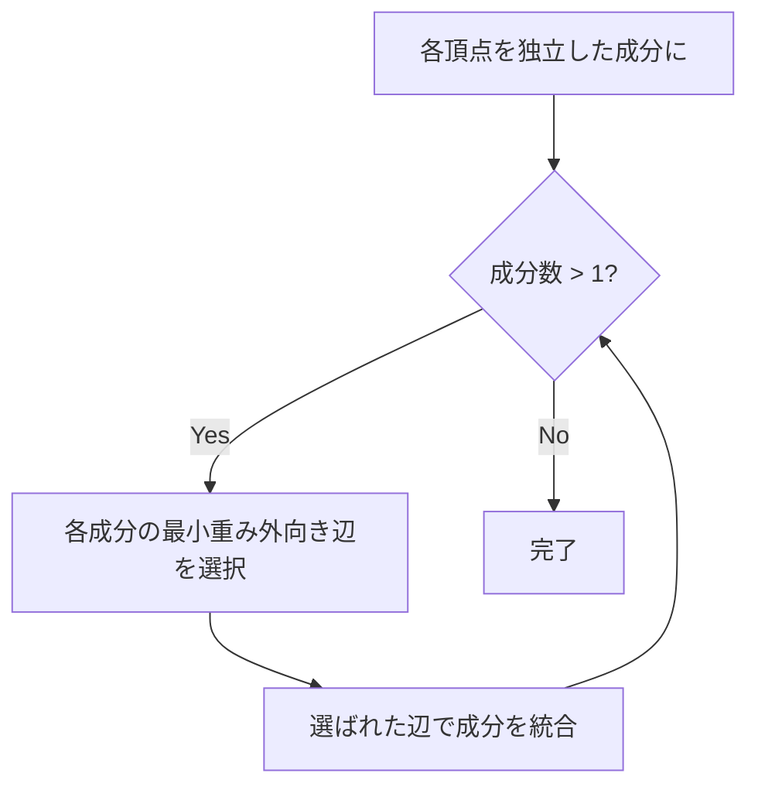

## Borůvka法とは

Borůvka法 (Boruvka's algorithm) は、重み付き無向連結グラフの**最小全域木 (MST)** を求めるアルゴリズムである。1926年に Otakar Borůvka によって提案された、MST アルゴリズムの中で最も歴史が古いものの一つである。

各連結成分から最小重みの外向き辺を**同時に**選んで統合する、という操作をフェーズごとに繰り返す。

## アルゴリズムの流れ

1. 各頂点を独立した連結成分とする
2. 各フェーズで以下を行う:
   - 各連結成分について、他の成分に向かう最小重み辺を選ぶ
   - 選ばれた辺を全て MST に追加し、成分を統合する
3. 連結成分が 1 つになったら終了



## 実装

```python title="boruvka.py"
class UnionFind:
    def __init__(self, n):
        self.parent = list(range(n))
        self.rank = [0] * n

    def find(self, x):
        while self.parent[x] != x:
            self.parent[x] = self.parent[self.parent[x]]
            x = self.parent[x]
        return x

    def union(self, a, b):
        ra, rb = self.find(a), self.find(b)
        if ra == rb:
            return False
        if self.rank[ra] < self.rank[rb]:
            ra, rb = rb, ra
        self.parent[rb] = ra
        if self.rank[ra] == self.rank[rb]:
            self.rank[ra] += 1
        return True


def boruvka(n: int, edges: list[tuple[int, int, int]]) -> list[tuple[int, int, int]]:
    uf = UnionFind(n)
    mst = []
    num_components = n

    while num_components > 1:
        # Find cheapest edge for each component
        cheapest = {}  # component root -> edge index
        for i, (u, v, w) in enumerate(edges):
            cu, cv = uf.find(u), uf.find(v)
            if cu == cv:
                continue
            if cu not in cheapest or edges[cheapest[cu]][2] > w:
                cheapest[cu] = i
            if cv not in cheapest or edges[cheapest[cv]][2] > w:
                cheapest[cv] = i

        if not cheapest:
            break

        # Add cheapest edges
        for idx in set(cheapest.values()):
            u, v, w = edges[idx]
            if uf.union(u, v):
                mst.append((u, v, w))
                num_components -= 1

    return mst
```

## 正当性の証明

### 命題: Borůvka法は最小全域木を出力する

**証明:**

各連結成分 $C$ について選ばれる辺は、$C$ と $V \setminus C$ のカットを横断する最小重み辺である。カットの性質 (Cut Property) より、この辺はある MST に含まれる。

各フェーズで追加される全ての辺についてこの議論が成り立つため、帰納法により Borůvka法が出力する辺集合は MST に含まれる。辺数が $|V| - 1$ に達したとき、全域木が完成する。 $\square$

## 計算量

### フェーズ数の解析

各フェーズで、各連結成分は少なくとも 1 つの他の成分と統合される。したがって、成分数は各フェーズで半分以下になる。

$$
\text{フェーズ数} \leq \lceil \log_2 V \rceil
$$

### 各フェーズの計算量

各フェーズでは全辺を走査するため $O(E)$。

### 全体

$$
O(E \log V)
$$

## 特徴と応用

Borůvka法は並列化に適している。各フェーズの「各成分の最小辺選択」は並列に実行できるため、PRAM モデルでは $O(\log^2 V)$ 時間で実行可能である。

また、randomized MST アルゴリズムの基礎としても使われる (Karger-Klein-Tarjan のアルゴリズムなど)。

## まとめ

| 項目 | 内容 |
|------|------|
| 入力 | 重み付き無向連結グラフ |
| 出力 | 最小全域木 |
| 時間計算量 | $O(E \log V)$ |
| 空間計算量 | $O(V + E)$ |
| 核心 | 各成分の最小外向き辺を同時選択 |
| 応用 | 並列 MST、randomized MST |
