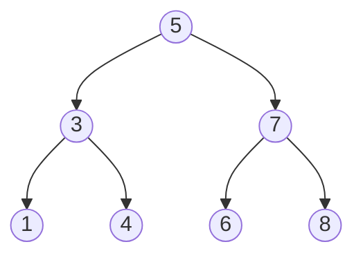
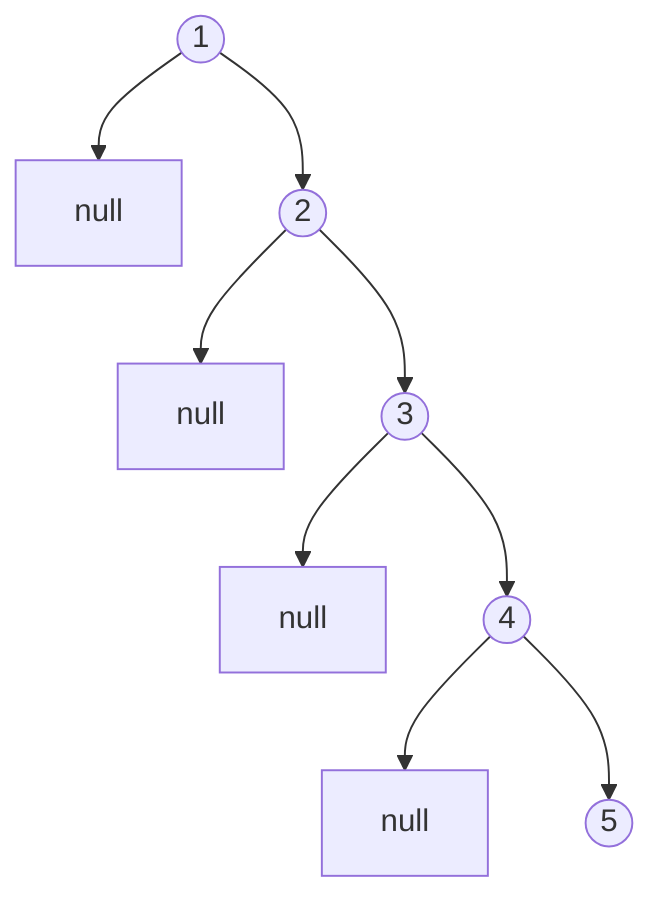

## 二分探索木とは

**二分探索木 (Binary Search Tree, BST)** は、各ノードが以下の性質を満たす二分木である。

- 左部分木に含まれる全てのノードの値は、そのノードの値より小さい
- 右部分木に含まれる全てのノードの値は、そのノードの値より大きい
- 左右の部分木もそれぞれ二分探索木である

### 定義

二分木 $T$ が二分探索木であるとは、任意のノード $v$ について以下が成り立つことである。

$$
\forall u \in \text{left}(v): \text{key}(u) < \text{key}(v)
$$

$$
\forall w \in \text{right}(v): \text{key}(w) > \text{key}(v)
$$

ここで $\text{left}(v)$, $\text{right}(v)$ はそれぞれ $v$ の左部分木、右部分木に含まれるノードの集合を表す。

### 具体例

値 `[5, 3, 7, 1, 4, 6, 8]` を順に挿入した場合のBSTは以下のようになる。



この木を**中間順走査 (in-order traversal)** すると `1, 3, 4, 5, 6, 7, 8` とソートされた順序が得られる。

## 基本操作

### 探索 (Search)

値 $k$ を探索するには、根から出発して以下を繰り返す。

1. 現在のノードの値と $k$ を比較
2. $k$ が小さければ左の子へ、大きければ右の子へ進む
3. 一致すれば発見、`null` に到達すれば存在しない

```python title="search.py"
def search(node, key):
    if node is None:
        return None
    if key == node.key:
        return node
    elif key < node.key:
        return search(node.left, key)
    else:
        return search(node.right, key)
```

### 挿入 (Insert)

新しい値 $k$ の挿入は、探索と同様に根から辿り、`null` に到達した位置に新しいノードを追加する。

```python title="insert.py"
def insert(node, key):
    if node is None:
        return Node(key)
    if key < node.key:
        node.left = insert(node.left, key)
    elif key > node.key:
        node.right = insert(node.right, key)
    return node
```

### 削除 (Delete)

削除は3つのケースに分かれる。

1. **葉ノード**: そのまま削除
2. **子が1つ**: 子で置き換える
3. **子が2つ**: 右部分木の最小値 (後続ノード) で置き換え、後続ノードを再帰的に削除

```python title="delete.py"
def delete(node, key):
    if node is None:
        return None
    if key < node.key:
        node.left = delete(node.left, key)
    elif key > node.key:
        node.right = delete(node.right, key)
    else:
        # Found the node to delete
        if node.left is None:
            return node.right
        if node.right is None:
            return node.left
        # Two children: replace with in-order successor
        successor = find_min(node.right)
        node.key = successor.key
        node.right = delete(node.right, successor.key)
    return node

def find_min(node):
    while node.left is not None:
        node = node.left
    return node
```

## 計算量

### 各操作の計算量

| 操作 | 平均 | 最悪 |
|------|------|------|
| 探索 | $O(\log n)$ | $O(n)$ |
| 挿入 | $O(\log n)$ | $O(n)$ |
| 削除 | $O(\log n)$ | $O(n)$ |

### 最悪ケース

ソート済みのデータを順に挿入すると、木が一直線の鎖状 (skewed tree) になり、高さが $O(n)$ となる。

例えば `1, 2, 3, 4, 5` を順に挿入すると以下のようになる。



この問題を解決するために、AVL木、赤黒木などの**平衡二分探索木**が考案されている。

### 平均高さの解析

$n$ 個のキーをランダムな順序で挿入した場合、BSTの期待高さは $O(\log n)$ である。

**定理:** $n$ 個の異なるキーのランダム順列を空のBSTに挿入した場合、期待される木の高さは $\Theta(\log n)$ である。

直感的には、ランダム挿入では根がおおよそ中央値付近になるため、木が概ねバランスする。

## 中間順走査

BSTの重要な性質として、**中間順走査 (in-order traversal)** がキーのソート順を与えることが挙げられる。

```python title="inorder.py"
def inorder(node):
    if node is None:
        return
    inorder(node.left)
    print(node.key)
    inorder(node.right)
```

### 正当性の証明

**命題:** BSTの中間順走査はキーを昇順に出力する。

**証明 (帰納法):**

- **基底:** 空の木または単一ノードの木では明らかに成立する
- **帰納:** BST性質より、左部分木の全キー < 根のキー < 右部分木の全キーである。帰納仮説より左部分木の中間順走査は左部分木のキーを昇順に出力し、右部分木も同様である。したがって全体として昇順となる。 $\square$

## まとめ

| 項目 | 内容 |
|------|------|
| データ構造 | 二分木ベースの順序付き辞書 |
| BST性質 | 左 < 親 < 右 |
| 平均計算量 | $O(\log n)$ |
| 最悪計算量 | $O(n)$ (偏った木) |
| 中間順走査 | ソート済み列を出力 |
| 課題 | 最悪ケースの回避 → 平衡BSTへ |
