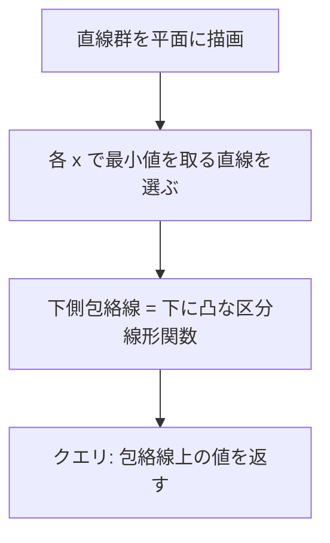

## Convex Hull Trick とは

Convex Hull Trick (CHT) は、一次関数 $f_i(x) = a_i x + b_i$ の集合に対する最小値 (または最大値) クエリを効率的に処理するテクニックである。

$$
\min_{i} (a_i x + b_i)
$$

を $x$ を指定するたびに求めたい場面で使われる。

## 幾何学的な意味: 下側包絡線

CHT の本質は**下側包絡線** (lower envelope) の構築にある。

$xy$ 平面上に複数の直線 $y = a_i x + b_i$ を描くと、各 $x$ に対して最も下にある直線が「その $x$ での最小値」を与える。全ての $x$ について最小値を与える直線をつなげた曲線が下側包絡線であり、これは**下に凸な区分線形関数**になる。



CHT は、この下側包絡線を構成する直線の列を効率的に管理する。包絡線上に現れない直線 (他の直線の組み合わせで常に上回られる直線) を除去することで、クエリを高速に処理できる。

## 動機: DPの高速化

以下の形の DP 漸化式に現れる:

$$
dp[i] = \min_{j < i} (a_j \cdot x_i + b_j) + c_i
$$

ここで $a_j, b_j$ は $j$ のみに依存し、$x_i$ は $i$ のみに依存する。素朴には $O(n^2)$ だが、CHT を使うと $O(n)$ や $O(n \log n)$ に改善できる。

### 具体的なDP問題での適用例

**問題:** $n$ 個の荷物を配送する。荷物 $i$ の重さは $w_i$、配送地点までの距離は $d_i$ (ただし $d_1 < d_2 < \cdots < d_n$)。トラックは 1 台ずつ使い、各トラックに連続した荷物を積む。トラック $1$ 台のコストは $(\text{最後の荷物の距離})^2 + \sum (\text{荷物の重さ})$ とする。総コストを最小化せよ。

$dp[i]$ = 荷物 $1$ から $i$ までの最小コスト、$W_i = \sum_{t=1}^{i} w_t$ (重さの累積和) とすると:

$$
dp[i] = \min_{j < i} (dp[j] + d_i^2 + W_i - W_j)
$$

$W_j$ を含む項を整理すると:

$$
dp[i] = \min_{j < i} (dp[j] - W_j) + d_i^2 + W_i
$$

ここで $a_j = 0$, $b_j = dp[j] - W_j$ とすると傾きが全て 0 で CHT は不要だが、もう少し複雑な例として:

$$
dp[i] = \min_{j < i} (dp[j] + (d_i - d_j)^2)
$$

を考える。展開すると:

$$
dp[i] = \min_{j < i} (dp[j] + d_j^2 - 2 d_i d_j) + d_i^2
$$

$a_j = -2d_j$, $b_j = dp[j] + d_j^2$ とおくと:

$$
dp[i] = \min_{j < i} (a_j \cdot d_i + b_j) + d_i^2
$$

これは CHT の形になる。$d_j$ が単調増加なら $a_j = -2d_j$ は単調減少なので、単調 CHT が使える。

**数値例:** $d = [1, 3, 5, 8]$ の場合:

- $dp[1] = d_1^2 = 1$
- $j=1$: $a_1 = -2, b_1 = 1 + 1 = 2$。直線 $y = -2x + 2$ を追加
- $dp[2] = (-2 \cdot 3 + 2) + 9 = -4 + 9 = 5$
- $j=2$: $a_2 = -6, b_2 = 5 + 9 = 14$。直線 $y = -6x + 14$ を追加
- $dp[3] = \min(-2 \cdot 5 + 2, -6 \cdot 5 + 14) + 25 = \min(-8, -16) + 25 = 9$
- $j=3$: $a_3 = -10, b_3 = 9 + 25 = 34$。直線 $y = -10x + 34$ を追加
- $dp[4] = \min(-2 \cdot 8 + 2, -6 \cdot 8 + 14, -10 \cdot 8 + 34) + 64 = \min(-14, -34, -46) + 64 = 18$

## アルゴリズム

### 直線の追加

傾き $a$ が**単調減少**の順に直線を追加する場合、凸包の管理はスタックで行える:

1. 新しい直線 $l$ を追加するとき、スタックの末尾の直線が $l$ によって不要になるかチェック
2. 不要なら除去し、繰り返す
3. $l$ をスタックに追加

### bad 関数の幾何学的意味

3 本の直線 $l_1, l_2, l_3$ (この順にスタックに入っている) があるとき、$l_2$ が不要かどうかを判定する `bad` 関数の幾何学的意味を説明する。

$l_1$ と $l_2$ の交点の $x$ 座標を $x_{12}$、$l_1$ と $l_3$ の交点の $x$ 座標を $x_{13}$ とする。もし $x_{13} \leq x_{12}$ ならば、$l_1$ から $l_3$ に直接切り替えたほうが常に得であり、$l_2$ は下側包絡線に現れない。

具体的に:
- $l_1$ と $l_2$ の交点: $a_1 x + b_1 = a_2 x + b_2$ より $x_{12} = \frac{b_2 - b_1}{a_1 - a_2}$
- $l_1$ と $l_3$ の交点: $x_{13} = \frac{b_3 - b_1}{a_1 - a_3}$

$x_{13} \leq x_{12}$ の条件は:

$$
\frac{b_3 - b_1}{a_1 - a_3} \leq \frac{b_2 - b_1}{a_1 - a_2}
$$

整数演算で除算を避けるため、外積の形に変形する:

$$
(b_3 - b_1)(a_1 - a_2) \leq (b_2 - b_1)(a_1 - a_3)
$$

これがコード中の `bad` 関数の条件式に対応する。

### クエリ

$x$ が**単調増加**の順にクエリされる場合、スタックの先頭から順に最適な直線を探せばよい (ポインタを進めるだけ)。

```python title="convex_hull_trick.py"
class ConvexHullTrick:
    def __init__(self):
        self.lines = []  # (a, b)
        self.ptr = 0

    def bad(self, l1, l2, l3):
        # l2 is unnecessary if intersection of l1,l3 is left of intersection of l1,l2
        return (l3[1] - l1[1]) * (l1[0] - l2[0]) <= (l2[1] - l1[1]) * (l1[0] - l3[0])

    def add_line(self, a: int, b: int):
        line = (a, b)
        while len(self.lines) >= 2 and self.bad(self.lines[-2], self.lines[-1], line):
            self.lines.pop()
        self.lines.append(line)

    def query(self, x: int) -> int:
        while self.ptr + 1 < len(self.lines):
            a1, b1 = self.lines[self.ptr]
            a2, b2 = self.lines[self.ptr + 1]
            if a1 * x + b1 > a2 * x + b2:
                self.ptr += 1
            else:
                break
        a, b = self.lines[self.ptr]
        return a * x + b
```

## 計算量

### 命題: 単調な CHT は全体 $O(n)$

**証明:**

各直線は高々 1 回追加され、高々 1 回除去される。したがって直線の追加は償却 $O(1)$。

クエリのポインタは単調に増加するので、全クエリで合計 $O(n)$。 $\square$

## 単調性条件がない場合の対処法

### 二分探索版 CHT

傾きが単調であっても、クエリの $x$ が単調でない場合がある。この場合、ポインタの単調移動は使えないが、包絡線上で二分探索すれば $O(\log n)$ でクエリに答えられる。

隣接する直線 $l_i, l_{i+1}$ の交点 $x_i$ を管理し、クエリ $x$ に対して $x_i \leq x < x_{i+1}$ となる $i$ を二分探索で見つける。

### Li Chao Tree

傾きもクエリも任意の順序の場合は **Li Chao Tree** (Li Chao Segment Tree) を用いる。これは区間を再帰的に分割するセグメント木構造で、各ノードに「そのノードの管理区間の中点で最小値を取る直線」を保持する。

```python title="li_chao_tree.py"
class LiChaoTree:
    def __init__(self, lo, hi):
        self.lo = lo
        self.hi = hi
        self.line = None  # (a, b) representing y = ax + b
        self.left = None
        self.right = None

    def _eval(self, line, x):
        return line[0] * x + line[1]

    def add_line(self, new_line):
        if self.line is None:
            self.line = new_line
            return
        mid = (self.lo + self.hi) // 2
        left_better = self._eval(new_line, self.lo) < self._eval(self.line, self.lo)
        mid_better = self._eval(new_line, mid) < self._eval(self.line, mid)
        if mid_better:
            self.line, new_line = new_line, self.line
        if self.lo == self.hi:
            return
        if left_better != mid_better:
            if self.left is None:
                self.left = LiChaoTree(self.lo, mid)
            self.left.add_line(new_line)
        else:
            if self.right is None:
                self.right = LiChaoTree(mid + 1, self.hi)
            self.right.add_line(new_line)

    def query(self, x):
        res = self._eval(self.line, x) if self.line else float('inf')
        mid = (self.lo + self.hi) // 2
        if x <= mid and self.left:
            res = min(res, self.left.query(x))
        elif x > mid and self.right:
            res = min(res, self.right.query(x))
        return res
```

Li Chao Tree では直線の追加もクエリも $O(\log(\text{値域}))$ で処理できる。

### 手法の比較

| 手法 | 傾きの条件 | クエリの条件 | 追加 | クエリ |
|------|-----------|------------|------|--------|
| 単調 CHT | 単調 | 単調 | 償却 $O(1)$ | 償却 $O(1)$ |
| 二分探索 CHT | 単調 | 任意 | 償却 $O(1)$ | $O(\log n)$ |
| Li Chao Tree | 任意 | 任意 | $O(\log V)$ | $O(\log V)$ |

ここで $V$ は値域のサイズ。

## 最大値クエリへの対応

最小値ではなく最大値を求めたい場合は、**上側包絡線** (upper envelope) を管理する。実装上は不等号の向きを変えるか、傾きと切片の符号を反転させて最小値問題に帰着させればよい。

## まとめ

| 項目 | 内容 |
|------|------|
| 適用対象 | $\min_j(a_j x + b_j)$ 型の DP 最適化 |
| 時間計算量 | $O(n)$ (単調) / $O(n \log n)$ (一般) |
| 空間計算量 | $O(n)$ |
| 核心 | 不要な直線を凸包 (下側包絡線) から除去 |
| 応用 | DP高速化、最小コスト計算 |
