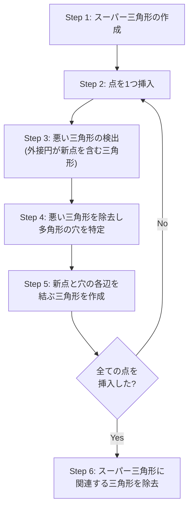

## ドロネー三角形分割とは

平面上に $n$ 個の点が与えられたとき、これらの点を頂点とする三角形分割のうち、**どの三角形の外接円の内部にも他の点が含まれない** という条件を満たすものを **ドロネー三角形分割 (Delaunay Triangulation)** と呼ぶ。

### 定義

三角形分割 $\mathcal{T}$ がドロネー条件を満たすとは、$\mathcal{T}$ の任意の三角形 $t$ に対して、$t$ の外接円の内部に $\mathcal{T}$ の他の頂点が含まれないことである。

### 性質

- 最小角最大化: 全ての三角形分割の中で最小角を最大化する
- 一意性: 4点以上が同一円周上にない場合、ドロネー三角形分割は一意
- ボロノイ図との双対性: ドロネー辺はボロノイ領域の隣接関係に対応

## 空円条件 (Empty Circle Property)

ドロネー三角形分割の最も重要な性質は空円条件である。

**命題:** 三角形分割がドロネー三角形分割であるための必要十分条件は、全ての三角形の外接円が他の頂点を含まないことである。

### 局所判定 (辺フリップ条件)

実用上重要なのは、空円条件を**局所的に**判定できることである。辺 $e$ を共有する2つの三角形 $\triangle ABC$ と $\triangle ABD$ について、$\triangle ABC$ の外接円が点 $D$ を含まなければ、辺 $e$ はドロネー条件を満たす。

**命題:** 全ての内部辺が局所的にドロネー条件を満たすならば、三角形分割全体がドロネー三角形分割である。

この局所性がエッジフリップによるアルゴリズムの正当性を保証する。

### 外接円判定

4点 $a, b, c, d$ について、$d$ が三角形 $abc$ の外接円の内部にあるかを行列式で判定できる。

$$
\begin{vmatrix}
a_x - d_x & a_y - d_y & (a_x - d_x)^2 + (a_y - d_y)^2 \\
b_x - d_x & b_y - d_y & (b_x - d_x)^2 + (b_y - d_y)^2 \\
c_x - d_x & c_y - d_y & (c_x - d_x)^2 + (c_y - d_y)^2
\end{vmatrix} > 0
$$

($a, b, c$ が反時計回りの場合)

### 直感的な理解

この行列式は、3点 $a, b, c$ の外接円に対する点 $d$ の位置を判定する。$a, b, c$ が反時計回りに並んでいるとき:

- 行列式 $> 0$ → $d$ は外接円の **内部** にある
- 行列式 $= 0$ → $d$ は外接円 **上** にある (4点が共円)
- 行列式 $< 0$ → $d$ は外接円の **外部** にある

## Lifting Map: 放物面への射影による理解

ドロネー三角形分割を深く理解するための強力な道具が **Lifting Map** (持ち上げ写像) である。

### アイデア

2次元平面上の点 $(x, y)$ を、3次元空間の放物面 $z = x^2 + y^2$ 上の点 $(x, y, x^2 + y^2)$ に写す。

$$
\text{lift}: (x, y) \mapsto (x, y, x^2 + y^2)
$$

この射影のもとで、**ドロネー三角形分割は持ち上げた点集合の下側凸包 (lower convex hull) を平面に射影したもの** に一致する。

### なぜ成り立つか

放物面 $z = x^2 + y^2$ の重要な性質: 3点 $(x_1, y_1)$, $(x_2, y_2)$, $(x_3, y_3)$ を通る円は、持ち上げた3点を通る平面を放物面に射影したものである。点 $(x_4, y_4)$ がこの円の内部にあることと、持ち上げた点 $(x_4, y_4, x_4^2 + y_4^2)$ が平面の **下側** にあることが同値になる。

したがって、空円条件「外接円内に他の点がない」は、持ち上げた点の凸包の「下側の面に他の点がない」と等価であり、これはまさに下側凸包の定義である。

この対応関係により、ドロネー三角形分割は3次元凸包アルゴリズムを用いて構築できる。

## Bowyer-Watson アルゴリズム

Bowyer-Watson アルゴリズムは逐次挿入法の一種で、最も実装しやすいドロネー三角形分割アルゴリズムの一つである。

### アルゴリズムの流れ



### 詳細な手順

**Step 1: スーパー三角形の作成**

全ての入力点を包含する十分大きな三角形を作成する。入力点の座標範囲から、バウンディングボックスを十分に大きく覆う三角形を選べばよい。

**Step 2: 点の挿入**

点 $p$ を三角形分割に挿入する。

**Step 3: 悪い三角形の検出**

現在の三角形分割の中で、外接円が新しい点 $p$ を含む三角形を全て見つける。これらを「悪い三角形 (bad triangles)」と呼ぶ。

**Step 4: 穴の特定**

悪い三角形を全て除去すると、多角形の「穴」ができる。穴の境界辺は、悪い三角形の辺のうち、悪い三角形1つだけに隣接する辺 (= 共有されていない辺) である。

**Step 5: 再三角形化**

穴の各境界辺と新しい点 $p$ を結んで新しい三角形を作成する。

**Step 6: スーパー三角形の除去**

全ての点を挿入した後、スーパー三角形の頂点を含む三角形を全て除去する。

### 具体例: 5点での動作追跡

点集合: $A = (1, 1)$, $B = (5, 1)$, $C = (3, 4)$, $D = (2, 3)$, $E = (4, 2)$

**初期状態:** スーパー三角形 $\triangle S_1 S_2 S_3$ (十分大きい) を作成。

**点 $A = (1, 1)$ を挿入:**
- 悪い三角形: $\triangle S_1 S_2 S_3$ (その外接円は $A$ を含む)
- 穴の境界: 辺 $S_1 S_2$, $S_2 S_3$, $S_3 S_1$
- 新しい三角形: $\triangle A S_1 S_2$, $\triangle A S_2 S_3$, $\triangle A S_3 S_1$

**点 $B = (5, 1)$ を挿入:**
- 悪い三角形: $B$ の外接円テストに引っかかる三角形群を検出
- 穴を作り、$B$ と境界辺で新しい三角形を構成

**点 $C = (3, 4)$ を挿入:**
- 同様に悪い三角形を検出、除去、再三角形化

**点 $D = (2, 3)$, $E = (4, 2)$ を挿入:**
- 各挿入で空円条件に違反する三角形を除去し、新しい三角形で埋める

**最終処理:** スーパー三角形の頂点 $S_1, S_2, S_3$ を含む三角形を全て除去。

結果として、5点のドロネー三角形分割が得られる。

### 実装

```python title="bowyer_watson.py"
def bowyer_watson(points):
    """Compute Delaunay triangulation using Bowyer-Watson algorithm"""
    # Step 1: Create super triangle
    min_x = min(p[0] for p in points) - 1
    max_x = max(p[0] for p in points) + 1
    min_y = min(p[1] for p in points) - 1
    max_y = max(p[1] for p in points) + 1
    dx, dy = max_x - min_x, max_y - min_y
    s1 = (min_x - 10 * dx, min_y - dy)
    s2 = (max_x + 10 * dx, min_y - dy)
    s3 = ((min_x + max_x) / 2, max_y + 10 * dy)
    super_tri = (s1, s2, s3)
    triangles = [super_tri]

    for p in points:
        # Step 3: Find bad triangles
        bad = []
        for tri in triangles:
            if in_circumcircle(tri[0], tri[1], tri[2], p):
                bad.append(tri)

        # Step 4: Find boundary edges of the hole
        boundary = []
        for tri in bad:
            for i in range(3):
                edge = (tri[i], tri[(i + 1) % 3])
                # Edge is on boundary if not shared by another bad triangle
                shared = False
                for other in bad:
                    if other == tri:
                        continue
                    if edge[0] in other and edge[1] in other:
                        shared = True
                        break
                if not shared:
                    boundary.append(edge)

        # Remove bad triangles
        for tri in bad:
            triangles.remove(tri)

        # Step 5: Create new triangles
        for edge in boundary:
            triangles.append((edge[0], edge[1], p))

    # Step 6: Remove triangles with super triangle vertices
    triangles = [
        tri for tri in triangles
        if s1 not in tri and s2 not in tri and s3 not in tri
    ]
    return triangles
```

### 計算量

この単純な実装では、各点の挿入で全三角形を走査するため $O(n)$、全体で $O(n^2)$ になる。

点の挿入順をランダムにすると、期待計算量は $O(n \log n)$ に改善される。これは、各挿入で影響を受ける三角形の数が期待 $O(1)$ であることによる。

## 逐次挿入法 (エッジフリップ)

### アルゴリズム

1. 点を1つずつ追加する
2. 新しい点を含む三角形を見つける
3. その三角形を分割する
4. エッジフリップによりドロネー条件を回復する

### エッジフリップ

2つの隣接する三角形が共有する辺について、ドロネー条件が満たされない場合、辺をフリップ (反転) する。これにより局所的にドロネー条件が回復される。

四角形 $ABCD$ で辺 $AC$ がドロネー条件を満たさない場合:
- フリップ前: $\triangle ABC$ と $\triangle ACD$
- フリップ後: $\triangle ABD$ と $\triangle BCD$

フリップ後は新しい辺に隣接する三角形についても再帰的にドロネー条件をチェックする必要がある。Lawson のフリップアルゴリズムでは、このカスケードが有限回で停止することが保証されている。

### 実装

```python title="delaunay.py"
def in_circumcircle(a, b, c, d):
    """d が abc の外接円内にあるか判定"""
    ax, ay = a[0] - d[0], a[1] - d[1]
    bx, by = b[0] - d[0], b[1] - d[1]
    cx, cy = c[0] - d[0], c[1] - d[1]
    det = ((ax*ax + ay*ay) * (bx*cy - cx*by)
         - (bx*bx + by*by) * (ax*cy - cx*ay)
         + (cx*cx + cy*cy) * (ax*by - bx*ay))
    return det > 0
```

## 分割統治法

分割統治法によるドロネー三角形分割は、最悪計算量 $O(n \log n)$ を保証する。

### 手順

1. 点集合を x 座標でソートする
2. 点集合を左半分と右半分に分割する
3. それぞれのドロネー三角形分割を再帰的に構築する
4. 2つの三角形分割をマージする

### マージ手順

マージが最も複雑な部分である。左右の三角形分割を結合するには:

1. 左右の凸包の共通接線 (下接線) を見つける
2. 接線から始めて、上方に向かって新しいドロネー辺を追加していく
3. 各ステップで、左右の候補点のうち外接円条件を満たすものを選択する
4. 上接線に到達するまで繰り返す

マージにかかる時間は $O(n)$ であり、再帰の深さは $O(\log n)$ なので、全体で $O(n \log n)$ となる。

## 退化ケースへの対処

### 4点以上が同一円周上

4点以上が同一円周上にある場合、ドロネー三角形分割は一意でなくなる。この場合、外接円判定の行列式が 0 になる。

対処法:
- **シンボリック摂動法 (Simulation of Simplicity):** 各点に微小な摂動を加えて一般の位置にする。実際に座標を変更する必要はなく、タイブレークルール (例: 辞書順で小さい点を優先) を定めればよい
- **任意の三角形分割を許容:** 共円の4点に対してどちらの対角線を選んでもドロネー条件は満たされるため、どちらを選択してもよい

### 共線点

全ての点が一直線上にある場合、三角形分割は存在しない。アルゴリズムはこのケースを正しく検出して報告する必要がある。

## 計算量

| 手法 | 期待計算量 | 最悪計算量 |
|------|-----------|-----------|
| Bowyer-Watson (ランダム順) | $O(n \log n)$ | $O(n^2)$ |
| 逐次挿入 + フリップ (ランダム順) | $O(n \log n)$ | $O(n^2)$ |
| 分割統治 | $O(n \log n)$ | $O(n \log n)$ |
| Fortune's Algorithm (ボロノイ経由) | $O(n \log n)$ | $O(n \log n)$ |

ドロネー三角形分割の辺の数は $O(n)$、三角形の数も $O(n)$ である。これは平面グラフのオイラーの公式 $V - E + F = 2$ から導かれる。

## 応用

- 有限要素法のメッシュ生成
- 地形の三角形モデリング (TIN: Triangulated Irregular Network)
- 最近傍グラフの構築
- ボロノイ図の構築 (双対)
- ユークリッド最小全域木 (EMST) の構築
- 補間・等高線生成

## まとめ

| 項目 | 内容 |
|------|------|
| 入力 | 平面上の $n$ 点 |
| 出力 | ドロネー三角形分割 |
| 最適計算量 | $O(n \log n)$ |
| 核心 | 空円条件 + エッジフリップ |
| 退化ケース | 共円点にはシンボリック摂動法で対処 |
