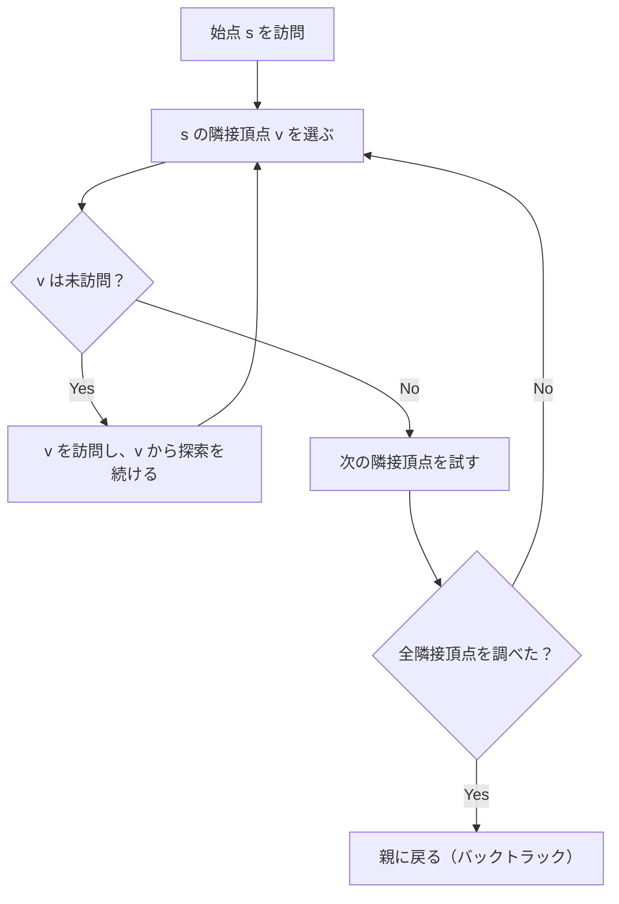

## DFS とは

**DFS (Depth-First Search, 深さ優先探索)** は、グラフの頂点を可能な限り深い方向に探索し、行き止まりに達したら戻って別の枝を探索するアルゴリズムである。

スタック (LIFO) または再帰を用いて実装する。

### 問題設定

グラフ $G = (V, E)$ と始点 $s \in V$ が与えられたとき、$s$ から到達可能な全頂点を訪問する。訪問順序 (発見時刻・終了時刻) はトポロジカルソートや強連結成分分解などの応用で重要になる。

## アルゴリズムの動作

### 基本方針

DFS は以下のように動作する:

1. 始点 $s$ をスタックに入れる (または再帰呼び出しする)
2. スタックから頂点 $u$ を取り出し、訪問済みにする
3. $u$ の未訪問の隣接頂点 $v$ をスタックに入れる
4. スタックが空になるまで繰り返す



### 直感的な理解

DFS は「迷路を片手で壁を触りながら進む」方法に例えられる。分岐があれば一方を選んで進み、行き止まりに着いたら最後の分岐まで戻って別の道を試す。

## タイムスタンプ

DFS では各頂点に 2 つのタイムスタンプを記録する:

- **発見時刻 (discovery time)** $d[v]$: 頂点 $v$ を最初に訪問した時刻
- **終了時刻 (finish time)** $f[v]$: 頂点 $v$ の処理が完了した時刻

これらは以下の性質を満たす:

### 括弧定理

任意の 2 頂点 $u, v$ について、区間 $[d[u], f[u]]$ と $[d[v], f[v]]$ は互いに素であるか、一方が他方を含む。

### 白色パス定理

$v$ が $u$ の子孫であるための必要十分条件は、時刻 $d[u]$ において $u$ から $v$ へ未訪問の頂点のみを通るパスが存在することである。

## 実装

### 再帰版

```python title="dfs_recursive.py"
def dfs(graph: list[list[int]], start: int) -> list[int]:
    n = len(graph)
    visited = [False] * n
    order = []

    def _dfs(u: int) -> None:
        visited[u] = True
        order.append(u)
        for v in graph[u]:
            if not visited[v]:
                _dfs(v)

    _dfs(start)
    return order
```

### スタック版

```python title="dfs_stack.py"
def dfs_stack(graph: list[list[int]], start: int) -> list[int]:
    n = len(graph)
    visited = [False] * n
    order = []
    stack = [start]

    while stack:
        u = stack.pop()
        if visited[u]:
            continue
        visited[u] = True
        order.append(u)
        for v in reversed(graph[u]):
            if not visited[v]:
                stack.append(v)

    return order
```

## 辺の分類

DFS は有向グラフの辺を以下の 4 種類に分類する:

| 辺の種類 | 条件 | 意味 |
|----------|------|------|
| 木辺 (tree edge) | $v$ が未訪問 | DFS 木に含まれる辺 |
| 後退辺 (back edge) | $v$ が祖先 | 閉路の存在を示す |
| 前進辺 (forward edge) | $v$ が子孫 | 子孫へのショートカット |
| 交差辺 (cross edge) | その他 | 異なる部分木間の辺 |

**重要:** 無向グラフでは前進辺と交差辺は存在しない。辺は木辺か後退辺のいずれかに分類される。

## 計算量

| 項目 | 計算量 |
|------|--------|
| 時間計算量 | $O(V + E)$ |
| 空間計算量 | $O(V)$ (再帰の場合はコールスタック分) |

各頂点と各辺をちょうど 1 回ずつ処理するため、時間計算量は $O(V + E)$ である。

## 応用

### トポロジカルソート

DAG (有向非巡回グラフ) の頂点を、辺の方向に沿った順に並べ替える。DFS の終了時刻の逆順がトポロジカル順序になる。

### 閉路検出

DFS 中に後退辺 (back edge) が見つかれば、グラフに閉路が存在する。

### 強連結成分分解

Tarjan のアルゴリズムや Kosaraju のアルゴリズムは DFS を基礎としている。

## まとめ

| 項目 | 内容 |
|------|------|
| 入力 | グラフ $G = (V, E)$、始点 $s$ |
| 出力 | 頂点の訪問順序、タイムスタンプ |
| 時間計算量 | $O(V + E)$ |
| 空間計算量 | $O(V)$ |
| 核心 | スタック / 再帰による深さ優先の探索 |
| 応用 | トポロジカルソート、閉路検出、強連結成分 など |
