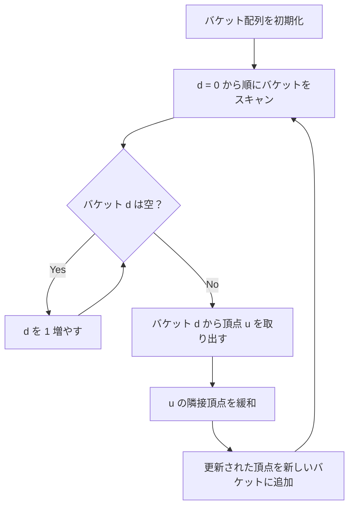

## Dial's Algorithm とは

**Dial's Algorithm** (ダイアルのアルゴリズム) は、辺の重みが非負整数であるグラフにおいて、単一始点最短経路を求めるアルゴリズムである。1969年にロバート・ダイアルによって提案された。

バケットキュー (bucket queue) を用いることで、Dijkstra法のヒープ操作を定数時間に置き換える。辺の重みの最大値を $C$ とすると、$O(V + E + C)$ で動作する。

### 核心アイデア

距離ごとにバケット (配列のスロット) を用意し、各頂点をその暫定距離に対応するバケットに入れる。バケットを距離 0 から順にスキャンすることで、最小距離の頂点を $O(1)$ で取得できる。

## アルゴリズムの動作

### 基本方針

1. $C \cdot V + 1$ 個のバケットを用意 (最大距離 = $C \cdot V$)
2. $d[s] = 0$ とし、バケット $0$ に始点 $s$ を入れる
3. 距離 $0$ から順にバケットをスキャンし、空でないバケットを見つける
4. そのバケット内の頂点 $u$ を取り出し、隣接頂点を緩和する
5. 緩和で距離が更新された頂点は新しいバケットに移動する
6. 全バケットが空になるまで繰り返す



### Dijkstra法との関係

Dial's Algorithm は Dijkstra法の優先度付きキューをバケットキューに置き換えたものである。辺の重みが整数であるため、バケットのインデックスとして距離を直接使える。

## 実装

```python title="dial.py"
def dial(n: int, graph: list[list[tuple[int, int]]], start: int, max_weight: int) -> list[int]:
    INF = float('inf')
    max_dist = max_weight * n
    dist = [INF] * n
    dist[start] = 0

    # Bucket array
    buckets: list[list[int]] = [[] for _ in range(max_dist + 1)]
    buckets[0].append(start)

    idx = 0
    while idx <= max_dist:
        while not buckets[idx]:
            idx += 1
            if idx > max_dist:
                return dist

        u = buckets[idx].pop()
        if dist[u] < idx:
            continue  # outdated

        for v, w in graph[u]:
            new_dist = dist[u] + w
            if new_dist < dist[v]:
                dist[v] = new_dist
                buckets[new_dist].append(v)

    return dist
```

## 正当性

Dial's Algorithm の正当性は Dijkstra法と同じ論法で証明できる。バケットを距離の小さい順にスキャンすることが、Dijkstra法の「暫定距離最小の頂点を選ぶ」操作に対応する。

辺の重みが非負整数であるため、バケットのインデックスが距離に直接対応し、正しい順序で頂点を処理できる。

## 計算量

| 項目 | 計算量 |
|------|--------|
| 時間計算量 | $O(V + E + C \cdot V)$ |
| 空間計算量 | $O(V + C \cdot V)$ |

ここで $C$ は辺の重みの最大値。

### 他の手法との比較

| 手法 | 時間計算量 | 条件 |
|------|-----------|------|
| Dijkstra (二分ヒープ) | $O((V+E) \log V)$ | 非負重み |
| Dijkstra (フィボナッチヒープ) | $O(V \log V + E)$ | 非負重み |
| Dial | $O(V + E + CV)$ | 非負整数重み |
| 0-1 BFS | $O(V + E)$ | 重み 0 or 1 |

$C$ が小さい場合、Dial's Algorithm は Dijkstra法より高速になる。特に $C = O(1)$ なら $O(V + E)$ で動作する。

## 空間最適化

バケットの数を $C + 1$ に削減できる (circular bucket)。現在処理中の距離を $d$ とすると、バケットに入る頂点の距離は $[d, d + C]$ の範囲に限られるため。

```python title="dial_circular.py"
def dial_circular(n: int, graph: list[list[tuple[int, int]]], start: int, max_weight: int) -> list[int]:
    INF = float('inf')
    C = max_weight
    dist = [INF] * n
    dist[start] = 0
    num_buckets = C + 1
    buckets: list[list[int]] = [[] for _ in range(num_buckets)]
    buckets[0].append(start)

    idx = 0
    remaining = 1
    while remaining > 0:
        while not buckets[idx % num_buckets]:
            idx += 1
        u = buckets[idx % num_buckets].pop()
        remaining -= 1
        if dist[u] < idx:
            continue

        for v, w in graph[u]:
            new_dist = dist[u] + w
            if new_dist < dist[v]:
                dist[v] = new_dist
                buckets[new_dist % num_buckets].append(v)
                remaining += 1

    return dist
```

この最適化により空間計算量は $O(V + C)$ に改善される。

## 応用

### 小さい重みのグラフ

辺の重みの種類が少ない場合に特に有効。例えば道路ネットワークで重みが制限速度の逆数として小さな整数に離散化されている場合。

### 0-1 BFS の一般化

0-1 BFS は Dial's Algorithm で $C = 1$ の特殊ケースと見なせる。

## まとめ

| 項目 | 内容 |
|------|------|
| 入力 | 非負整数重みグラフ $G$、始点 $s$ |
| 出力 | 各頂点への最短距離 $d[v]$ |
| 時間計算量 | $O(V + E + CV)$ |
| 空間計算量 | $O(V + C)$ (circular bucket) |
| 核心 | バケットキューによる定数時間の最小値取得 |
| 利点 | $C$ が小さいとき Dijkstra より高速 |
| 前提 | 辺の重みが非負整数 |
