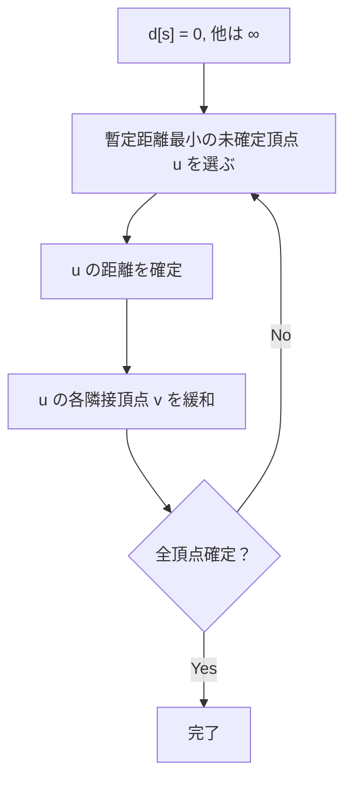

## Dijkstra法とは

**Dijkstra法** (ダイクストラ法) は、辺の重みが非負であるグラフにおいて、単一始点から全頂点への最短経路を求めるアルゴリズムである。1956年にエドガー・ダイクストラによって考案された。

優先度付きキュー (最小ヒープ) を用いた実装では $O((V + E) \log V)$ で動作する。

### 問題設定

重み付きグラフ $G = (V, E, w)$ ($w: E \to \mathbb{R}_{\geq 0}$) と始点 $s \in V$ が与えられたとき、$s$ から各頂点 $v$ への最短距離 $\delta(s, v)$ を求める。

**前提条件:** 全ての辺の重みが非負、すなわち $w(e) \geq 0$ for all $e \in E$。

## アルゴリズムの動作

### 基本方針

Dijkstra法は**貪欲法**に基づく。まだ最短距離が確定していない頂点のうち、暫定距離が最小の頂点を選び、その頂点の距離を確定させる。

1. $d[s] = 0$、他の全頂点は $d[v] = \infty$ で初期化
2. 暫定距離最小の未確定頂点 $u$ を選ぶ
3. $u$ の距離を確定させ、$u$ の各隣接頂点 $v$ について緩和 (relaxation) を行う
4. 全頂点が確定するまで 2-3 を繰り返す

### 緩和操作

辺 $(u, v)$ に対する緩和:

$$
\text{if } d[u] + w(u, v) < d[v] \text{ then } d[v] \leftarrow d[u] + w(u, v)
$$



### 直感的な理解

Dijkstra法は「最も近い未到達の場所から順に確定させていく」アルゴリズムである。始点から波が広がっていくイメージで、波が到達した頂点から順に距離を確定させる。波は重みが小さい辺ほど速く伝わる。

## 実装

### 優先度付きキューを用いた実装

```python title="dijkstra.py"
import heapq

def dijkstra(graph: list[list[tuple[int, int]]], start: int) -> list[int]:
    n = len(graph)
    INF = float('inf')
    dist = [INF] * n
    dist[start] = 0
    # (distance, vertex)
    pq = [(0, start)]

    while pq:
        d, u = heapq.heappop(pq)
        if d > dist[u]:
            continue  # outdated entry
        for v, w in graph[u]:
            if dist[u] + w < dist[v]:
                dist[v] = dist[u] + w
                heapq.heappush(pq, (dist[v], v))

    return dist
```

### 実装のポイント

- 優先度付きキューには同じ頂点が複数回入りうる。取り出したときに `d > dist[u]` なら古い情報なのでスキップする (lazy deletion)
- Python の `heapq` は最小ヒープなのでそのまま使える

## 正当性の証明

### 命題: Dijkstra法は非負重みグラフの最短距離を正しく計算する

**証明 (帰納法):**

確定した頂点の集合を $S$ とする。以下を帰納法で示す: 「頂点 $u$ が確定したとき、$d[u] = \delta(s, u)$」。

**基底:** $s$ が確定するとき、$d[s] = 0 = \delta(s, s)$。

**帰納段階:** 頂点 $u$ が確定するとき、$d[u] = \delta(s, u)$ を示す。

背理法で $d[u] > \delta(s, u)$ と仮定する。$s$ から $u$ への最短パスを考え、$S$ から出る最初の辺を $(x, y)$ とする ($x \in S$, $y \notin S$)。

帰納法の仮定より $d[x] = \delta(s, x)$。$y$ は $x$ の緩和で $d[y] \leq d[x] + w(x, y) = \delta(s, y)$ となっている。

アルゴリズムは暫定距離最小の頂点を選ぶので、$d[u] \leq d[y]$ である。

$$
d[u] \leq d[y] \leq \delta(s, y) \leq \delta(s, u)
$$

ここで最後の不等号は、辺の重みが非負であることから、$y$ を経由するパスの長さが $y$ までの距離以上であることによる。

これは $d[u] > \delta(s, u)$ に矛盾する。よって $d[u] = \delta(s, u)$。 $\square$

**注意:** この証明の最後のステップで $\delta(s, y) \leq \delta(s, u)$ を使うが、これは辺の重みが非負であることに依存する。負の辺があるとこの不等式が成り立たず、Dijkstra法は正しく動作しない。

## 計算量

| 実装 | 時間計算量 |
|------|------------|
| 配列 | $O(V^2)$ |
| 二分ヒープ | $O((V + E) \log V)$ |
| フィボナッチヒープ | $O(V \log V + E)$ |

疎グラフ ($E = O(V)$) では二分ヒープが効率的、密グラフ ($E = O(V^2)$) では配列が効率的である。

空間計算量はいずれも $O(V)$ (距離配列) + $O(V)$ (ヒープ) = $O(V)$。

## 応用

### 経路復元

距離だけでなく経路を求めたい場合は、各頂点の親を記録する。

### ダイアル法との関係

辺の重みが整数で最大値が $C$ のとき、バケットキューを用いると $O(V + E + C)$ で動作する (Dial's Algorithm)。

### A* 探索との関係

Dijkstra法にヒューリスティック関数を加えたものが A* 探索である。ヒューリスティックが許容的 (admissible) であれば最適解が保証される。

## まとめ

| 項目 | 内容 |
|------|------|
| 入力 | 非負重みグラフ $G$、始点 $s$ |
| 出力 | 各頂点への最短距離 $d[v]$ |
| 時間計算量 | $O((V + E) \log V)$ (二分ヒープ) |
| 空間計算量 | $O(V)$ |
| 核心 | 暫定距離最小の頂点から貪欲に確定 |
| 前提 | 全辺の重みが非負 |
| 応用 | 経路探索、ネットワークルーティング など |
