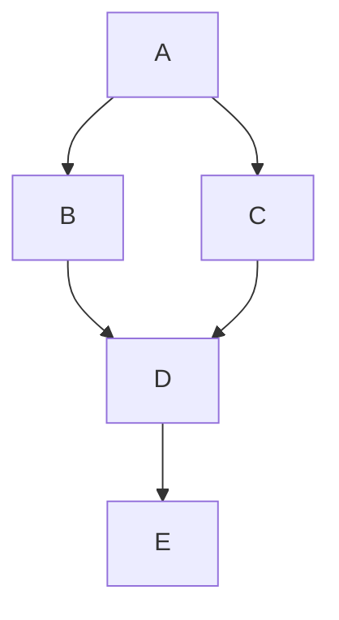
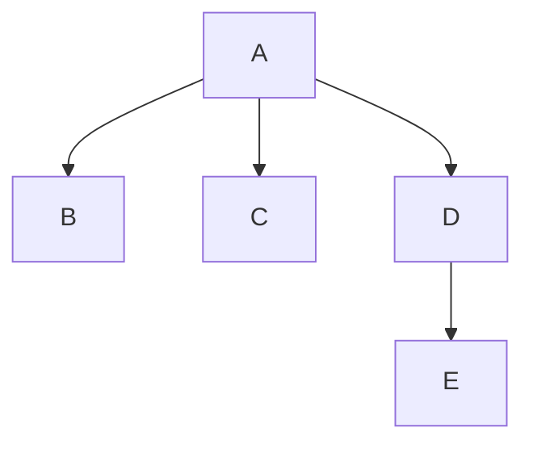
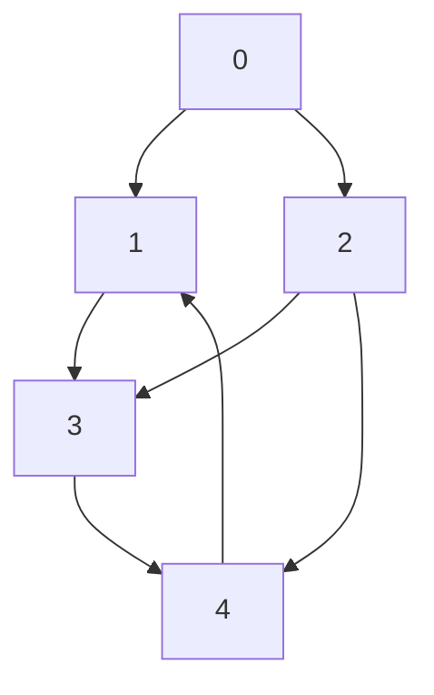

## Dominator Tree とは

有向グラフ $G = (V, E)$ と始点 $s$ に対して、Dominator Tree は各頂点の**支配者 (dominator)** の関係を木構造で表したものである。コンパイラ最適化における SSA (Static Single Assignment) 形式の構築や、制御フロー解析において中心的な役割を果たす。

### 定義

頂点 $d$ が頂点 $v$ を**支配する** (dominate) とは、$s$ から $v$ への全てのパスが $d$ を通ることである。形式的には、

$$
d \text{ dom } v \iff \text{$s$ から $v$ への任意のパス } s = v_0, v_1, \ldots, v_k = v \text{ に対して } d \in \{v_0, v_1, \ldots, v_k\}
$$

が成り立つ。$s$ は全ての頂点を支配し、各頂点は自分自身を支配する。

$v$ の**即時支配者** (immediate dominator, idom) は、$v$ を支配する頂点のうち $v$ 自身を除いて $v$ に最も近いものである。より正確には、$v \neq s$ に対して、

$$
\text{idom}(v) = d \iff d \text{ dom } v,\ d \neq v,\ \text{かつ } v \text{ を支配する任意の } d' \neq v \text{ に対して } d' \text{ dom } d
$$

$s$ 以外の全ての到達可能な頂点には一意な即時支配者が存在する。各頂点から即時支配者への辺を張ると木構造 (**Dominator Tree**) になる。

### 具体例

次の制御フローグラフ (始点 $A$) を考える。



各頂点の支配者を求める。

| 頂点 | 支配者の集合 | 即時支配者 |
|------|------------|-----------|
| $A$ | $\{A\}$ | なし (根) |
| $B$ | $\{A, B\}$ | $A$ |
| $C$ | $\{A, C\}$ | $A$ |
| $D$ | $\{A, D\}$ | $A$ |
| $E$ | $\{A, D, E\}$ | $D$ |

$D$ の即時支配者は $A$ である。$B$ や $C$ は $D$ を支配しない (パス $A \to C \to D$ は $B$ を通らず、$A \to B \to D$ は $C$ を通らない)。

対応する Dominator Tree は次のようになる。



### 支配者の性質

支配関係にはいくつかの重要な性質がある。

1. **推移性**: $a \text{ dom } b$ かつ $b \text{ dom } c$ ならば $a \text{ dom } c$
2. **反対称性**: $a \text{ dom } b$ かつ $b \text{ dom } a$ ならば $a = b$
3. **一意性**: $s$ 以外の任意の頂点 $v$ に対して $\text{idom}(v)$ は一意
4. **木構造**: 即時支配者関係は $s$ を根とする木を形成する

## 素朴なアプローチ

各頂点 $v$ について、$s$ から $v$ への全てのパスに共通して含まれる頂点を列挙すれば支配者を求められる。しかしパスの数は指数的になり得るので、これは現実的でない。

データフロー解析の枠組みで反復的に計算する方法がある。各頂点 $v$ の支配者集合 $\text{Dom}(v)$ を次の方程式で求める。

$$
\text{Dom}(v) = \{v\} \cup \bigcap_{p \in \text{pred}(v)} \text{Dom}(p)
$$

全頂点の支配者集合が安定するまで反復する。この方法は $O(V^2)$ の空間を使い、最悪 $O(V \cdot E)$ の時間がかかる。

## Lengauer-Tarjan アルゴリズム

Lengauer と Tarjan (1979) によるアルゴリズムは、**半支配者 (semi-dominator)** という概念を導入し、即時支配者を効率的に計算する。

### ステップ 1: DFS 番号の付与

始点 $s$ から DFS を行い、各頂点に DFS 発見順序 (preorder) の番号を付ける。以降、頂点を DFS 番号で参照する。DFS 番号が小さいほど DFS で早く訪問された頂点である。

DFS によって以下が得られる。

- **DFS 木**: DFS で使われた辺からなる木
- **DFS 番号**: 各頂点の訪問順序 $\text{dfn}(v)$
- **DFS 木の辺の分類**: 木辺、前方辺、後退辺、交差辺

### ステップ 2: 半支配者 (Semi-dominator) の計算

半支配者は即時支配者を求めるための中間的な概念である。

**定義**: 頂点 $v \neq s$ に対して、

$$
\text{sdom}(v) = \min \{ u \mid \exists \text{パス } u = w_0, w_1, \ldots, w_k = v\ (k \geq 1) \text{ で } w_1, \ldots, w_{k-1} \text{ の全てが } \text{dfn}(w_i) > \text{dfn}(v) \}
$$

すなわち、$v$ への「DFS 番号が $v$ より大きい中間頂点のみを経由する」パスの始点のうち、DFS 番号が最小のものである。

**直感的な理解**: 半支配者は「DFS 木を使わずに $v$ に到達できる最も早い頂点」と考えることができる。DFS 木のみを見ると $v$ の親が支配者の候補だが、DFS 木以外のパス (交差辺や後退辺) を経由して $v$ に到達できる頂点がある場合、支配者はもっと上に位置する可能性がある。半支配者はその「もっと上」の限界を示す。

**半支配者の計算**: DFS 番号の逆順 (大きい方から小さい方) に処理する。各頂点 $v$ について、$v$ の前任者 (predecessor) $u$ を調べ、次の 2 つの場合を考える。

1. $\text{dfn}(u) < \text{dfn}(v)$ の場合: $u$ 自身が半支配者の候補
2. $\text{dfn}(u) > \text{dfn}(v)$ の場合: $u$ から DFS 木の祖先方向に辿り、既に計算された半支配者の中で最小の DFS 番号を持つものが候補

この計算には Union-Find (Link-Eval) データ構造を使い、DFS 木上のパス中で半支配者の DFS 番号が最小の頂点を効率的に求める。

### ステップ 3: 即時支配者の計算

半支配者から即時支配者を求めるために、以下の定理を使う。

**定理 (Lengauer-Tarjan)**: $v \neq s$ とする。DFS 木において $\text{sdom}(v)$ から $v$ へのパス上の頂点 $u$ ($v$ は含まない) のうち、$\text{sdom}(u)$ の DFS 番号が最小のものを $u^*$ とする。

- $\text{sdom}(u^*) = \text{sdom}(v)$ ならば、$\text{idom}(v) = \text{sdom}(v)$
- $\text{sdom}(u^*) < \text{sdom}(v)$ は起こらない (半支配者の定義より)
- $\text{sdom}(u^*) > \text{sdom}(v)$ ならば、$\text{idom}(v) = \text{idom}(u^*)$

この定理により、半支配者の計算結果から即時支配者を 2 パスで求められる。

### 具体例でのアルゴリズム追跡

次のグラフで動作を追跡する (始点は頂点 0)。



**ステップ 1: DFS**

DFS 順: $0, 1, 3, 4, 2$ (DFS 番号はこの順に 0, 1, 2, 3, 4)

DFS 木の辺: $0 \to 1$, $1 \to 3$, $3 \to 4$, $0 \to 2$

非木辺: $2 \to 3$ (交差辺)、$2 \to 4$ (交差辺)、$4 \to 1$ (後退辺)

**ステップ 2: 半支配者** (DFS 番号の逆順に処理)

- $v = 2$ (dfn=4): pred = $\{0\}$, $\text{sdom}(2) = 0$
- $v = 4$ (dfn=3): pred = $\{3, 2\}$, dfn(3)=2 < dfn(4)=3 なので 3 が候補、dfn(2)=4 > dfn(4)=3 なので sdom(2)=0 が候補。$\text{sdom}(4) = \min(3, 0) = 0$
- $v = 3$ (dfn=2): pred = $\{1, 2\}$, dfn(1)=1 < dfn(3)=2 なので 1 が候補、dfn(2)=4 > dfn(3)=2 なので sdom(2)=0 が候補。$\text{sdom}(3) = \min(1, 0) = 0$
- $v = 1$ (dfn=1): pred = $\{0, 4\}$, dfn(0)=0 < dfn(1)=1 なので 0 が候補、dfn(4)=3 > dfn(1)=1 なので sdom(4)=0 が候補。$\text{sdom}(1) = 0$

**ステップ 3: 即時支配者**

全ての頂点の半支配者が $0$ なので、$\text{idom}(1) = \text{idom}(2) = \text{idom}(3) = \text{idom}(4) = 0$

### 実装 (Simple 版)

```python title="dominator_tree_lt.py"
def lengauer_tarjan(n, adj, root):
    # DFS numbering
    dfn = [-1] * n
    vertex = []  # vertex[dfn] -> original vertex
    parent = [-1] * n
    order = 0

    stack = [(root, False)]
    while stack:
        v, visited = stack.pop()
        if visited or dfn[v] != -1:
            continue
        dfn[v] = order
        vertex.append(v)
        order += 1
        for u in reversed(adj[v]):
            if dfn[u] == -1:
                parent[u] = v
                stack.append((u, False))

    # Compute semi-dominators
    pred = [[] for _ in range(n)]  # predecessors in original graph
    for u in range(n):
        for v in adj[u]:
            pred[v].append(u)

    sdom = list(range(n))  # sdom[v] = dfn of semi-dominator
    idom = [-1] * n
    best = list(range(n))
    dsu_parent = list(range(n))

    def find(v):
        if dsu_parent[v] == v:
            return v
        r = find(dsu_parent[v])
        if dfn[sdom[best[dsu_parent[v]]]] < dfn[sdom[best[v]]]:
            best[v] = best[dsu_parent[v]]
        dsu_parent[v] = r
        return r

    bucket = [[] for _ in range(n)]

    # Process vertices in reverse DFS order
    for i in range(order - 1, 0, -1):
        v = vertex[i]
        for u in pred[v]:
            if dfn[u] == -1:
                continue
            find(u)
            if dfn[sdom[best[u]]] < dfn[sdom[v]]:
                sdom[v] = sdom[best[u]]
        bucket[vertex[dfn[sdom[v]]]].append(v)
        dsu_parent[v] = parent[v]

        for u in bucket[parent[v]]:
            find(u)
            if sdom[best[u]] == sdom[u]:
                idom[u] = parent[v]
            else:
                idom[u] = best[u]
        bucket[parent[v]].clear()

    # Final pass: fix idom
    for i in range(1, order):
        v = vertex[i]
        if idom[v] != vertex[dfn[sdom[v]]]:
            idom[v] = idom[idom[v]]

    idom[root] = root
    return idom
```

## Cooper et al. の反復アルゴリズム

Cooper, Harvey, Kennedy (2001) による反復アルゴリズムは、実装が簡単で実用上も高速に動作する。

### アイデア

DFS の逆後順 (reverse postorder) で頂点を処理し、各頂点の即時支配者を反復的に更新する。更新が収束するまで繰り返す。

### intersect 関数

2 つの頂点の「最も近い共通支配者」を求める関数である。Dominator Tree 上の LCA (Lowest Common Ancestor) に相当する。

```python title="intersect.py"
def intersect(b1, b2, idom, dfn):
    finger1 = b1
    finger2 = b2
    while finger1 != finger2:
        while dfn[finger1] > dfn[finger2]:
            finger1 = idom[finger1]
        while dfn[finger2] > dfn[finger1]:
            finger2 = idom[finger2]
    return finger1
```

この関数は、2 つの頂点から同時に即時支配者を辿り上がり、合流する頂点を返す。DFS の逆後順番号を使うことで、番号が大きい方を先に親へ移動させる。

### 完全な実装

```python title="dominator_tree_cooper.py"
def compute_idom(n, adj, root):
    # 1. Build reverse postorder via DFS
    visited = [False] * n
    reverse_postorder = []

    def dfs(v):
        visited[v] = True
        for u in adj[v]:
            if not visited[u]:
                dfs(u)
        reverse_postorder.append(v)

    dfs(root)
    reverse_postorder.reverse()
    rpo_number = {v: i for i, v in enumerate(reverse_postorder)}

    # Build predecessor list
    pred = [[] for _ in range(n)]
    for u in range(n):
        for v in adj[u]:
            pred[v].append(u)

    # 2. Iteratively compute idom
    idom = [-1] * n
    idom[root] = root

    changed = True
    while changed:
        changed = False
        for v in reverse_postorder:
            if v == root:
                continue
            # Find first predecessor with known idom
            new_idom = -1
            for p in pred[v]:
                if idom[p] != -1:
                    new_idom = p
                    break
            if new_idom == -1:
                continue
            # Intersect with other processed predecessors
            for p in pred[v]:
                if p == new_idom:
                    continue
                if idom[p] != -1:
                    # Walk up until convergence
                    f1, f2 = new_idom, p
                    while f1 != f2:
                        while rpo_number[f1] > rpo_number[f2]:
                            f1 = idom[f1]
                        while rpo_number[f2] > rpo_number[f1]:
                            f2 = idom[f2]
                    new_idom = f1
            if idom[v] != new_idom:
                idom[v] = new_idom
                changed = True

    return idom
```

最悪計算量は $O(V^2)$ だが、実際の制御フローグラフでは 2-3 回の反復で収束することが多く、実用上は非常に高速である。

## 支配境界 (Dominance Frontier)

### 定義

頂点 $d$ の**支配境界** (dominance frontier) $\text{DF}(d)$ は、$d$ が支配する領域の「境界」に位置する頂点の集合である。

$$
\text{DF}(d) = \{ v \in V \mid d \text{ dom } \text{pred}(v) \text{ のいずれかを支配するが、} d \text{ は } v \text{ を厳密に支配しない} \}
$$

より正確には、

$$
\text{DF}(d) = \{ v \in V \mid (\exists u \in \text{pred}(v)\ .\ d \text{ dom } u) \wedge (d \text{ does not strictly dominate } v) \}
$$

ここで「$d$ が $v$ を厳密に支配する」とは $d \text{ dom } v$ かつ $d \neq v$ のことである。

### 計算方法

即時支配者が求まっていれば、支配境界は次のように効率的に計算できる。

```python title="dominance_frontier.py"
def compute_df(n, adj, idom, root):
    pred = [[] for _ in range(n)]
    for u in range(n):
        for v in adj[u]:
            pred[v].append(u)

    df = [set() for _ in range(n)]
    for v in range(n):
        if len(pred[v]) < 2:
            continue
        for p in pred[v]:
            runner = p
            while runner != idom[v]:
                df[runner].add(v)
                runner = idom[runner]
    return df
```

このアルゴリズムの計算量は $O(E \cdot D)$ であり、$D$ は Dominator Tree の深さである。

## 応用: SSA 形式の構築

SSA (Static Single Assignment) 形式はコンパイラ最適化で広く使われる中間表現である。SSA 形式では、各変数の定義が正確に 1 回だけ行われる。

SSA 形式の構築には支配境界が不可欠である。変数 $x$ がブロック $B$ で定義されているとき、$\text{DF}(B)$ に含まれる各ブロックの先頭に **$\phi$ 関数** ($\phi$-function) を挿入する必要がある。$\phi$ 関数は、制御フローの合流点で異なるパスから来る変数の値を統合する。

構築手順:

1. Dominator Tree を構築する
2. 支配境界を計算する
3. 各変数について、定義ブロックの支配境界に $\phi$ 関数を挿入する
4. 変数のリネーミングを Dominator Tree の DFS で行う

## 計算量

| アルゴリズム | 時間計算量 | 特徴 |
|------------|-----------|------|
| Lengauer-Tarjan (simple) | $O(E \log V)$ | Union-Find にパス圧縮のみ使用 |
| Lengauer-Tarjan (sophisticated) | $O(E \cdot \alpha(V))$ | Union-Find にランクとパス圧縮を使用 |
| Cooper et al. (iterative) | $O(V^2)$ 最悪 | 実用的には 2-3 反復で収束 |
| 支配境界の計算 | $O(E \cdot D)$ | $D$ は Dominator Tree の深さ |

Lengauer-Tarjan の sophisticated 版は、Union-Find の操作を洗練させることで、逆アッカーマン関数 $\alpha(V)$ のファクタまで計算量を落とす。実用上は simple 版で十分な場合が多い。

## まとめ

| 項目 | 内容 |
|------|------|
| 入力 | 有向グラフ、始点 |
| 出力 | 各頂点の即時支配者 (idom) / Dominator Tree |
| 時間計算量 | $O(E \cdot \alpha(V))$ (Lengauer-Tarjan) |
| 核心 | 半支配者 + Union-Find で即時支配者を効率計算 |
| 応用 | SSA 構築、制御フロー解析、支配境界の計算 |
