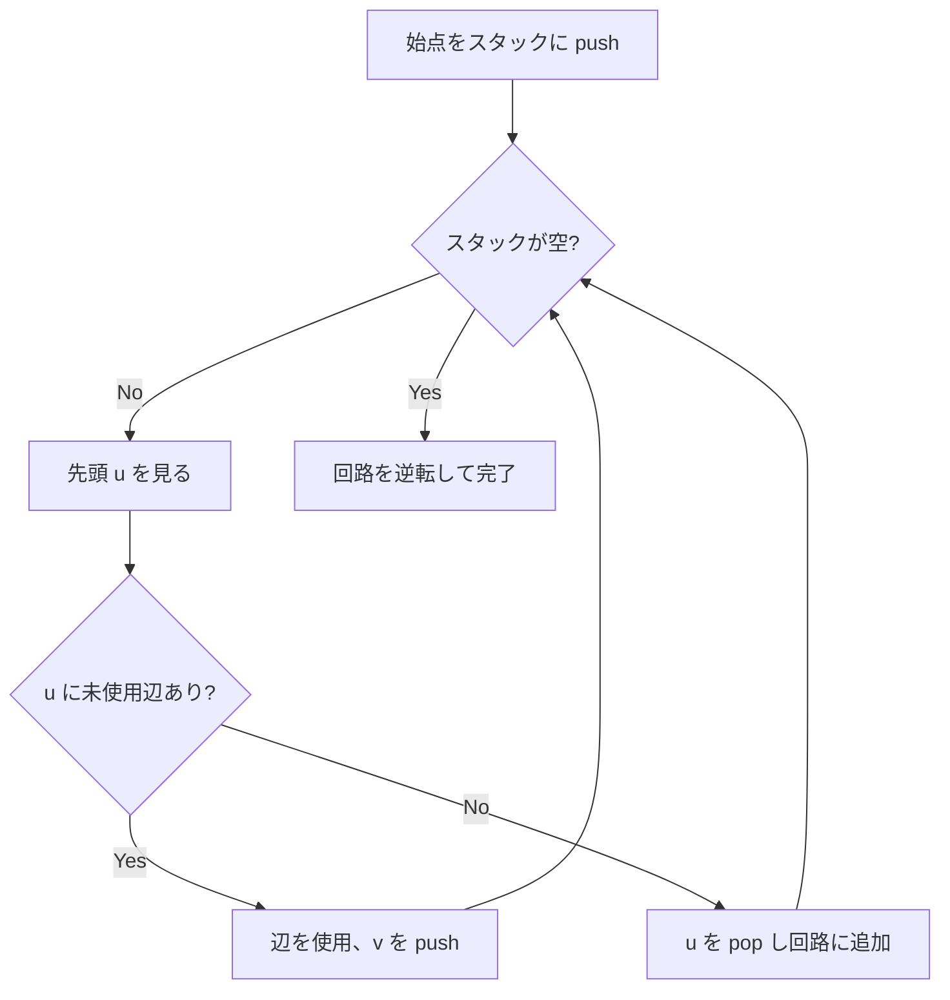

## オイラー路とオイラー閉路

### 定義

- **オイラー路 (Eulerian path)**: グラフの全ての辺をちょうど1回ずつ通る経路
- **オイラー閉路 (Eulerian circuit)**: 始点と終点が同じオイラー路

### 歴史

1736年、Euler はケーニヒスベルクの7つの橋の問題を解く中でオイラー閉路の概念を導入した。これがグラフ理論の起源とされている。

## 存在条件

### 無向グラフの場合

連結な無向グラフについて:

- **オイラー閉路が存在する** $\iff$ 全ての頂点の次数が偶数
- **オイラー路が存在する** $\iff$ 奇数次数の頂点がちょうど 0 個または 2 個

奇数次数の頂点が 2 個の場合、それらがオイラー路の始点と終点になる。

### 有向グラフの場合

連結な有向グラフについて:

- **オイラー閉路が存在する** $\iff$ 全頂点で入次数 = 出次数
- **オイラー路が存在する** $\iff$ 高々 1 頂点で出次数 - 入次数 = 1 (始点)、高々 1 頂点で入次数 - 出次数 = 1 (終点)、残りは入次数 = 出次数

## Hierholzer のアルゴリズム

### アルゴリズムの流れ

Hierholzer のアルゴリズムは、スタックを使って効率的にオイラー閉路/路を構築する。

1. 始点をスタックに push
2. スタックの先頭の頂点 $u$ から未使用の辺があれば:
   - その辺を使用済みにし、辺の先の頂点 $v$ をスタックに push
3. 未使用の辺がなければ:
   - $u$ をスタックから pop し、回路の配列に追加
4. スタックが空になるまで繰り返し
5. 回路の配列を逆転



### 実装

```python title="euler_path.py"
def euler_path(n: int, edges: list[tuple[int, int]]) -> list[int]:
    adj = [[] for _ in range(n)]
    for i, (u, v) in enumerate(edges):
        adj[u].append((v, i))
        adj[v].append((u, i))

    # Find start vertex
    degree = [0] * n
    for u, v in edges:
        degree[u] += 1
        degree[v] += 1

    start = 0
    for i in range(n):
        if degree[i] % 2 == 1:
            start = i
            break

    used = [False] * len(edges)
    adj_ptr = [0] * n
    stack = [start]
    circuit = []

    while stack:
        u = stack[-1]
        found = False
        while adj_ptr[u] < len(adj[u]):
            v, idx = adj[u][adj_ptr[u]]
            adj_ptr[u] += 1
            if used[idx]:
                continue
            used[idx] = True
            stack.append(v)
            found = True
            break
        if not found:
            stack.pop()
            circuit.append(u)

    circuit.reverse()
    return circuit
```

## なぜ Hierholzer のアルゴリズムは正しいのか

### 直感的な説明

スタックから頂点を pop して回路に追加するのは、その頂点から出る全ての辺が使用済みのときだけである。このとき、その頂点で「行き止まり」になっている。

オイラー閉路/路の存在条件 (次数の偶奇条件) が満たされていれば、行き止まりになるのは始点 (閉路の場合) または終点 (路の場合) だけである。

アルゴリズムは部分回路を発見しながら、それらを正しい順序で繋ぎ合わせていく。

## 計算量

| 操作 | 計算量 |
|------|--------|
| 隣接リスト構築 | $O(E)$ |
| 経路構築 | $O(E)$ |
| **合計** | $O(V + E)$ |

## 応用

- **DNA 配列アセンブリ**: DNA の断片から元の配列を再構築 (de Bruijn グラフのオイラー路)
- **一筆書き**: 全ての線を一度だけ通る経路
- **郵便配達人問題**: 全ての道路を少なくとも1回通る最短巡回 (中国人郵便配達人問題)
- **回路設計**: VLSI 設計でのワイヤの配置

## まとめ

| 項目 | 内容 |
|------|------|
| 入力 | 連結グラフ |
| 出力 | オイラー路またはオイラー閉路 |
| 存在条件 | 奇数次数頂点が 0 個 (閉路) または 2 個 (路) |
| 時間計算量 | $O(V + E)$ |
| 空間計算量 | $O(V + E)$ |
| 核心 | Hierholzer のスタックベース構築法 |
| 応用 | DNA アセンブリ、一筆書き |
