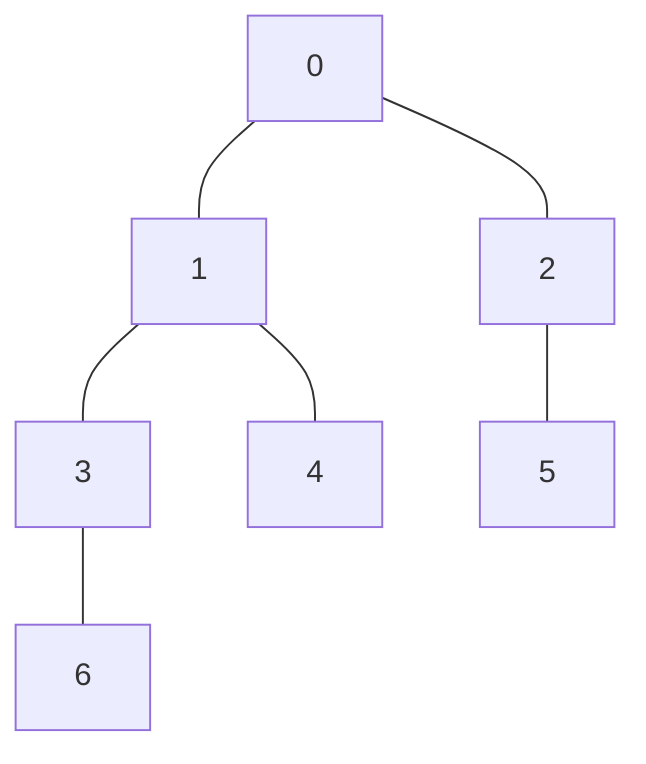

## Euler Tour とは

**Euler Tour** (オイラーツアー) は、根付き木を DFS で走査して得られる頂点の列である。木の構造を一次元配列に「平坦化」することで、部分木クエリやパスクエリを区間クエリに帰着させることができる。

## Euler Tour の種類

Euler Tour にはいくつかのバリエーションがある。

### 1. 入退出型 (tin/tout)

各頂点に「入る時刻 (tin)」と「出る時刻 (tout)」を記録する。列の長さは $2n$ である。

$$
\mathrm{tin}[u] < \mathrm{tin}[v] < \mathrm{tout}[v] < \mathrm{tout}[u] \iff v \text{ は } u \text{ の部分木に含まれる}
$$

### 2. 頂点再訪型

各辺を通るたびに頂点を記録する。列の長さは $2n - 1$ である。LCA の RMQ への帰着に使われる。

### 3. DFS 順 (DFS Order)

各頂点を最初に訪問した時刻のみ記録する。列の長さは $n$ で、部分木は連続区間になる。

本記事では主に 1 の入退出型を扱う。

## 定義と構築

### 構築アルゴリズム

```python title="euler_tour.py"
timer = 0
tin = [0] * n
tout = [0] * n
euler = []

def dfs(u, parent):
    global timer
    tin[u] = timer
    timer += 1
    euler.append(u)
    for v in adj[u]:
        if v != parent:
            dfs(v, u)
    tout[u] = timer
    timer += 1
    euler.append(u)
```

### 具体例



入退出型の Euler Tour:

| 時刻 | 0 | 1 | 2 | 3 | 4 | 5 | 6 | 7 | 8 | 9 | 10 | 11 | 12 | 13 |
|------|---|---|---|---|---|---|---|---|---|---|----|----|----|----|
| 頂点 | 0 | 1 | 3 | 6 | 6 | 3 | 4 | 4 | 1 | 2 | 5 | 5 | 2 | 0 |
| 種別 | in | in | in | in | out | out | in | out | out | in | in | out | out | out |

| 頂点 $v$ | 0 | 1 | 2 | 3 | 4 | 5 | 6 |
|----------|---|---|---|---|---|---|---|
| $\mathrm{tin}[v]$ | 0 | 1 | 9 | 2 | 6 | 10 | 3 |
| $\mathrm{tout}[v]$ | 13 | 8 | 12 | 5 | 7 | 11 | 4 |

## 重要な性質

### 性質 1: 部分木は連続区間

頂点 $u$ の部分木に含まれる頂点は、DFS 順 (tin で並べたとき) で連続した区間を形成する。

具体的には、頂点 $v$ が $u$ の部分木に含まれるのは $\mathrm{tin}[u] \leq \mathrm{tin}[v]$ かつ $\mathrm{tout}[v] \leq \mathrm{tout}[u]$ のときである。

**証明:** DFS の性質から明らか。$u$ を訪問してから $u$ の処理が完了するまでの間に、$u$ の部分木の全頂点が訪問される。 $\square$

### 性質 2: 祖先判定

頂点 $u$ が頂点 $v$ の祖先であることは、$\mathrm{tin}[u] \leq \mathrm{tin}[v]$ かつ $\mathrm{tout}[v] \leq \mathrm{tout}[u]$ で $O(1)$ 判定できる。

### 性質 3: DFS 順での部分木列挙

DFS 順で各頂点に番号 $\mathrm{tin}[v]$ を振ると、$u$ の部分木の頂点は区間 $[\mathrm{tin}[u], \mathrm{tin}[u] + \mathrm{size}(u) - 1]$ に対応する。

## 応用

### 部分木クエリ

部分木の和・最大値などのクエリを、区間データ構造 (セグメント木、BIT) で処理できる。

- 頂点 $v$ の値を配列の $\mathrm{tin}[v]$ 番目に格納
- $u$ の部分木の集約 = 区間 $[\mathrm{tin}[u], \mathrm{tin}[u] + \mathrm{size}(u) - 1]$ の集約

```python title="subtree_query.py"
# Build segment tree on DFS-ordered array
# a[tin[v]] = value[v]
def subtree_sum(u):
    return seg.query(tin[u], tin[u] + size[u] - 1)

def update_vertex(v, new_val):
    seg.update(tin[v], new_val)
```

### LCA への帰着

頂点再訪型の Euler Tour (長さ $2n - 1$) を構築し、深さ配列に対して RMQ を行うことで LCA を求められる。詳細は「LCA - Euler Tour + Sparse Table」の記事を参照。

### 部分木の頂点差分

$\mathrm{tin}$ で $+1$、$\mathrm{tout}$ で $-1$ をいもす法的に記録することで、部分木に対する差分更新が可能。

## 計算量

| 項目 | 計算量 |
|------|--------|
| Euler Tour 構築 | $O(n)$ |
| 祖先判定 | $O(1)$ |
| 部分木クエリ (セグメント木) | $O(\log n)$ |
| 空間計算量 | $O(n)$ |

## DFS Order と BFS Order の比較

| | DFS Order (Euler Tour) | BFS Order |
|---|---|---|
| 部分木 | 連続区間 | 不連続 |
| 同じ深さの頂点 | 不連続 | 連続区間 |
| 用途 | 部分木クエリ、LCA | レベルごとの処理 |

## まとめ

| 項目 | 内容 |
|------|------|
| 入力 | $n$ 頂点の根付き木 |
| 出力 | Euler Tour 列、tin/tout 配列 |
| 計算量 | $O(n)$ |
| 核心 | DFS 走査順で木を一次元配列に平坦化し、部分木を連続区間に対応させる |
| 応用 | 部分木クエリ、LCA、祖先判定、パスクエリ (HL 分解と組合せ) |
