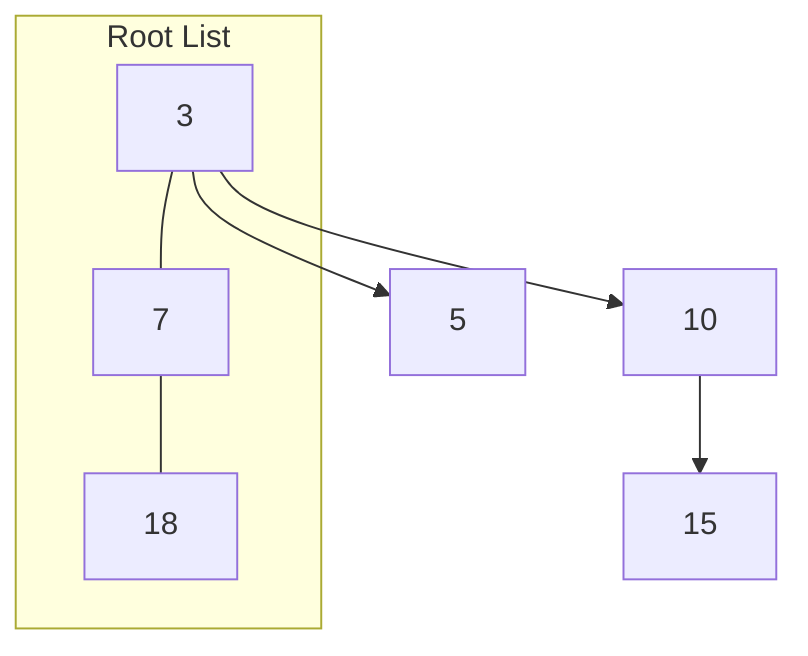

## Fibonacci Heap とは

Fibonacci Heap (フィボナッチヒープ) は、Michael L. Fredman と Robert E. Tarjan によって1987年に提案されたヒープデータ構造である。通常の二分ヒープと比べて、**insert** と **decrease-key** が償却 $O(1)$ で動作する点が大きな特徴であり、Dijkstra 法や Prim 法の計算量改善に寄与する。

### 操作の償却計算量

| 操作 | Fibonacci Heap | Binary Heap |
|------|---------------|-------------|
| insert | $O(1)$ | $O(\log n)$ |
| find-min | $O(1)$ | $O(1)$ |
| delete-min | $O(\log n)$ | $O(\log n)$ |
| decrease-key | $O(1)$ | $O(\log n)$ |
| merge | $O(1)$ | $O(n)$ |

## 構造

Fibonacci Heap は**根リスト (root list)** と呼ばれる循環二重連結リストで管理される木の集合で構成される。各ノードは以下のフィールドを持つ。

- `key`: キー値
- `degree`: 子の数
- `mark`: カットされた子があるかどうかのフラグ
- `parent`: 親ノードへのポインタ
- `child`: 子ノードのいずれかへのポインタ
- `left`, `right`: 兄弟ノードとの循環二重連結リスト

ヒープ全体は最小ノード `min` へのポインタと、ノード総数 `n` を保持する。



## 基本操作

### Insert

新しいノードを根リストに追加する。最小ノードポインタを必要に応じて更新する。

**償却計算量:** $O(1)$

```python title="insert.py"
def insert(H, x):
    # Create a new node with key x
    node = FibNode(x)
    # Add to root list
    add_to_root_list(H, node)
    # Update min pointer
    if H.min is None or node.key < H.min.key:
        H.min = node
    H.n += 1
```

### Find-Min

最小ノードポインタ `min` を返すだけである。

**計算量:** $O(1)$

### Merge (Union)

2 つの Fibonacci Heap の根リストを連結し、最小ノードポインタを更新する。

**償却計算量:** $O(1)$

### Delete-Min (Extract-Min)

最小ノードを削除する操作であり、Fibonacci Heap で最も重要な操作である。

1. 最小ノードの全ての子を根リストに移動する
2. 最小ノードを根リストから削除する
3. **Consolidate**: 根リスト内で同じ degree の木を統合する

Consolidate のプロセスでは、degree ごとに配列を用い、同じ degree の根が 2 つ見つかった場合にキーが大きい方を小さい方の子にする。これにより、各 degree の根が高々 1 つになる。

**償却計算量:** $O(\log n)$

```python title="extract_min.py"
def extract_min(H):
    z = H.min
    if z is not None:
        # Move all children to root list
        for child in z.children():
            add_to_root_list(H, child)
            child.parent = None
        # Remove z from root list
        remove_from_root_list(H, z)
        if z == z.right:
            H.min = None
        else:
            H.min = z.right
            consolidate(H)
        H.n -= 1
    return z
```

### Decrease-Key

ノードのキーを減少させる操作である。

1. ノードのキーを新しい値に更新する
2. ヒープ性質が壊れた場合 (キーが親より小さくなった場合)、ノードを**カット**して根リストに移動する
3. **カスケードカット**: 親が mark フラグを持っている場合、親もカットする。これを再帰的に行う

```python title="decrease_key.py"
def decrease_key(H, x, k):
    if k > x.key:
        raise ValueError("new key is greater than current key")
    x.key = k
    y = x.parent
    if y is not None and x.key < y.key:
        cut(H, x, y)
        cascading_cut(H, y)
    if x.key < H.min.key:
        H.min = x

def cut(H, x, y):
    # Remove x from child list of y
    remove_from_child_list(y, x)
    y.degree -= 1
    add_to_root_list(H, x)
    x.parent = None
    x.mark = False

def cascading_cut(H, y):
    z = y.parent
    if z is not None:
        if not y.mark:
            y.mark = True
        else:
            cut(H, y, z)
            cascading_cut(H, z)
```

**償却計算量:** $O(1)$

## ポテンシャル関数による償却解析

Fibonacci Heap の償却計算量はポテンシャル関数法で証明される。

### ポテンシャル関数

$$
\Phi(H) = t(H) + 2m(H)
$$

ここで $t(H)$ は根リスト内の木の数、$m(H)$ は mark フラグが立っているノードの数である。

### Insert の償却計算量

実コスト $O(1)$、ポテンシャルの増加 $\Delta\Phi = 1$ (根が 1 つ増える)。

$$
\hat{c} = O(1) + 1 = O(1)
$$

### Delete-Min の償却計算量

consolidate で $t(H)$ 本の根が最大 $O(\log n)$ 本に減る。実コスト $O(t(H) + D(n))$ に対し、ポテンシャルの減少が十分大きいため、

$$
\hat{c} = O(\log n)
$$

ここで $D(n)$ はノード数 $n$ のときの最大 degree であり、$D(n) \leq \lfloor \log_\phi n \rfloor$ ($\phi$ は黄金比) が成り立つ。

### Decrease-Key の償却計算量

カスケードカットで $c$ 回のカットが発生した場合、実コスト $O(c)$ だが、$c - 1$ 個の mark フラグが解除されるため、ポテンシャルの減少が $2(c - 1)$ 以上になり、

$$
\hat{c} = O(c) + 1 + 2 - 2(c - 1) = O(1)
$$

## 最大 degree の上界

Fibonacci Heap において、ノード数 $n$ のとき、任意のノードの degree は $O(\log n)$ である。

### 補題

degree $k$ のノードの部分木に含まれるノード数は少なくとも $F_{k+2} \geq \phi^k$ 個である。ここで $F_k$ はフィボナッチ数列の第 $k$ 項であり、$\phi = (1 + \sqrt{5})/2$ は黄金比である。

これが「フィボナッチヒープ」の名前の由来である。

**証明の概略:**

degree $k$ のノード $x$ の子を追加順に $y_1, y_2, \ldots, y_k$ とする。$y_i$ が $x$ の子になった時点で $x$ の degree は少なくとも $i - 1$ であった。consolidate で同じ degree 同士を統合するため、$y_i$ の degree はその時点で $i - 1$ 以上であった。その後カスケードカットで最大 1 つの子を失うので、$y_i$ の degree は $i - 2$ 以上。

$s_k$ を degree $k$ のノードの部分木の最小サイズとすると、

$$
s_k \geq 2 + \sum_{i=2}^{k} s_{i-2} \geq F_{k+2}
$$

フィボナッチ数列の性質 $F_{k+2} \geq \phi^k$ より、degree $k$ のノードの部分木は $\phi^k$ 以上のノードを含む。したがって $n \geq \phi^k$ より $k \leq \log_\phi n$。 $\square$

## 応用

Fibonacci Heap は以下のアルゴリズムで理論的な計算量改善に使われる。

- **Dijkstra 法**: $O(E + V \log V)$ (Binary Heap では $O((E + V) \log V)$)
- **Prim 法**: $O(E + V \log V)$

ただし、定数倍が大きいため、実用上は Binary Heap やその他の単純なヒープが好まれることも多い。

## まとめ

| 項目 | 内容 |
|------|------|
| データ構造 | 循環二重連結リストで管理される木の集合 |
| insert | 償却 $O(1)$ |
| find-min | $O(1)$ |
| delete-min | 償却 $O(\log n)$ |
| decrease-key | 償却 $O(1)$ |
| merge | $O(1)$ |
| 名前の由来 | 部分木の最小サイズがフィボナッチ数で下界されること |
