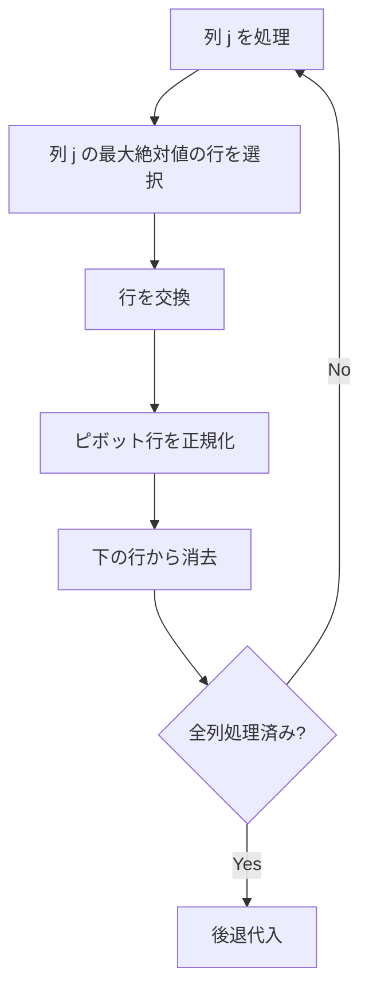

## ガウスの消去法とは

ガウスの消去法 (Gaussian Elimination) は、連立一次方程式を解くための基本的なアルゴリズムである。拡大係数行列に対して行基本変換を繰り返し、上三角行列 (行階段形) に変換した後、後退代入で解を求める。

### 問題設定

$n$ 元連立一次方程式

$$
\begin{cases}
a_{11}x_1 + a_{12}x_2 + \cdots + a_{1n}x_n = b_1 \\
a_{21}x_1 + a_{22}x_2 + \cdots + a_{2n}x_n = b_2 \\
\vdots \\
a_{n1}x_1 + a_{n2}x_2 + \cdots + a_{nn}x_n = b_n
\end{cases}
$$

を行列形式で $Ax = b$ と書く。拡大係数行列 $[A | b]$ に対して操作を行う。

### 具体例

$$
\begin{cases}
2x_1 + x_2 - x_3 = 8 \\
-3x_1 - x_2 + 2x_3 = -11 \\
-2x_1 + x_2 + 2x_3 = -3
\end{cases}
$$

の解は $x_1 = 2, x_2 = 3, x_3 = -1$ である。

## アルゴリズム

### 前進消去 (Forward Elimination)

列 $j = 0, 1, \ldots, n-1$ について順に処理する。

1. **ピボット選択:** 列 $j$ の行 $j$ 以降で絶対値最大の要素を持つ行を選ぶ (部分ピボット選択)
2. **行交換:** ピボット行と行 $j$ を交換する
3. **スケーリング:** 行 $j$ をピボット値で割って、対角要素を 1 にする
4. **消去:** 行 $j+1, j+2, \ldots, n-1$ から行 $j$ の適切な倍数を引いて、列 $j$ の要素を 0 にする



### 後退代入 (Back Substitution)

上三角行列が得られたら、下の行から順に変数の値を求める。

$$
x_i = b_i - \sum_{j=i+1}^{n-1} a_{ij} x_j
$$

### 実装

```python title="gaussian_elimination.py"
def gaussian_elimination(A: list[list[float]], b: list[float]) -> list[float]:
    n = len(A)
    # Build augmented matrix
    M = [A[i][:] + [b[i]] for i in range(n)]

    # Forward elimination
    for col in range(n):
        # Partial pivoting
        max_row = max(range(col, n), key=lambda r: abs(M[r][col]))
        M[col], M[max_row] = M[max_row], M[col]

        if abs(M[col][col]) < 1e-12:
            raise ValueError("Singular matrix")

        # Scale pivot row
        pivot = M[col][col]
        for j in range(col, n + 1):
            M[col][j] /= pivot

        # Eliminate below
        for row in range(col + 1, n):
            factor = M[row][col]
            for j in range(col, n + 1):
                M[row][j] -= factor * M[col][j]

    # Back substitution
    x = [0.0] * n
    for i in range(n - 1, -1, -1):
        x[i] = M[i][n]
        for j in range(i + 1, n):
            x[i] -= M[i][j] * x[j]
    return x
```

## 計算量

### 時間計算量

前進消去のステップ $j$ では、$n - j$ 行に対して $n - j + 1$ 要素の操作を行う。

$$
\sum_{j=0}^{n-1} (n - j)(n - j + 1) \approx \sum_{k=1}^{n} k^2 = \frac{n(n+1)(2n+1)}{6} = O(n^3)
$$

後退代入は $O(n^2)$ であるため、全体の時間計算量は $O(n^3)$ である。

### 空間計算量

拡大係数行列を in-place で変換すれば $O(n^2)$ (入力の分)。

## 部分ピボット選択の重要性

### 数値安定性

ピボット選択なしでは、小さいピボット値で割ることにより丸め誤差が増幅され、数値的に不安定になる。

例えば以下の系を考える。

$$
\begin{cases}
0.0001 x_1 + x_2 = 1 \\
x_1 + x_2 = 2
\end{cases}
$$

ピボット選択なしで $0.0001$ で割ると、$x_2$ の係数が $10000$ のオーダーになり、精度が大きく劣化する。

### 部分ピボット選択

各ステップで列の絶対値最大の要素をピボットに選ぶことで、この問題を緩和する。実用上、部分ピボット選択でほとんどのケースに対応できる。

### 完全ピボット選択

行と列の両方で最大要素を探す方法もあるが、列の入れ替えにより変数の順序が変わるため実装が複雑になる。実用上は部分ピボット選択で十分である。

## 行階段形と階数

ガウスの消去法の結果、ピボットが 0 でない行の数が行列の**階数 (rank)** である。

$$
\text{rank}(A) = \text{ピボットの数}
$$

これにより、連立方程式の解の存在と一意性を判定できる。

- $\text{rank}(A) = \text{rank}([A|b]) = n$: 一意解が存在
- $\text{rank}(A) = \text{rank}([A|b]) < n$: 無限に多くの解が存在
- $\text{rank}(A) < \text{rank}([A|b])$: 解なし

## Gauss-Jordan 消去法

後退代入の代わりに、上方向の消去も行って**簡約行階段形 (Reduced Row Echelon Form, RREF)** を求める方法を Gauss-Jordan 消去法と呼ぶ。

前進消去の各ステップで下だけでなく上の行からも消去する。

```python title="gauss_jordan.py"
def gauss_jordan(A, b):
    n = len(A)
    M = [A[i][:] + [b[i]] for i in range(n)]
    for col in range(n):
        max_row = max(range(col, n), key=lambda r: abs(M[r][col]))
        M[col], M[max_row] = M[max_row], M[col]
        pivot = M[col][col]
        for j in range(n + 1):
            M[col][j] /= pivot
        # Eliminate ALL other rows (not just below)
        for row in range(n):
            if row == col:
                continue
            factor = M[row][col]
            for j in range(n + 1):
                M[row][j] -= factor * M[col][j]
    return [M[i][n] for i in range(n)]
```

計算量は同じ $O(n^3)$ だが、後退代入が不要になる。

## 応用

| 応用 | 説明 |
|------|------|
| 連立方程式の求解 | 最も基本的な応用 |
| 逆行列の計算 | $[A | I]$ に Gauss-Jordan を適用して $[I | A^{-1}]$ を得る |
| 行列式の計算 | 前進消去で上三角にし、対角成分の積を計算 |
| 階数の計算 | ピボットの数が階数 |
| LU 分解 | ガウスの消去法の過程で $L$, $U$ を記録 |

## まとめ

| 項目 | 内容 |
|------|------|
| 入力 | $n \times n$ 係数行列 $A$, 定数ベクトル $b$ |
| 出力 | 解ベクトル $x$ |
| 時間計算量 | $O(n^3)$ |
| 空間計算量 | $O(n^2)$ |
| 核心 | 行基本変換による上三角化 + 後退代入 |
| 注意 | 部分ピボット選択で数値安定性を確保 |
