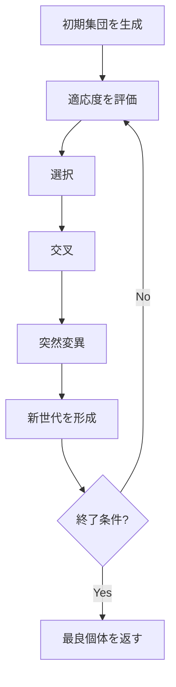

## 遺伝的アルゴリズムとは

遺伝的アルゴリズム (Genetic Algorithm, GA) は、**自然選択**と**遺伝**の仕組みを模倣したメタヒューリスティクスである。John Holland が 1975 年に提案した。

複数の解 (個体) からなる集団を維持し、選択・交叉・突然変異の操作を繰り返すことで、世代を重ねるごとに解の品質を向上させる。

## 基本用語

| 用語 | 意味 |
|------|------|
| 個体 (Individual) | 1 つの解候補 |
| 遺伝子 (Gene) | 解を構成する要素 |
| 染色体 (Chromosome) | 遺伝子の列 (解の表現) |
| 集団 (Population) | 個体の集合 |
| 適応度 (Fitness) | 解の評価値 |
| 世代 (Generation) | 1 回の選択・交叉・突然変異のサイクル |

## アルゴリズム

### 全体の流れ



### 1. 初期集団の生成

$N$ 個の個体をランダムに生成する。

```python title="ga_init.py"
def initialize_population(pop_size: int, gene_length: int) -> list[list[int]]:
    return [
        [random.randint(0, 1) for _ in range(gene_length)]
        for _ in range(pop_size)
    ]
```

### 2. 選択 (Selection)

適応度の高い個体を次世代の親として選ぶ。

#### ルーレット選択

適応度に比例した確率で選択する。個体 $i$ の選択確率は

$$
p_i = \frac{f_i}{\sum_{j=1}^{N} f_j}
$$

#### トーナメント選択

$k$ 個の個体をランダムに選び、その中で最も適応度の高い個体を親とする。$k$ が大きいほど選択圧が高い。

```python title="tournament_selection.py"
def tournament_selection(population, fitnesses, k=2):
    selected = random.sample(range(len(population)), k)
    winner = max(selected, key=lambda i: fitnesses[i])
    return population[winner]
```

### 3. 交叉 (Crossover)

2 つの親の遺伝子を組み合わせて子を生成する。

#### 一点交叉

ランダムな位置で親の遺伝子を切り替える。

$$
\text{Parent 1: } \underbrace{a_1 a_2 a_3}_{\text{前半}} \mid \underbrace{a_4 a_5}_{\text{後半}}
$$

$$
\text{Parent 2: } \underbrace{b_1 b_2 b_3}_{\text{前半}} \mid \underbrace{b_4 b_5}_{\text{後半}}
$$

$$
\text{Child: } a_1 a_2 a_3 \mid b_4 b_5
$$

#### 二点交叉

2 つの位置で区切り、中央部分を交換する。

#### 一様交叉

各遺伝子について 50% の確率でどちらの親から継承するか決める。

```python title="crossover.py"
def single_point_crossover(parent1, parent2):
    point = random.randint(1, len(parent1) - 1)
    child1 = parent1[:point] + parent2[point:]
    child2 = parent2[:point] + parent1[point:]
    return child1, child2
```

### 4. 突然変異 (Mutation)

各遺伝子を小さな確率で変化させる。探索の多様性を維持する役割がある。

```python title="mutation.py"
def mutate(individual, rate=0.01):
    return [
        1 - gene if random.random() < rate else gene
        for gene in individual
    ]
```

突然変異率が高すぎるとランダム探索に近くなり、低すぎると多様性が失われる。典型的には $1/L$ ($L$ は遺伝子長) 程度が使われる。

### 5. エリート保存 (Elitism)

最良の個体を次世代に必ず残す戦略。エリート保存がないと、最良解が失われる可能性がある。

## 完全な実装

```python title="genetic_algorithm.py"
import random

def genetic_algorithm(
    fitness_fn,
    gene_length: int,
    pop_size: int = 100,
    max_generations: int = 1000,
    crossover_rate: float = 0.8,
    mutation_rate: float = 0.01,
    tournament_size: int = 3,
):
    # Initialize
    population = [
        [random.randint(0, 1) for _ in range(gene_length)]
        for _ in range(pop_size)
    ]

    best = max(population, key=fitness_fn)

    for gen in range(max_generations):
        fitnesses = [fitness_fn(ind) for ind in population]

        new_pop = [list(best)]  # Elitism

        while len(new_pop) < pop_size:
            # Selection
            p1 = tournament_selection(population, fitnesses, tournament_size)
            p2 = tournament_selection(population, fitnesses, tournament_size)

            # Crossover
            if random.random() < crossover_rate:
                c1, c2 = single_point_crossover(p1, p2)
            else:
                c1, c2 = list(p1), list(p2)

            # Mutation
            c1 = mutate(c1, mutation_rate)
            c2 = mutate(c2, mutation_rate)

            new_pop.extend([c1, c2])

        population = new_pop[:pop_size]
        current_best = max(population, key=fitness_fn)
        if fitness_fn(current_best) > fitness_fn(best):
            best = current_best

    return best
```

## 理論的背景

### スキーマ定理 (Schema Theorem)

Holland のスキーマ定理は、GA の動作原理を説明する理論である。

**スキーマ**: 遺伝子の部分的なパターン (例: `1*0**1` の `*` は任意の値)。

- **次数** $o(H)$: スキーマ中の確定ビット数
- **定義長** $\delta(H)$: 最初と最後の確定ビット間の距離
- **適応度** $f(H)$: スキーマに属する個体の平均適応度

**定理:** 平均以上の適応度を持ち、短く低次のスキーマは、世代を重ねるごとに指数的に増加する。

$$
m(H, t+1) \geq m(H, t) \cdot \frac{f(H)}{\bar{f}} \cdot \left(1 - p_c \cdot \frac{\delta(H)}{L-1}\right) \cdot (1 - p_m)^{o(H)}
$$

ただし $m(H, t)$ は世代 $t$ でスキーマ $H$ に属する個体数、$\bar{f}$ は集団の平均適応度、$p_c$ は交叉率、$p_m$ は突然変異率。

### Building Block 仮説

GA は短い、低次の、高適応度のスキーマ (building blocks) を組み合わせることで、より良い解を構築していくという仮説。

## パラメータ設計

| パラメータ | 典型的な値 | 影響 |
|-----------|-----------|------|
| 集団サイズ | 50-200 | 大きいと多様性が高いが計算コスト増 |
| 交叉率 | 0.6-0.9 | 高いと探索力が増す |
| 突然変異率 | 0.001-0.05 | 高すぎるとランダム化 |
| トーナメントサイズ | 2-5 | 大きいと選択圧が高い |
| エリート数 | 1-5 | 最良解の保存 |

## 応用

- **関数最適化**: ブラックボックス最適化
- **組合せ最適化**: TSP、スケジューリング
- **機械学習**: ニューラルネットワークの構造探索 (NAS)
- **ゲーム AI**: 戦略の進化
- **工学設計**: アンテナ設計、翼形状最適化

## 他の進化計算手法

| 手法 | 特徴 |
|------|------|
| 遺伝的アルゴリズム (GA) | 二値/離散表現、交叉が中心 |
| 遺伝的プログラミング (GP) | プログラム (木構造) の進化 |
| 進化戦略 (ES) | 実数表現、突然変異が中心 |
| 差分進化 (DE) | 実数表現、差分ベクトルによる突然変異 |
| 粒子群最適化 (PSO) | 群れの動きを模倣 |

## まとめ

| 項目 | 内容 |
|------|------|
| 種類 | メタヒューリスティクス (進化計算) |
| 着想 | 自然選択と遺伝 |
| 操作 | 選択、交叉、突然変異 |
| 空間計算量 | $O(N \cdot L)$ ($N$: 集団サイズ, $L$: 遺伝子長) |
| 最適性 | 保証なし (ヒューリスティック) |
| 利点 | 汎用性が高い、並列化が容易 |
| 欠点 | パラメータ調整が必要、収束が遅い場合がある |
