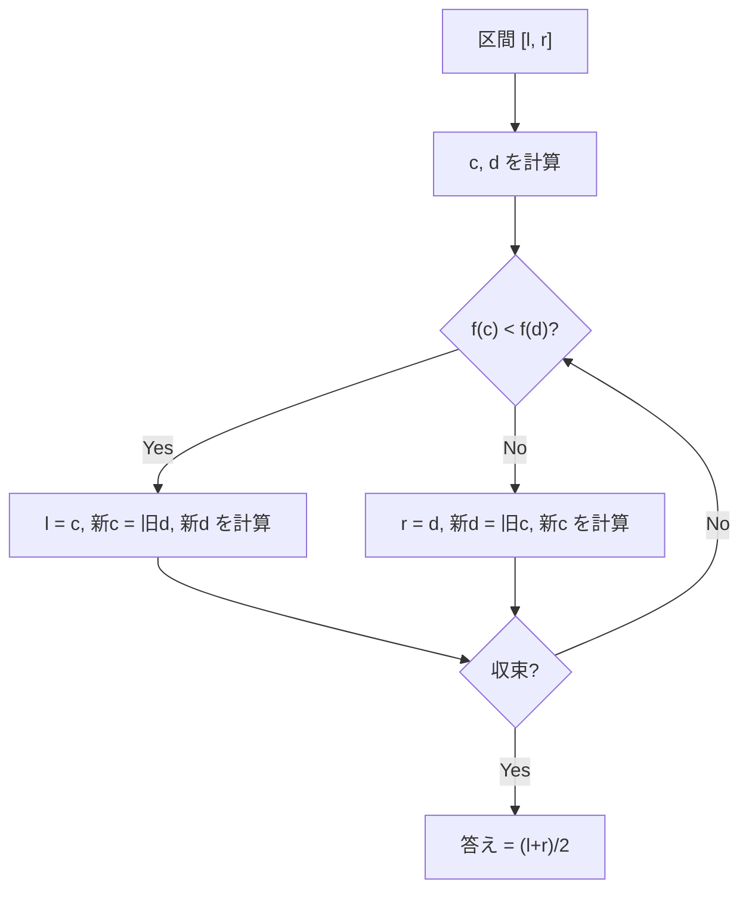

## 黄金分割探索とは

黄金分割探索 (Golden Section Search) は、**凸関数** (unimodal function) の極値を求めるアルゴリズムである。三分探索の改良版であり、**黄金比**の性質を利用して各反復での関数評価を 1 回に抑える。

### 三分探索の問題点

三分探索では各反復で 2 つの内点 $m_1, m_2$ を計算し、$f(m_1)$ と $f(m_2)$ の 2 回の関数評価が必要である。しかし、分割点の位置を適切に選べば、前回の評価結果を再利用でき、新たに必要な関数評価は 1 回で済む。

### 黄金比

黄金比 $\varphi = \frac{1 + \sqrt{5}}{2} \approx 1.618$ は以下の性質を持つ。

$$
\varphi^2 = \varphi + 1, \quad \frac{1}{\varphi} = \varphi - 1 \approx 0.618
$$

この性質が、分割点の再利用を可能にする。

## アルゴリズム

### 分割点の設計

区間 $[l, r]$ に対して、2 つの内点を次のように置く。

$$
c = l + (2 - \varphi)(r - l), \quad d = r - (2 - \varphi)(r - l)
$$

ここで $2 - \varphi = \frac{1}{\varphi^2} \approx 0.382$ である。

### 再利用の仕組み

上に凸な関数の最大値を求める場合に $f(c) < f(d)$ だったとする。区間を $[c, r]$ に縮小する。

新しい区間 $[c, r]$ に対して分割点を計算すると、**前回の $d$ が新しい $c$ の位置に一致する**。これは黄金比の性質による。

$$
c_{\text{new}} = c + (2 - \varphi)(r - c) = d
$$

したがって $f(d)$ は再計算不要であり、新しい $d$ の値だけを計算すればよい。



### 収束率

各反復で区間が $\frac{1}{\varphi} \approx 0.618$ 倍に縮小する。三分探索の $\frac{2}{3} \approx 0.667$ より速い。

しかも関数評価は各反復 1 回 (三分探索は 2 回)。関数評価あたりの収束率で比較すると:

| 手法 | 区間縮小率 | 関数評価/反復 | 評価あたり縮小率 |
|------|-----------|-------------|----------------|
| 三分探索 | $2/3 \approx 0.667$ | 2 | $\sqrt{2/3} \approx 0.816$ |
| 黄金分割探索 | $1/\varphi \approx 0.618$ | 1 | $0.618$ |

黄金分割探索は関数評価あたりの効率が約 25% 優れている。

## 実装

```python title="golden_section_search.py"
import math

def golden_section_search_max(f, lo: float, hi: float, eps: float = 1e-9) -> float:
    phi = (1 + math.sqrt(5)) / 2
    resp = 2 - phi  # ~0.382

    c = lo + resp * (hi - lo)
    d = hi - resp * (hi - lo)
    fc = f(c)
    fd = f(d)

    while hi - lo > eps:
        if fc < fd:
            lo = c
            c = d
            fc = fd
            d = hi - resp * (hi - lo)
            fd = f(d)
        else:
            hi = d
            d = c
            fd = fc
            c = lo + resp * (hi - lo)
            fc = f(c)

    return (lo + hi) / 2
```

### ポイント

- 初期化時に $f(c)$ と $f(d)$ の 2 回評価が必要
- 以降の各反復では 1 回の関数評価のみ
- 全体の関数評価回数は約 $\log_{\varphi}((r - l) / \varepsilon) + 1$ 回

## 正当性の証明

### 命題: 分割点の再利用が正しいこと

$f(c) < f(d)$ の場合、新しい区間 $[c, r]$ で $c_{\text{new}} = d$ を示す。

$$
c_{\text{new}} = c + (2 - \varphi)(r - c)
$$

$c = l + (2-\varphi)(r-l)$ より $r - c = r - l - (2-\varphi)(r-l) = (\varphi - 1)(r - l)$ なので

$$
c_{\text{new}} = c + (2-\varphi)(\varphi - 1)(r-l)
$$

$(2-\varphi)(\varphi-1) = 2\varphi - 2 - \varphi^2 + \varphi = 3\varphi - 2 - \varphi^2$ であり、$\varphi^2 = \varphi + 1$ より $3\varphi - 2 - \varphi - 1 = 2\varphi - 3$。

一方 $d = r - (2-\varphi)(r-l)$ なので $d - c = (r-l)(1 - 2(2-\varphi)) = (r-l)(2\varphi - 3)$。

よって $c_{\text{new}} = c + (2\varphi - 3)(r-l) = c + (d - c) = d$。 $\square$

## 計算量

### 時間計算量

$k$ 回の反復後の区間幅は $(\varphi - 1)^k (r - l)$ である。

精度 $\varepsilon$ を達成するのに必要な反復回数は

$$
k = O\left(\log_\varphi \frac{r - l}{\varepsilon}\right) = O\left(\log \frac{r - l}{\varepsilon}\right)
$$

### 空間計算量

$O(1)$。変数の数は定数個である。

## 応用

- **凸関数の最適化**: 三分探索の代替として広く使われる
- **物理シミュレーション**: 最適パラメータの探索
- **機械学習**: 学習率のライン探索
- **工学**: 黄金比が自然に現れる最適化問題

## まとめ

| 項目 | 内容 |
|------|------|
| 入力 | 凸関数 $f$, 区間 $[l, r]$ |
| 出力 | $f$ の極値を取る $x$ |
| 時間計算量 | $O(\log((r-l)/\varepsilon))$ |
| 空間計算量 | $O(1)$ |
| 関数評価回数 | 各反復で 1 回 (初回のみ 2 回) |
| 三分探索との比較 | 関数評価あたり約 25% 効率的 |
