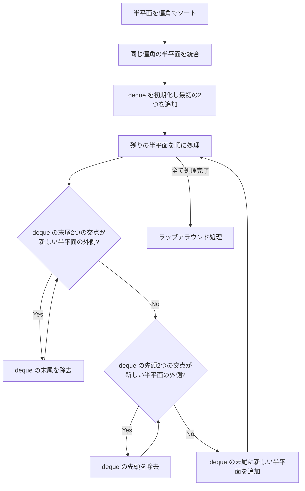

## 半平面交差とは

半平面とは、直線によって平面を2つに分けた片方の領域である。$n$ 個の半平面の **共通部分 (交差)** を求める問題を半平面交差問題と呼ぶ。

### 定義

半平面は $ax + by \leq c$ の形で表される。$n$ 個の半平面 $H_1, H_2, \ldots, H_n$ の交差は:

$$
R = \bigcap_{i=1}^{n} H_i
$$

$R$ は凸多角形 (有界でない場合もある) となる。これは半平面がそれぞれ凸集合であり、凸集合の交差は常に凸集合になるという性質による。

### 半平面の表現

実装上、半平面は境界直線上の方向ベクトルとオフセットで表現するのが便利である。直線 $ax + by = c$ の法線ベクトル $(a, b)$ に対して、方向ベクトルを $\vec{d} = (-b, a)$ とし、直線上の任意の一点 $p$ を保持する。このとき半平面は「方向ベクトルの左側」の領域として統一的に扱える。

偏角 (angle) は $\theta = \text{atan2}(d_y, d_x)$ で計算する。

## 逐次切断法

最も単純な方法は、現在の凸多角形を各半平面で順に切断していく方法である。

### アルゴリズム

1. 十分大きな初期凸多角形 (バウンディングボックス) を用意する
2. 各半平面 $H_i$ に対して、現在の凸多角形を $H_i$ で切断する
3. $n$ 回の切断後に残った凸多角形が結果

### 凸多角形の切断

凸多角形を直線 $ax + by = c$ で切断するには、Sutherland-Hodgman アルゴリズムの考え方を使う。各辺について:

- 両端点が半平面内 → 辺をそのまま保持
- 始点が内側、終点が外側 → 交点まで保持
- 始点が外側、終点が内側 → 交点から保持
- 両端点が外側 → 辺を除去

```python title="half_plane_intersection.py"
def clip_polygon(polygon, a, b, c):
    """polygon を ax + by <= c で切断"""
    result = []
    n = len(polygon)
    for i in range(n):
        cur = polygon[i]
        nxt = polygon[(i + 1) % n]
        cur_in = a * cur[0] + b * cur[1] <= c + 1e-9
        nxt_in = a * nxt[0] + b * nxt[1] <= c + 1e-9
        if cur_in:
            result.append(cur)
        if cur_in != nxt_in:
            # Compute intersection
            d1 = a * cur[0] + b * cur[1] - c
            d2 = a * nxt[0] + b * nxt[1] - c
            t = d1 / (d1 - d2)
            ix = cur[0] + t * (nxt[0] - cur[0])
            iy = cur[1] + t * (nxt[1] - cur[1])
            result.append((ix, iy))
    return result
```

各切断は凸多角形の頂点数 $m$ に対して $O(m)$ であり、最悪の場合 $m = O(n)$ となるため、全体の計算量は $O(n^2)$ である。

## $O(n \log n)$ アルゴリズム

半平面を偏角でソートし、両端キュー (deque) を用いて効率的に交差を計算する方法がある。このアルゴリズムは **ソート & インクリメンタル法** と呼ばれ、半平面交差問題の標準的な解法である。

### 核心アイデア

半平面を偏角順にソートすると、隣接する半平面同士の交点が交差領域の頂点候補になる。deque に半平面を追加する際、新しい半平面によって不要になった（交差領域に寄与しなくなった）古い半平面を効率的に除去できる。

### 前準備: 2直線の交点

2つの半平面 $H_i$, $H_j$ の境界直線の交点を求める関数が必要である。半平面 $H$ を点 $p$ と方向ベクトル $\vec{d}$ で表すとき、2直線の交点は以下で求められる。

$$
t = \frac{(\vec{p_j} - \vec{p_i}) \times \vec{d_j}}{\vec{d_i} \times \vec{d_j}}
$$

$$
\text{intersection} = \vec{p_i} + t \cdot \vec{d_i}
$$

ここで $\vec{d_i} \times \vec{d_j} = 0$ の場合、2直線は平行であり交点は存在しない。

### 詳細な手順



**Step 1: ソートと統合**

全半平面を偏角 $\theta$ の昇順でソートする。同じ偏角を持つ半平面（平行な半平面）が複数ある場合、最も制約が厳しいもの（最も内側にあるもの）だけを残す。

**Step 2: deque への逐次追加**

偏角順に半平面を処理する。新しい半平面 $H_{\text{new}}$ を追加する際、以下の除去操作を行う。

**末尾の除去条件:** deque の末尾の2つの半平面を $H_a$, $H_b$ (末尾が $H_b$) とする。$H_a$ と $H_b$ の境界直線の交点 $q$ が $H_{\text{new}}$ の外側にある場合、$H_b$ は最終的な交差に寄与しないため除去する。

**先頭の除去条件:** 同様に、deque の先頭の2つの半平面 $H_c$, $H_d$ (先頭が $H_c$) の交点 $q'$ が $H_{\text{new}}$ の外側にある場合、$H_c$ を除去する。

**Step 3: ラップアラウンド処理**

全ての半平面を処理した後、deque は「環状」になるべきだが、先頭と末尾の整合性を確認する必要がある。

- deque の末尾2つの交点が先頭の半平面の外側にある間、末尾を除去する
- deque の先頭2つの交点が末尾の半平面の外側にある間、先頭を除去する

この処理により、余分な半平面が除去され、最終的な交差領域の頂点列が得られる。

### 具体的な数値例

以下の4つの半平面で動作を追跡する。

- $H_1$: $y \leq 3$ (上側の制約、偏角 $0$)
- $H_2$: $x \leq 4$ (右側の制約、偏角 $\pi/2$)
- $H_3$: $y \geq 0$ (下側の制約、偏角 $\pi$)
- $H_4$: $x \geq 1$ (左側の制約、偏角 $-\pi/2$)

**ソート後の順序:** $H_4$ (偏角 $-\pi/2$), $H_1$ (偏角 $0$), $H_2$ (偏角 $\pi/2$), $H_3$ (偏角 $\pi$)

**処理の追跡:**

1. $H_4$ と $H_1$ を deque に追加 → deque: $[H_4, H_1]$、交点 $(1, 3)$
2. $H_2$ を処理: $H_4$ と $H_1$ の交点 $(1, 3)$ は $H_2$ ($x \leq 4$) の内側 → 除去不要。deque: $[H_4, H_1, H_2]$
3. $H_3$ を処理: $H_1$ と $H_2$ の交点 $(4, 3)$ は $H_3$ ($y \geq 0$) の内側 → 除去不要。deque: $[H_4, H_1, H_2, H_3]$
4. ラップアラウンド: $H_2$ と $H_3$ の交点 $(4, 0)$ は $H_4$ の内側、$H_4$ と $H_1$ の交点 $(1, 3)$ は $H_3$ の内側 → 変更なし

結果: 4つの交点 $(1, 3)$, $(4, 3)$, $(4, 0)$, $(1, 0)$ で構成される長方形。

### 実装

```python title="half_plane_intersection_nlogn.py"
import math
from collections import deque

class HalfPlane:
    def __init__(self, p, d):
        # p: point on the boundary line
        # d: direction vector (the half-plane is the left side of d)
        self.p = p
        self.d = d
        self.angle = math.atan2(d[1], d[0])

def cross2d(a, b):
    return a[0] * b[1] - a[1] * b[0]

def intersect(h1, h2):
    """Compute intersection point of two half-plane boundary lines"""
    dc = cross2d(h1.d, h2.d)
    diff = (h2.p[0] - h1.p[0], h2.p[1] - h1.p[1])
    t = cross2d(diff, h2.d) / dc
    return (h1.p[0] + t * h1.d[0], h1.p[1] + t * h1.d[1])

def is_outside(h, p):
    """Check if point p is outside half-plane h"""
    return cross2d(h.d, (p[0] - h.p[0], p[1] - h.p[1])) < -1e-9

def half_plane_intersection(planes):
    planes.sort(key=lambda h: h.angle)
    # Remove parallel duplicates (keep the tightest constraint)
    unique = [planes[0]]
    for i in range(1, len(planes)):
        if abs(planes[i].angle - unique[-1].angle) > 1e-9:
            unique.append(planes[i])
        else:
            # Keep the one further in the direction of the normal
            if cross2d(unique[-1].d,
                       (planes[i].p[0] - unique[-1].p[0],
                        planes[i].p[1] - unique[-1].p[1])) < 0:
                unique[-1] = planes[i]
    planes = unique
    if len(planes) < 3:
        return []

    dq = deque()
    dq.append(planes[0])
    dq.append(planes[1])

    for i in range(2, len(planes)):
        h = planes[i]
        while len(dq) >= 2 and is_outside(h, intersect(dq[-2], dq[-1])):
            dq.pop()
        while len(dq) >= 2 and is_outside(h, intersect(dq[0], dq[1])):
            dq.popleft()
        dq.append(h)

    # Wrap-around cleanup
    while len(dq) >= 3 and is_outside(dq[0], intersect(dq[-2], dq[-1])):
        dq.pop()
    while len(dq) >= 3 and is_outside(dq[-1], intersect(dq[0], dq[1])):
        dq.popleft()

    if len(dq) < 3:
        return []

    # Compute vertices
    vertices = []
    for i in range(len(dq)):
        vertices.append(intersect(dq[i], dq[(i + 1) % len(dq)]))
    return vertices
```

### 計算量の解析

**ソート:** $O(n \log n)$

**deque の処理:** 各半平面は deque に高々1回追加され、高々1回除去される。したがって全体で $O(n)$。

**合計:** $O(n \log n)$ (ソートがボトルネック)

## 実装上の注意点

### 浮動小数点誤差

計算幾何では浮動小数点誤差が深刻な問題を引き起こす。半平面交差では特に以下の点に注意が必要である。

- **交点計算の誤差:** 2直線がほぼ平行な場合、交点の精度が著しく低下する。外積 $\vec{d_i} \times \vec{d_j}$ が 0 に近い場合の処理が必要
- **内外判定の誤差:** `is_outside` 関数ではイプシロン ($\varepsilon \approx 10^{-9}$) を用いて判定する
- **偏角の比較:** `atan2` の結果を比較する際にもイプシロンが必要

整数座標の問題では、有理数演算や多倍長整数を用いることで誤差を完全に排除できる場合もある。

### 退化ケース

- **平行な半平面:** 同じ方向の半平面が複数ある場合、最も厳しい制約のみを残す
- **空の交差:** 矛盾する制約 (例: $x \leq 1$ と $x \geq 3$) がある場合、交差は空集合になる。deque の要素数が3未満になったら空を返す
- **非有界な交差:** 半平面が全方向をカバーしない場合、交差は無限領域になる。有界な結果が必要な場合は、大きなバウンディングボックスに対応する半平面を事前に追加する

## 線形計画法との関係

半平面交差は **2次元線形計画法 (2D Linear Programming)** と密接に関連する。

2次元線形計画法は、$n$ 個の線形不等式 (= 半平面) の制約下で線形目的関数を最適化する問題であり、これは半平面交差で得られる凸多角形の中で目的関数を最大化 (最小化) する頂点を求めることに等しい。

ランダム化増分法を用いると、2次元線形計画法は期待 $O(n)$ で解ける。これは半平面交差全体を求める $O(n \log n)$ よりも高速であり、最適値だけが必要な場合に有利である。

## 計算量

| 手法 | 時間計算量 |
|------|-----------|
| 逐次切断法 | $O(n^2)$ |
| ソート + deque | $O(n \log n)$ |
| 分割統治法 | $O(n \log n)$ |

## 応用

- 線形計画法の実行可能領域の可視化
- ボロノイ図の構築 (各母点の領域は半平面の交差)
- ロボティクスの可視領域計算
- カーネル計算 (多角形のカーネルは半平面交差で求められる)
- アートギャラリー問題の部分問題

## まとめ

| 項目 | 内容 |
|------|------|
| 入力 | $n$ 個の半平面 |
| 出力 | 共通部分の凸多角形 |
| 最適計算量 | $O(n \log n)$ |
| 核心 | 偏角ソート + deque による逐次構築 |
| 注意点 | 浮動小数点誤差、平行な半平面の処理 |
