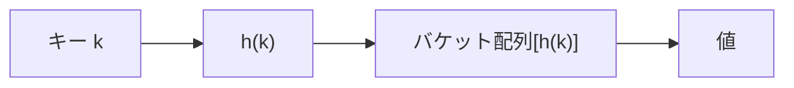

## Hash Table とは

Hash Table (ハッシュテーブル) は、**キー** を **ハッシュ関数** で変換し、配列のインデックスにマッピングすることで、キーと値のペアを効率的に管理するデータ構造である。

平均的な場合、挿入・検索・削除の全てが $O(1)$ で行える。

### 基本構造



ハッシュ関数 $h$ がキー $k$ を $[0, m)$ ($m$ はテーブルサイズ) の範囲の整数に変換する。

## ハッシュ関数

良いハッシュ関数の条件:

1. **決定的**: 同じキーに対して常に同じ値を返す
2. **一様分布**: キーが各バケットにできるだけ均等に分散する
3. **高速**: 計算が $O(1)$ (キーの長さに対して線形)

### 除算法

最も基本的なハッシュ関数:

$$
h(k) = k \bmod m
$$

$m$ は素数が望ましい。2のべき乗だと下位ビットだけが使われ衝突が増える。

### 乗算法

$$
h(k) = \lfloor m \cdot (kA \bmod 1) \rfloor
$$

ここで $A$ は定数 ($0 < A < 1$)。Knuth は $A \approx (\sqrt{5} - 1)/2 \approx 0.6180$ を推奨している。

## 衝突解決

異なるキーが同じバケットにマッピングされることを**衝突 (collision)** という。衝突は避けられないため (鳩の巣原理)、解決手法が必要である。

### チェイン法 (Separate Chaining)

各バケットに連結リストを持たせ、衝突したエントリをリストに追加する。

```python title="hash_table_chaining.py"
class HashTable:
    def __init__(self, size=16):
        self.size = size
        self.buckets = [[] for _ in range(size)]
        self.count = 0

    def _hash(self, key):
        return hash(key) % self.size

    def insert(self, key, value):
        h = self._hash(key)
        for i, (k, v) in enumerate(self.buckets[h]):
            if k == key:
                self.buckets[h][i] = (key, value)
                return
        self.buckets[h].append((key, value))
        self.count += 1

    def search(self, key):
        h = self._hash(key)
        for k, v in self.buckets[h]:
            if k == key:
                return v
        return None

    def delete(self, key):
        h = self._hash(key)
        for i, (k, v) in enumerate(self.buckets[h]):
            if k == key:
                self.buckets[h].pop(i)
                self.count -= 1
                return True
        return False
```

### オープンアドレス法 (Open Addressing)

衝突時に別の空きバケットを探す。代表的な探索法:

- **線形探索 (Linear Probing)**: $h(k, i) = (h(k) + i) \bmod m$
- **二次探索 (Quadratic Probing)**: $h(k, i) = (h(k) + c_1 i + c_2 i^2) \bmod m$
- **二重ハッシュ (Double Hashing)**: $h(k, i) = (h_1(k) + i \cdot h_2(k)) \bmod m$

```python title="hash_table_linear.py"
class OpenAddressHashTable:
    def __init__(self, size=16):
        self.size = size
        self.keys = [None] * size
        self.values = [None] * size
        self.deleted = [False] * size

    def _hash(self, key):
        return hash(key) % self.size

    def insert(self, key, value):
        h = self._hash(key)
        for i in range(self.size):
            idx = (h + i) % self.size
            if self.keys[idx] is None or self.deleted[idx]:
                self.keys[idx] = key
                self.values[idx] = value
                self.deleted[idx] = False
                return
            if self.keys[idx] == key:
                self.values[idx] = value
                return
        raise OverflowError("Hash table is full")

    def search(self, key):
        h = self._hash(key)
        for i in range(self.size):
            idx = (h + i) % self.size
            if self.keys[idx] is None and not self.deleted[idx]:
                return None
            if self.keys[idx] == key and not self.deleted[idx]:
                return self.values[idx]
        return None
```

## 計算量

負荷率 (load factor) を $\alpha = n / m$ ($n$: 要素数、$m$: テーブルサイズ) とする。

### チェイン法

| 操作 | 平均 | 最悪 |
|------|------|------|
| 挿入 | $O(1)$ | $O(n)$ |
| 検索 | $O(1 + \alpha)$ | $O(n)$ |
| 削除 | $O(1 + \alpha)$ | $O(n)$ |

$\alpha$ が定数 (例: $\alpha \leq 1$) に保たれていれば、全操作が期待 $O(1)$ である。

### 検索の期待計算量の導出

一様ハッシュを仮定する。チェイン法で検索に失敗する場合、期待される比較回数は $\alpha$ (バケット内の要素数の期待値) である。

検索に成功する場合、挿入時にそのエントリがリストの何番目に追加されたかに依存する。$i$ 番目に挿入された要素の検索コストの期待値は $1 + (i-1)/m$ であり、全要素について平均すると

$$
\frac{1}{n} \sum_{i=1}^{n} \left(1 + \frac{i-1}{m}\right) = 1 + \frac{n-1}{2m} \approx 1 + \frac{\alpha}{2}
$$

### リハッシュ

$\alpha$ が閾値を超えたら、より大きなテーブルを確保して全要素を再挿入する (**リハッシュ**)。テーブルサイズを 2 倍にすれば、挿入の償却計算量は $O(1)$ に保たれる。

## 応用

### 辞書/連想配列

Python の `dict`、Java の `HashMap`、JavaScript の `Map` や `Object` はすべてハッシュテーブルを基盤としている。

### 集合

要素の存在判定が $O(1)$ でできるため、集合の実装にも使われる (Python の `set`、Java の `HashSet`)。

### メモ化

再帰アルゴリズムの結果をキャッシュする際にハッシュテーブルが使われる。

### カウント

文字の出現頻度や単語の出現回数などのカウントに適している。

## まとめ

| 項目 | 内容 |
|------|------|
| データ構造 | Hash Table (ハッシュテーブル) |
| 基本操作 | insert, search, delete |
| 平均計算量 | $O(1)$ (全操作) |
| 最悪計算量 | $O(n)$ (全要素が同じバケットに衝突) |
| 空間計算量 | $O(n)$ |
| 衝突解決 | チェイン法、オープンアドレス法 |
| 主な応用 | 辞書、集合、メモ化、カウント |
