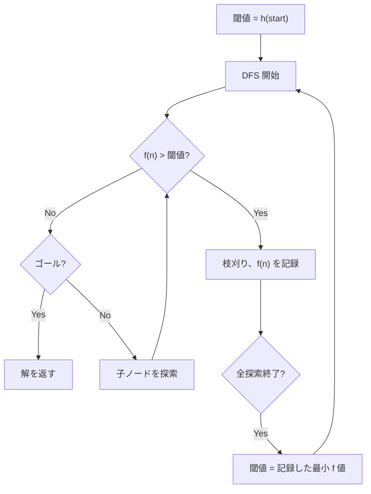

## IDA* とは

IDA* (Iterative Deepening A*) は、**反復深化深さ優先探索 (IDDFS)** と **A* のヒューリスティック関数** を組み合わせた探索アルゴリズムである。A* と同等の最適性を持ちながら、メモリ使用量が $O(d)$ ($d$ は解の深さ) で済む。

### A* の問題点

A* は最適な経路を見つけるが、Open リストに大量のノードを保持する必要があり、メモリ使用量が指数的に増加する場合がある。

### 反復深化のアイデア

反復深化は「深さ制限を徐々に増やしながら深さ優先探索を繰り返す」手法である。IDA* ではこの深さ制限の代わりに **$f$ 値の閾値** を使う。

$$
f(n) = g(n) + h(n)
$$

- $g(n)$: スタートからノード $n$ までの実コスト
- $h(n)$: ノード $n$ からゴールまでの推定コスト (ヒューリスティック)

## アルゴリズム

### 手順

1. 閾値を $f(\text{start}) = h(\text{start})$ に設定
2. 深さ優先探索を行い、$f(n) > \text{閾値}$ のノードを枝刈り
3. ゴールが見つかれば終了
4. 見つからなければ、枝刈りした中で最小の $f$ 値を新しい閾値として反復



### 疑似コード

```python title="ida_star.py"
def ida_star(start, goal, h, neighbors):
    threshold = h(start)

    def search(node, g, threshold, path):
        f = g + h(node)
        if f > threshold:
            return f  # minimum f exceeding threshold
        if node == goal:
            return "FOUND"

        min_t = float('inf')
        for next_node, cost in neighbors(node):
            if next_node not in path:
                path.add(next_node)
                t = search(next_node, g + cost, threshold, path)
                if t == "FOUND":
                    return "FOUND"
                min_t = min(min_t, t)
                path.remove(next_node)

        return min_t

    path = {start}
    while True:
        t = search(start, 0, threshold, path)
        if t == "FOUND":
            return threshold  # optimal cost
        if t == float('inf'):
            return None  # no solution
        threshold = t
```

## 正当性

### 最適性

IDA* はヒューリスティック $h$ が**許容的** (admissible) であれば最適解を返す。

**許容的とは:** 全てのノード $n$ に対して $h(n) \leq h^*(n)$ (実際のコスト以下) が成り立つこと。

**証明の概略:**

閾値は $h(\text{start}), t_1, t_2, \ldots$ と単調に増加する。最適解のコストを $C^*$ とすると、閾値が $C^*$ に達した反復で最適解が見つかる。$h$ が許容的なので、最適パス上のノードは $f(n) = g(n) + h(n) \leq C^*$ を満たし、枝刈りされない。一方、コスト $> C^*$ のパスは $f > C^*$ で枝刈りされる。

### 整合性がある場合

$h$ が**整合的** (consistent) であれば、各ノードの最初の訪問が最適であり、再訪問によるオーバーヘッドがない。

整合性: $h(n) \leq c(n, n') + h(n')$ (三角不等式)

## 計算量

### 時間計算量

最悪ケースでは、各反復で前の反復の探索を全てやり直す。しかし、反復深化と同様に最後の反復が支配的なので、実用上は A* と同程度の探索ノード数になる。

ヒューリスティックが整合的な場合、閾値ごとの反復回数は高々 $O(b^d)$ ($b$ は分岐率、$d$ は解の深さ)。反復回数はヒューリスティックの精度に依存する。

### 空間計算量

深さ優先探索ベースなので、**$O(d)$** のみ。A* の $O(b^d)$ と比較して劇的に少ない。

| アルゴリズム | 時間 | 空間 | 最適性 |
|------------|------|------|--------|
| BFS | $O(b^d)$ | $O(b^d)$ | Yes |
| A* | $O(b^d)$ | $O(b^d)$ | Yes (h が許容的) |
| IDDFS | $O(b^d)$ | $O(d)$ | Yes (コスト均一) |
| IDA* | $O(b^d)$ | $O(d)$ | Yes (h が許容的) |

## ヒューリスティック関数

### グリッド探索の場合

- **マンハッタン距離**: $h(n) = |x_n - x_g| + |y_n - y_g|$ (4方向移動)
- **チェビシェフ距離**: $h(n) = \max(|x_n - x_g|, |y_n - y_g|)$ (8方向移動)
- **ユークリッド距離**: $h(n) = \sqrt{(x_n - x_g)^2 + (y_n - y_g)^2}$

### 15パズルの場合

- **ミスプレース数**: 正しい位置にないタイルの数
- **マンハッタン距離の和**: 各タイルのマンハッタン距離の合計
- **パターンデータベース**: 部分問題の最適解をテーブル化

ヒューリスティックが正確であるほど枝刈りが効果的になり、探索ノード数が減少する。

## 応用

IDA* は以下のような問題で広く使われる:

- **スライドパズル** (15パズル、8パズル)
- **ルービックキューブ**
- **経路探索** (メモリが限られる場合)
- **組合せ最適化問題**

15パズルの最適解を求める場合、A* ではメモリが足りないことがあるが、IDA* なら解ける。

## まとめ

| 項目 | 内容 |
|------|------|
| 種類 | 最適経路探索 |
| ベース | 反復深化 + A* ヒューリスティック |
| 時間計算量 | $O(b^d)$ (ヒューリスティック依存) |
| 空間計算量 | $O(d)$ |
| 最適性 | Yes (h が許容的な場合) |
| 利点 | A* と同等の探索効率でメモリ $O(d)$ |
| 欠点 | 同じノードを複数回訪問する |
