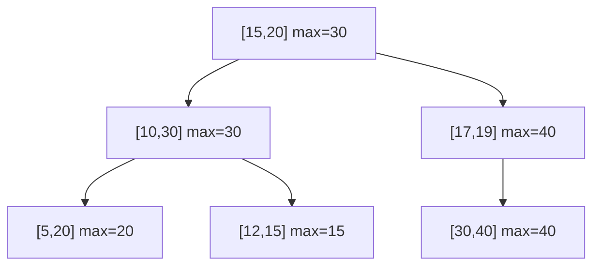

## Interval Tree とは

Interval Tree (区間木) は、区間の集合を管理し、与えられた区間やポイントと重なる区間を効率的に検索するためのデータ構造である。コンピュータグラフィックス、データベース、スケジューリングなど多くの応用がある。

### 問題設定

$n$ 個の区間 $[l_i, r_i]$ の集合 $S$ が与えられたとき、以下のクエリに答えたい:

- **Stabbing Query:** 点 $q$ を含む全ての区間を報告する
- **Overlap Query:** 区間 $[q_l, q_r]$ と重なる全ての区間を報告する

## 平衡二分探索木ベースの Interval Tree

最も一般的な実装は、二分探索木 (BST) を拡張したものである。各ノードが区間の左端点をキーとして持ち、さらに**部分木中の最大右端点** $\text{max}$ を補助情報として保持する。

### 構造

各ノード $x$ は以下を持つ:
- `interval`: 区間 $[l, r]$
- `max`: $x$ を根とする部分木に含まれる全区間の右端点の最大値
- `left`, `right`: 子ノード

$$
x.\text{max} = \max(x.\text{interval}.r,\ x.\text{left}.\text{max},\ x.\text{right}.\text{max})
$$



## Overlap Query

区間 $[q_l, q_r]$ と重なる区間を探すアルゴリズム:

```python title="interval_tree.py"
def query_overlap(node, q_low, q_high):
    results = []
    if node is None:
        return results
    # Check if current interval overlaps
    if node.interval.low <= q_high and q_low <= node.interval.high:
        results.append(node.interval)
    # Prune: if left child's max < q_low, no overlap in left subtree
    if node.left is not None and node.left.max >= q_low:
        results.extend(query_overlap(node.left, q_low, q_high))
    # Check right subtree
    if node.right is not None and node.right.max >= q_low:
        results.extend(query_overlap(node.right, q_low, q_high))
    return results
```

### 単一区間の検索

重なる区間が 1 つだけ必要な場合は、より効率的な枝刈りが可能:

```python title="interval_search.py"
def interval_search(node, q_low, q_high):
    while node is not None:
        if overlaps(node.interval, q_low, q_high):
            return node.interval
        if node.left is not None and node.left.max >= q_low:
            node = node.left
        else:
            node = node.right
    return None
```

**計算量:** $O(\log n)$ (平衡 BST を使用した場合)

### 正当性

左の子の max 値が $q_l$ 未満の場合、左部分木にはクエリ区間と重なる区間が存在しない。これは左部分木の全ての区間の右端点が $q_l$ 未満であることを意味するためである。

逆に、左の子の max 値が $q_l$ 以上の場合:
- 左部分木に重なる区間が存在するか、
- 左部分木の max を持つ区間の左端点がクエリ区間の右端以下であれば重なる

## 挿入と削除

### 挿入

通常の BST と同様に区間の左端点をキーとして挿入し、挿入パスに沿って max 値を更新する。

```python title="insert.py"
def insert(node, interval):
    if node is None:
        return IntervalNode(interval)
    if interval.low < node.interval.low:
        node.left = insert(node.left, interval)
    else:
        node.right = insert(node.right, interval)
    # Update max
    node.max = max(node.max, interval.high)
    return node
```

**計算量:** $O(\log n)$ (平衡 BST)

### 削除

BST の削除と同様に行い、削除パスに沿って max 値を再計算する。

## 計算量

| 操作 | 計算量 |
|------|--------|
| 構築 | $O(n \log n)$ |
| 挿入 | $O(\log n)$ |
| 削除 | $O(\log n)$ |
| 重なり検索 (1つ) | $O(\log n)$ |
| 重なり検索 (全て) | $O(\log n + k)$ ($k$ は結果数) |

## 応用

- **スケジューリング:** 時間区間の衝突検出
- **コンピュータグラフィックス:** ウィンドウのオーバーラップ検出
- **データベース:** 範囲クエリの処理
- **計算幾何:** 線分の交差判定

## まとめ

| 項目 | 内容 |
|------|------|
| データ構造 | BST + 部分木の最大右端点 |
| 主要操作 | 区間の重なり検索 |
| 検索計算量 | $O(\log n + k)$ |
| 核心 | max 値による枝刈り |
| 応用 | スケジューリング、CG、DB |
