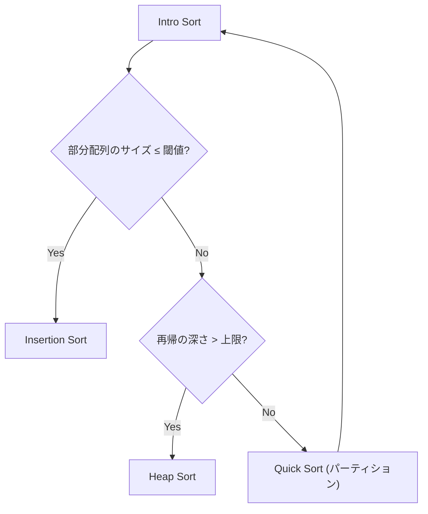

## Intro Sort とは

Intro Sort (Introspective Sort, イントロソート) は、David Musser が 1997 年に提案した**ハイブリッドソートアルゴリズム**である。Quick Sort の平均的な高速性を維持しつつ、最悪ケースの $O(n^2)$ 退化を防ぐために、再帰の深さに応じて Heap Sort に切り替える。さらに小規模な部分配列には Insertion Sort を使用する。

C++ の `std::sort` で広く採用されている。

## アルゴリズムの概要

### 3 つのアルゴリズムの組み合わせ



1. **Quick Sort** (主力): 平均 $O(n \log n)$ で高速
2. **Heap Sort** (フォールバック): 再帰が深くなりすぎた場合に $O(n \log n)$ を保証
3. **Insertion Sort** (仕上げ): 小規模データで高速

### 深さ上限

再帰の深さ上限は通常 $2 \lfloor \log_2 n \rfloor$ に設定する。Quick Sort がこの深さに達したら、現在の部分配列に対して Heap Sort に切り替える。

### 小規模閾値

部分配列のサイズが閾値 (通常 16) 以下の場合、Insertion Sort に切り替える。小規模データでは Insertion Sort が最も高速である。

## 実装

```python title="intro_sort.py"
import math

SIZE_THRESHOLD = 16

def intro_sort(a: list[int]) -> list[int]:
    max_depth = 2 * math.floor(math.log2(len(a))) if len(a) > 0 else 0
    _intro_sort(a, 0, len(a) - 1, max_depth)
    return a

def _intro_sort(a: list[int], lo: int, hi: int, depth: int):
    size = hi - lo + 1
    if size <= 1:
        return

    if size <= SIZE_THRESHOLD:
        # Insertion Sort for small arrays
        for i in range(lo + 1, hi + 1):
            key = a[i]
            j = i - 1
            while j >= lo and a[j] > key:
                a[j + 1] = a[j]
                j -= 1
            a[j + 1] = key
        return

    if depth == 0:
        # Heap Sort fallback
        heap_sort(a, lo, hi)
        return

    # Quick Sort with median-of-three
    pivot_idx = partition(a, lo, hi)
    _intro_sort(a, lo, pivot_idx - 1, depth - 1)
    _intro_sort(a, pivot_idx + 1, hi, depth - 1)
```

## 計算量

| ケース | 時間計算量 | 説明 |
|--------|-----------|------|
| 最良 | $O(n \log n)$ | |
| 平均 | $O(n \log n)$ | Quick Sort と同等 |
| 最悪 | $O(n \log n)$ | Heap Sort へのフォールバックで保証 |

**空間計算量:** $O(\log n)$ (再帰スタック)

### なぜ最悪 $O(n \log n)$ を保証できるか

Quick Sort の再帰が $2 \log n$ を超えると Heap Sort に切り替える。Heap Sort は最悪でも $O(n \log n)$ なので、全体の最悪計算量は $O(n \log n)$ に抑えられる。

深さ制限に達する前の Quick Sort の操作量は $O(n \log n)$ (各レベルで合計 $O(n)$ の操作を $O(\log n)$ レベル) である。

## 安定性

Intro Sort は**不安定ソート**である。Quick Sort も Heap Sort も不安定であるため。

## Median-of-Three

Intro Sort では通常、ピボット選択に**三要素の中央値 (Median-of-Three)** を使用する。部分配列の先頭・中央・末尾の 3 要素の中央値をピボットとすることで、最悪ケースの発生確率を大幅に下げる。

## 特徴と応用

### 長所

- 最悪計算量 $O(n \log n)$ 保証
- 平均性能は Quick Sort と同等
- in-place (追加メモリ $O(\log n)$)
- 実用上最速級のソートアルゴリズム

### 短所

- 不安定ソート
- 実装がやや複雑

### 採用実績

- C++ STL: `std::sort`
- .NET: `Array.Sort`
- Go: `sort.Sort` (の基盤)

## まとめ

| 項目 | 内容 |
|------|------|
| 時間計算量 (最良/平均/最悪) | $O(n \log n)$ / $O(n \log n)$ / $O(n \log n)$ |
| 空間計算量 | $O(\log n)$ |
| 安定性 | 不安定 |
| in-place | はい |
| 手法 | Quick Sort + Heap Sort + Insertion Sort のハイブリッド |
