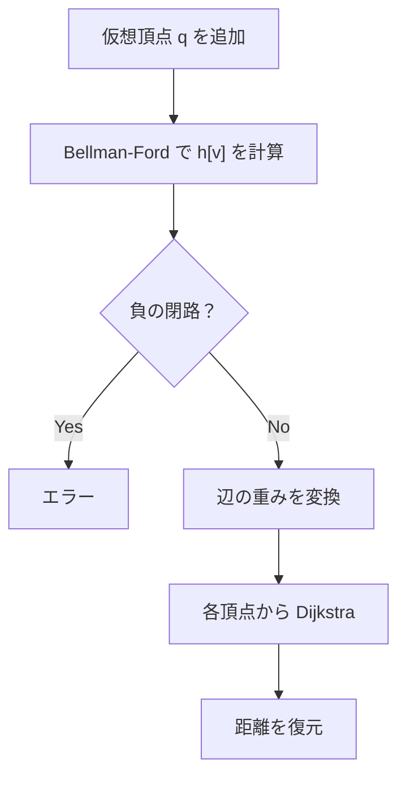

## Johnson's Algorithm とは

**Johnson's Algorithm** (ジョンソンのアルゴリズム) は、負の重みを持つ辺が存在する疎グラフにおいて、全頂点対間の最短経路を効率的に求めるアルゴリズムである。1977年にドナルド・B・ジョンソンによって提案された。

Bellman-Ford法でポテンシャルを計算した後、辺の重みを非負に変換してDijkstra法を各頂点から実行する。

### Warshall-Floyd法との比較

疎グラフ ($E = O(V)$) では:
- Warshall-Floyd法: $O(V^3)$
- Johnson's Algorithm: $O(V^2 \log V + VE)$

疎グラフでは Johnson's Algorithm の方が高速である。

## アルゴリズムの動作

### 全体の流れ

1. **仮想頂点の追加**: 新頂点 $q$ を追加し、$q$ から全頂点へ重み $0$ の辺を張る
2. **Bellman-Ford法**: $q$ を始点として Bellman-Ford法を実行し、ポテンシャル $h[v]$ を計算
3. **辺の重みの変換**: 各辺 $(u, v)$ の重みを $\hat{w}(u, v) = w(u, v) + h[u] - h[v]$ に変換
4. **Dijkstra法**: 各頂点を始点として Dijkstra法を実行
5. **距離の復元**: $\delta(u, v) = \hat{\delta}(u, v) - h[u] + h[v]$



### ポテンシャルと辺の重みの変換

ポテンシャル $h[v]$ は仮想頂点 $q$ からの最短距離である。変換後の重み:

$$
\hat{w}(u, v) = w(u, v) + h[u] - h[v]
$$

## 正当性の証明

### 命題: 変換後の重みは非負である

**証明:**

Bellman-Ford法の結果、三角不等式 $h[v] \leq h[u] + w(u, v)$ が全辺 $(u, v)$ について成立する。

$$
\hat{w}(u, v) = w(u, v) + h[u] - h[v] \geq 0
$$

三角不等式を変形すると $w(u, v) + h[u] - h[v] \geq 0$ が得られるため。 $\square$

### 命題: 変換後のグラフの最短パスと元のグラフの最短パスは一致する

**証明:**

パス $p = v_0 \to v_1 \to \cdots \to v_k$ の変換後の重みの合計:

$$
\sum_{i=0}^{k-1} \hat{w}(v_i, v_{i+1}) = \sum_{i=0}^{k-1} (w(v_i, v_{i+1}) + h[v_i] - h[v_{i+1}])
$$

テレスコーピング (望遠鏡和) により:

$$
= \left(\sum_{i=0}^{k-1} w(v_i, v_{i+1})\right) + h[v_0] - h[v_k]
$$

すなわち、パスの変換後の重みは元の重みに始点と終点のポテンシャル差 $h[v_0] - h[v_k]$ を加えたものになる。

この差は始点と終点だけで決まり、経路には依存しない。したがって、$v_0$ から $v_k$ への最短パスは変換前後で変わらない。 $\square$

## 実装

```python title="johnson.py"
import heapq

def johnson(n: int, edges: list[tuple[int, int, int]]) -> list[list[float]] | None:
    INF = float('inf')

    # Step 1: Add virtual vertex q = n
    bf_edges = edges + [(n, v, 0) for v in range(n)]
    h = [INF] * (n + 1)
    h[n] = 0

    # Step 2: Bellman-Ford from q
    for _ in range(n):
        for u, v, w in bf_edges:
            if h[u] < INF and h[u] + w < h[v]:
                h[v] = h[u] + w

    # Negative cycle check
    for u, v, w in bf_edges:
        if h[u] < INF and h[u] + w < h[v]:
            return None  # negative cycle

    # Step 3: Reweight edges
    adj = [[] for _ in range(n)]
    for u, v, w in edges:
        adj[u].append((v, w + h[u] - h[v]))

    # Step 4: Dijkstra from each vertex
    dist = [[INF] * n for _ in range(n)]
    for s in range(n):
        d = [INF] * n
        d[s] = 0
        pq = [(0, s)]
        while pq:
            du, u = heapq.heappop(pq)
            if du > d[u]:
                continue
            for v, w in adj[u]:
                if d[u] + w < d[v]:
                    d[v] = d[u] + w
                    heapq.heappush(pq, (d[v], v))
        # Step 5: Restore distances
        for v in range(n):
            if d[v] < INF:
                dist[s][v] = d[v] - h[s] + h[v]

    return dist
```

## 計算量

| 項目 | 計算量 |
|------|--------|
| Bellman-Ford | $O(VE)$ |
| Dijkstra $\times V$ 回 | $O(V(V + E) \log V)$ |
| 全体 | $O(VE + V^2 \log V)$ |
| 空間計算量 | $O(V^2)$ |

疎グラフ ($E = O(V)$) では $O(V^2 \log V)$ となり、Warshall-Floyd の $O(V^3)$ より高速。

密グラフ ($E = O(V^2)$) では $O(V^3 \log V)$ となり、Warshall-Floyd の方が高速。

## 応用

### 疎グラフの全点対最短路

疎グラフで負の辺がある場合の標準的なアルゴリズムである。

### ポテンシャルの概念

辺の重みを非負に変換するポテンシャルの技法は、最小費用流など他のアルゴリズムでも使われる重要な概念である。

## まとめ

| 項目 | 内容 |
|------|------|
| 入力 | 重み付き有向グラフ $G = (V, E, w)$ |
| 出力 | 全頂点対間の最短距離行列 |
| 時間計算量 | $O(VE + V^2 \log V)$ |
| 空間計算量 | $O(V^2)$ |
| 核心 | ポテンシャルによる辺の重みの非負化 |
| 利点 | 疎グラフで Warshall-Floyd より高速 |
| 前提 | 負の閉路がないこと |
