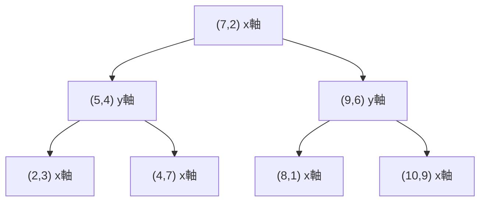

## k-d Tree とは

k-d Tree (k-dimensional tree) は、$k$ 次元空間の点集合を管理するための空間分割データ構造である。1975年に Jon Bentley によって提案された。最近傍探索、範囲探索などの空間クエリを効率的に処理できる。

### 構造

k-d Tree は二分探索木の一種であり、各レベルで交互に異なる次元を分割軸として使用する。

- 深さ 0 のノードは $x$ 軸で分割
- 深さ 1 のノードは $y$ 軸で分割
- 深さ $d$ のノードは第 $d \bmod k$ 軸で分割



## 計算量

| 操作 | 平均 | 最悪 |
|------|------|------|
| 構築 | $O(n \log n)$ | $O(n \log n)$ |
| 挿入 | $O(\log n)$ | $O(n)$ |
| 最近傍探索 | $O(\log n)$ | $O(n)$ |
| 範囲探索 | $O(\sqrt{n} + k)$ | $O(n)$ |

($k$ は報告する点の数)

## 構築

効率的に構築するには、各レベルで中央値を分割点とする。

```python title="build.py"
def build(points, depth=0):
    if not points:
        return None
    k = len(points[0])  # dimensions
    axis = depth % k
    # Sort by current axis and pick median
    points.sort(key=lambda p: p[axis])
    mid = len(points) // 2
    node = KdNode(
        point=points[mid],
        left=build(points[:mid], depth + 1),
        right=build(points[mid + 1:], depth + 1),
        axis=axis,
    )
    return node
```

各レベルで中央値を選ぶことで、木の高さが $O(\log n)$ に保たれる。ソートには $O(n \log n)$ かかるが、median-of-medians アルゴリズムを使えば $O(n)$ で中央値を選択でき、全体で $O(n \log n)$ の構築が可能。

## 最近傍探索

点 $q$ に最も近い点を探す。

```python title="nearest_neighbor.py"
def nearest(node, query, depth=0, best=None, best_dist=float('inf')):
    if node is None:
        return best, best_dist
    k = len(query)
    axis = depth % k
    # Update best
    dist = distance(node.point, query)
    if dist < best_dist:
        best = node.point
        best_dist = dist
    # Decide which subtree to search first
    diff = query[axis] - node.point[axis]
    if diff <= 0:
        first, second = node.left, node.right
    else:
        first, second = node.right, node.left
    # Search closer subtree
    best, best_dist = nearest(first, query, depth + 1, best, best_dist)
    # Check if we need to search the other subtree
    if abs(diff) < best_dist:
        best, best_dist = nearest(second, query, depth + 1, best, best_dist)
    return best, best_dist
```

### 枝刈りの原理

分割超平面からクエリ点までの距離が現在の最良距離より大きい場合、反対側の部分木には最近傍が存在しないため枝刈りできる。

平均的には多くの部分木が枝刈りされ、$O(\log n)$ の探索時間となる。ただし、最悪の場合 (点が特殊な分布を持つ場合) は $O(n)$ になりうる。

## 範囲探索

矩形領域 $R$ に含まれる全ての点を報告する。

```python title="range_search.py"
def range_search(node, region, depth=0, results=None):
    if node is None:
        return results
    if results is None:
        results = []
    axis = depth % len(node.point)
    # Check if current point is in region
    if point_in_region(node.point, region):
        results.append(node.point)
    # Check if left subtree may contain points
    if region[axis][0] <= node.point[axis]:
        range_search(node.left, region, depth + 1, results)
    # Check if right subtree may contain points
    if region[axis][1] >= node.point[axis]:
        range_search(node.right, region, depth + 1, results)
    return results
```

2次元の場合、範囲探索の計算量は $O(\sqrt{n} + k)$ ($k$ は報告する点の数) であることが知られている。

## 高次元での注意

k-d Tree は低次元 (2~3次元程度) では非常に効率的だが、次元が高くなると枝刈りの効果が薄れ、性能が劣化する。これは**次元の呪い** (curse of dimensionality) として知られる現象である。

高次元では、ほとんどの部分木を探索する必要があり、事実上全探索に近い性能になる。高次元空間では近似最近傍探索 (ANN) やハッシュベースの手法が有効である。

## まとめ

| 項目 | 内容 |
|------|------|
| データ構造 | 空間分割二分木 |
| 分割軸 | 深さに応じて次元を巡回 |
| 構築 | $O(n \log n)$ |
| 最近傍探索 | 平均 $O(\log n)$ |
| 適用次元 | 低次元 (2~3次元) で効率的 |
| 応用 | 最近傍探索、範囲探索、衝突検出 |
