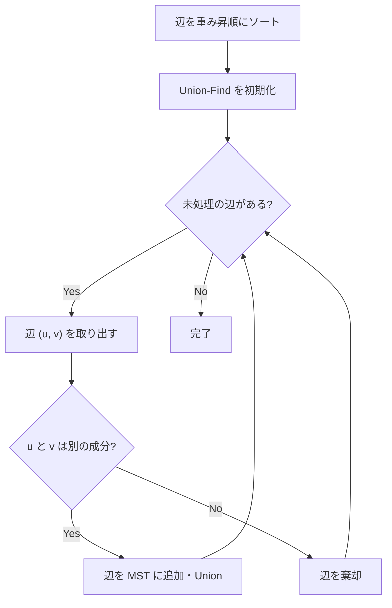

## Kruskal法とは

Kruskal法は、重み付き無向グラフの**最小全域木 (Minimum Spanning Tree, MST)** を求める貪欲アルゴリズムである。辺を重みの昇順にソートし、閉路を作らない辺を順に追加していく。

### 定義

重み付き無向連結グラフ $G = (V, E, w)$ に対して、全域木 $T$ とは $V$ の全頂点を含む木 (連結かつ閉路なし) である。最小全域木とは、辺の重みの総和 $\sum_{e \in T} w(e)$ が最小の全域木である。

## アルゴリズムの流れ

1. 全ての辺を重みの昇順にソートする
2. Union-Find (素集合データ構造) を初期化する
3. ソート順に辺 $(u, v)$ を見ていく:
   - $u$ と $v$ が異なる連結成分に属するなら、辺を MST に追加し、2つの成分を統合する
   - $u$ と $v$ が同じ連結成分に属するなら、辺を棄却する (追加すると閉路ができる)
4. $|V| - 1$ 本の辺が追加されたら終了



## Union-Find

Kruskal法の効率は Union-Find データ構造に依存する。Union-Find は以下の操作をほぼ $O(1)$ (正確には $O(\alpha(n))$、$\alpha$ はアッカーマン逆関数) でサポートする:

- **Find(x)**: $x$ が属する集合の代表元を返す
- **Union(x, y)**: $x$ と $y$ が属する集合を統合する

### 経路圧縮とランク併合

```python title="union_find.py"
class UnionFind:
    def __init__(self, n: int):
        self.parent = list(range(n))
        self.rank = [0] * n

    def find(self, x: int) -> int:
        # Path compression
        while self.parent[x] != x:
            self.parent[x] = self.parent[self.parent[x]]
            x = self.parent[x]
        return x

    def union(self, a: int, b: int) -> bool:
        ra, rb = self.find(a), self.find(b)
        if ra == rb:
            return False
        # Union by rank
        if self.rank[ra] < self.rank[rb]:
            ra, rb = rb, ra
        self.parent[rb] = ra
        if self.rank[ra] == self.rank[rb]:
            self.rank[ra] += 1
        return True
```

## 実装

```python title="kruskal.py"
def kruskal(n: int, edges: list[tuple[int, int, int]]) -> list[tuple[int, int, int]]:
    """
    n: number of vertices
    edges: list of (u, v, weight)
    returns: list of MST edges
    """
    edges.sort(key=lambda e: e[2])
    uf = UnionFind(n)
    mst = []
    for u, v, w in edges:
        if uf.union(u, v):
            mst.append((u, v, w))
            if len(mst) == n - 1:
                break
    return mst
```

## 正当性の証明

### 命題: Kruskal法は最小全域木を出力する

**証明 (カットの性質を利用):**

Kruskal法が辺 $e = (u, v)$ を追加する時点で、$u$ が属する連結成分を $S$、$v$ が属する連結成分を $T$ とする。$S$ と $V \setminus S$ の間のカットを考えると、$e$ はこのカットを横断する辺のうち最小重みのものである。

なぜなら、もし $e$ より重みが小さいカット辺 $e'$ が存在すれば、$e'$ は $e$ より先にソート順で現れるため、すでに処理済みである。$e'$ が棄却されたなら $S$ と $T$ は同じ成分に属するはずで、$e$ も棄却されるべきだが、これは矛盾する。

カットの性質 (任意のカットを横断する最小重み辺は何らかの MST に含まれる) より、各ステップで追加される辺は MST に含まれる。 $\square$

## 計算量

| 操作 | 計算量 |
|------|--------|
| ソート | $O(E \log E)$ |
| Union-Find 操作 | $O(E \cdot \alpha(V))$ |
| **合計** | $O(E \log E)$ |

$E \leq V^2$ なので $\log E = O(\log V)$ であり、$O(E \log V)$ とも書ける。

空間計算量は $O(V + E)$ である。

## Prim法との比較

| 項目 | Kruskal法 | Prim法 |
|------|-----------|--------|
| アプローチ | 辺ベース | 頂点ベース |
| データ構造 | Union-Find | 優先度付きキュー |
| 時間計算量 | $O(E \log E)$ | $O(E \log V)$ (二分ヒープ) |
| 疎グラフ | 効率的 | - |
| 密グラフ | - | 効率的 |

## まとめ

| 項目 | 内容 |
|------|------|
| 入力 | 重み付き無向連結グラフ |
| 出力 | 最小全域木 |
| 時間計算量 | $O(E \log E)$ |
| 空間計算量 | $O(V + E)$ |
| 核心 | 辺のソート + Union-Find |
| 応用 | ネットワーク設計、クラスタリング |
