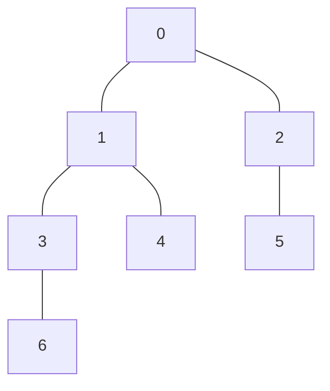

## 最小共通祖先 (LCA) とは

根付き木において、2つの頂点 $u, v$ の**最小共通祖先 (Lowest Common Ancestor, LCA)** とは、$u$ と $v$ の両方の祖先であるような頂点のうち、最も深いものを指す。

### 定義

根付き木 $T$ において、頂点 $u$ の祖先の集合を $\mathrm{Anc}(u)$ ($u$ 自身を含む) とする。このとき、

$$
\mathrm{LCA}(u, v) = \arg\max_{w \in \mathrm{Anc}(u) \cap \mathrm{Anc}(v)} \mathrm{depth}(w)
$$

### 具体例



この木で $\mathrm{LCA}(6, 4) = 1$、$\mathrm{LCA}(6, 5) = 0$ である。

## ダブリング (Binary Lifting)

### アイデア

素朴な方法では、$u$ と $v$ の深さを揃えた後、1ステップずつ親に遡って LCA を見つける。最悪 $O(n)$ かかる。

**ダブリング**では、$2^k$ 個上の祖先を前計算しておくことで、$O(\log n)$ で LCA クエリに答えられる。

### 前計算: ダブリングテーブル

$\mathrm{up}[k][v]$ を「頂点 $v$ の $2^k$ 個上の祖先」と定義する。

$$
\mathrm{up}[k][v] = \begin{cases}
\mathrm{parent}(v) & k = 0 \\
\mathrm{up}[k-1][\mathrm{up}[k-1][v]] & k \geq 1
\end{cases}
$$

直感的には、$2^k$ 個上に行くのは「$2^{k-1}$ 個上に行ってから、さらに $2^{k-1}$ 個上に行く」ことに等しい。

テーブルのサイズは $O(n \log n)$ であり、各エントリは $O(1)$ で計算できるため、前計算全体は $O(n \log n)$ である。

### クエリ処理

LCA クエリ $\mathrm{LCA}(u, v)$ を以下の手順で処理する。

#### ステップ 1: 深さを揃える

$\mathrm{depth}(u) > \mathrm{depth}(v)$ と仮定する (そうでなければ交換する)。差 $d = \mathrm{depth}(u) - \mathrm{depth}(v)$ を二進展開して、$d$ の各ビットが立っている $k$ について $u$ を $2^k$ 個上に移動する。

```python
d = depth[u] - depth[v]
for k in range(LOG, -1, -1):
    if d & (1 << k):
        u = up[k][u]
```

#### ステップ 2: 同時に遡る

深さを揃えた後 $u = v$ なら、それが LCA である。そうでなければ、$u \neq v$ を保ちながら $k = \mathrm{LOG}, \mathrm{LOG}-1, \ldots, 0$ の順に:

$$
\mathrm{up}[k][u] \neq \mathrm{up}[k][v] \implies u \leftarrow \mathrm{up}[k][u],\ v \leftarrow \mathrm{up}[k][v]
$$

最終的に $u$ と $v$ は LCA の子になるので、$\mathrm{LCA}(u,v) = \mathrm{parent}(u)$ を返す。

**なぜ正しいか:** 大きい $k$ から試すことで、二進法の各桁を上位から決定している。$\mathrm{up}[k][u] = \mathrm{up}[k][v]$ のときに移動しないのは、LCA を「飛び越えてしまう」のを防ぐためである。$\mathrm{up}[k][u] \neq \mathrm{up}[k][v]$ のときは LCA にまだ到達していないので、安全に移動できる。

## 実装

```python title="lca_doubling.py"
import math

def preprocess(n: int, parent: list[int], depth: list[int]):
    LOG = max(1, math.ceil(math.log2(n)))
    up = [[-1] * n for _ in range(LOG + 1)]
    for v in range(n):
        up[0][v] = parent[v]
    for k in range(1, LOG + 1):
        for v in range(n):
            if up[k-1][v] != -1:
                up[k][v] = up[k-1][up[k-1][v]]
    return up, LOG

def lca(u: int, v: int, up, depth, LOG):
    # Ensure depth[u] >= depth[v]
    if depth[u] < depth[v]:
        u, v = v, u
    # Step 1: equalize depths
    d = depth[u] - depth[v]
    for k in range(LOG, -1, -1):
        if d & (1 << k):
            u = up[k][u]
    if u == v:
        return u
    # Step 2: lift both
    for k in range(LOG, -1, -1):
        if up[k][u] != up[k][v]:
            u = up[k][u]
            v = up[k][v]
    return up[0][u]
```

## 計算量

| 項目 | 計算量 |
|------|--------|
| 前計算 (テーブル構築) | $O(n \log n)$ |
| 1回の LCA クエリ | $O(\log n)$ |
| 空間計算量 | $O(n \log n)$ |

## 正当性の証明

### 命題: ダブリングによる LCA クエリは正しい

**証明:**

ステップ 1 で深さを揃えた後の $u, v$ について考える。$u = v$ なら明らかに正しい。

$u \neq v$ の場合、$\mathrm{LCA}(u, v) = w$ とする。$d' = \mathrm{depth}(u) - \mathrm{depth}(w)$ とおく。

ステップ 2 では $k = \mathrm{LOG}, \mathrm{LOG}-1, \ldots, 0$ の順に処理する。各 $k$ について:

- $\mathrm{up}[k][u] = \mathrm{up}[k][v]$ のとき: $u, v$ の $2^k$ 個上の祖先が一致する。移動すると $w$ を通り越す可能性があるので移動しない。
- $\mathrm{up}[k][u] \neq \mathrm{up}[k][v]$ のとき: $u, v$ の $2^k$ 個上の祖先は $w$ より深い位置にある (まだ LCA に到達していない)。安全に移動する。

全ての $k$ を処理した後、$u$ と $v$ は $w$ の子 (深さ $\mathrm{depth}(w) + 1$) にいる。これは帰納法で示せる: 仮に $\mathrm{depth}(u) - \mathrm{depth}(w) > 1$ だとすると、ある $k$ について $\mathrm{up}[k][u] \neq \mathrm{up}[k][v]$ かつ移動後もまだ $w$ の真の子孫であるような $k$ が存在し、移動していなければならない。しかし二進表現の各ビットを全て処理しているので、正確に $d' - 1$ だけ移動することが保証される。

よって $\mathrm{up}[0][u] = w$ が LCA である。 $\square$

## 他の LCA アルゴリズムとの比較

| アルゴリズム | 前計算 | クエリ | 空間 |
|-------------|--------|--------|------|
| ダブリング | $O(n \log n)$ | $O(\log n)$ | $O(n \log n)$ |
| Euler Tour + Sparse Table | $O(n \log n)$ | $O(1)$ | $O(n \log n)$ |
| Euler Tour + Segment Tree | $O(n)$ | $O(\log n)$ | $O(n)$ |

ダブリングは実装が簡潔で理解しやすく、パスクエリへの応用も容易である。クエリあたり $O(\log n)$ は多くの場合十分高速である。

## まとめ

| 項目 | 内容 |
|------|------|
| 入力 | $n$ 頂点の根付き木、LCA クエリ $(u, v)$ |
| 出力 | $\mathrm{LCA}(u, v)$ |
| 前計算 | $O(n \log n)$ |
| クエリ | $O(\log n)$ |
| 核心 | $2^k$ 個上の祖先を前計算し、二進展開で効率的に遡る |
