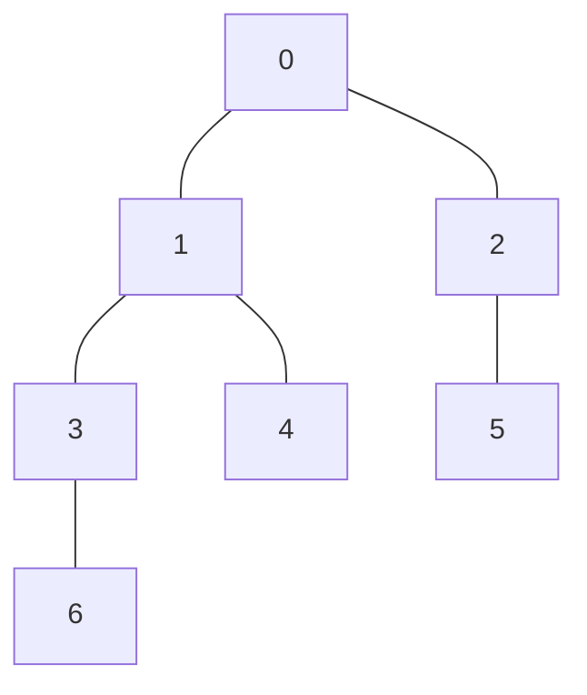

## 概要

Euler Tour + Sparse Table による LCA は、木上の LCA クエリを **前計算 $O(n \log n)$、クエリ $O(1)$** で処理するアルゴリズムである。LCA 問題を区間最小値クエリ (Range Minimum Query, RMQ) に帰着させるのが核心的なアイデアである。

## Euler Tour による LCA から RMQ への帰着

### Euler Tour とは

木を DFS で走査し、各頂点を「訪問するたび」に列に記録したものが **Euler Tour** である。$n$ 頂点の木では、Euler Tour の長さは $2n - 1$ になる。

### 帰着の仕組み

Euler Tour 列 $E[0..2n-2]$ と、各位置の深さ $D[i] = \mathrm{depth}(E[i])$ を考える。頂点 $u$ が最初に出現する位置を $\mathrm{first}(u)$ とする。

**重要な性質:** $\mathrm{LCA}(u, v)$ は、$E[\mathrm{first}(u)..\mathrm{first}(v)]$ (または逆順) の中で深さが最小の頂点である。

### 具体例



Euler Tour: `[0, 1, 3, 6, 3, 1, 4, 1, 0, 2, 5, 2, 0]`

深さ:        `[0, 1, 2, 3, 2, 1, 2, 1, 0, 1, 2, 1, 0]`

$\mathrm{LCA}(6, 5)$ を求める:
- $\mathrm{first}(6) = 3$, $\mathrm{first}(5) = 10$
- 区間 $[3, 10]$ の深さ配列: $[3, 2, 1, 2, 1, 0, 1, 2]$
- 最小値は $0$ (位置 $8$、頂点 $0$)
- よって $\mathrm{LCA}(6, 5) = 0$

### 帰着の正当性

**命題:** $l = \mathrm{first}(u)$, $r = \mathrm{first}(v)$ ($l \leq r$) としたとき、

$$
\mathrm{LCA}(u, v) = E[\arg\min_{l \leq i \leq r} D[i]]
$$

**証明:**

$w = \mathrm{LCA}(u, v)$ とする。

(1) **$w$ は区間 $[l, r]$ に含まれる:** DFS で $u$ を訪問してから $v$ を訪問するまでに、$w$ を必ず通過する (子部分木間の移動は親を経由するため)。

(2) **$w$ より浅い頂点は区間に含まれない:** $u$ と $v$ はともに $w$ の部分木に含まれるため、$\mathrm{first}(u)$ から $\mathrm{first}(v)$ の間には $w$ の部分木内の頂点しか現れない。$w$ の部分木内で $w$ より浅い頂点は存在しない。

(3) **$w$ は区間内で最も浅い:** (1) と (2) より、$w$ は区間 $[l, r]$ に含まれ、かつ区間内の全頂点の深さ $\geq \mathrm{depth}(w)$。 $\square$

## Sparse Table による RMQ

### Sparse Table とは

Sparse Table は静的配列の区間最小値クエリに特化したデータ構造である。

$\mathrm{sparse}[k][i]$ = 区間 $[i, i + 2^k - 1]$ における最小値のインデックス。

$$
\mathrm{sparse}[k][i] = \begin{cases}
i & k = 0 \\
\arg\min(D[\mathrm{sparse}[k-1][i]],\ D[\mathrm{sparse}[k-1][i + 2^{k-1}]]) & k \geq 1
\end{cases}
$$

### O(1) クエリ

区間 $[l, r]$ のクエリは以下の通り:

$$
k = \lfloor \log_2(r - l + 1) \rfloor
$$

$[l, l + 2^k - 1]$ と $[r - 2^k + 1, r]$ の 2 つの区間の最小値を比較する。これらは重なることがあるが、最小値クエリでは問題ない (冪等性)。

## 実装

```python title="lca_euler_tour.py"
import math

def preprocess(n, adj, root=0):
    # Euler Tour
    euler = []
    depth_arr = []
    first = [-1] * n
    depth = [0] * n

    def dfs(u, par, d):
        depth[u] = d
        first[u] = len(euler)
        euler.append(u)
        depth_arr.append(d)
        for v in adj[u]:
            if v != par:
                dfs(v, u, d + 1)
                euler.append(u)
                depth_arr.append(d)

    dfs(root, -1, 0)

    # Sparse Table
    m = len(euler)
    LOG = max(1, int(math.log2(m)))
    sparse = [[0] * m for _ in range(LOG + 1)]
    for i in range(m):
        sparse[0][i] = i
    for k in range(1, LOG + 1):
        for i in range(m - (1 << k) + 1):
            l_idx = sparse[k-1][i]
            r_idx = sparse[k-1][i + (1 << (k-1))]
            sparse[k][i] = l_idx if depth_arr[l_idx] <= depth_arr[r_idx] else r_idx

    return euler, depth_arr, first, sparse, LOG

def lca(u, v, euler, depth_arr, first, sparse, LOG):
    l, r = first[u], first[v]
    if l > r:
        l, r = r, l
    k = int(math.log2(r - l + 1))
    l_idx = sparse[k][l]
    r_idx = sparse[k][r - (1 << k) + 1]
    ans_idx = l_idx if depth_arr[l_idx] <= depth_arr[r_idx] else r_idx
    return euler[ans_idx]
```

## 計算量

| 項目 | 計算量 |
|------|--------|
| Euler Tour 構築 | $O(n)$ |
| Sparse Table 構築 | $O(n \log n)$ |
| LCA クエリ | $O(1)$ |
| 空間計算量 | $O(n \log n)$ |

## Sparse Table の O(1) クエリが正しい理由

区間 $[l, r]$ について $k = \lfloor \log_2(r - l + 1) \rfloor$ とすると:

- $2^k \leq r - l + 1 < 2^{k+1}$
- 区間 $[l, l + 2^k - 1]$ と $[r - 2^k + 1, r]$ の和集合は $[l, r]$ をカバーする
- 最小値は冪等 ($\min(a, a) = a$) なので、重なり部分があっても正しい結果が得られる

## ダブリング法との比較

| 項目 | ダブリング | Euler Tour + Sparse Table |
|------|-----------|--------------------------|
| 前計算 | $O(n \log n)$ | $O(n \log n)$ |
| クエリ | $O(\log n)$ | $O(1)$ |
| 実装の容易さ | 簡単 | やや複雑 |
| パスクエリへの拡張 | 容易 | やや困難 |

多数の LCA クエリを処理する場合は Euler Tour + Sparse Table が有利であるが、パスクエリへの拡張が必要な場合はダブリング法が適している。

## まとめ

| 項目 | 内容 |
|------|------|
| 入力 | $n$ 頂点の根付き木、LCA クエリ $(u, v)$ |
| 出力 | $\mathrm{LCA}(u, v)$ |
| 前計算 | $O(n \log n)$ |
| クエリ | $O(1)$ |
| 核心 | LCA を Euler Tour 上の RMQ に帰着させ、Sparse Table で $O(1)$ 応答 |
