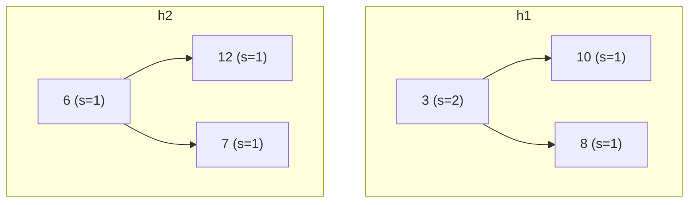

## Leftist Heap とは

Leftist Heap (左偏ヒープ) は、**マージ可能なヒープ** (Mergeable Heap) の一種である。各ノードに **s値** (s-value, null path length) を持たせ、木の「右側」が常に短くなるように制御することで、マージ操作を $O(\log n)$ で実現する。

### s値の定義

ノード $x$ の **s値** $s(x)$ は、$x$ から最も近い null ノードまでの距離として定義される。

$$
s(x) = \begin{cases} 0 & (x = \text{null}) \\ 1 + \min(s(\text{left}(x)),\ s(\text{right}(x))) & (\text{otherwise}) \end{cases}
$$

### Leftist 性質

任意のノード $x$ について、左の子の s値が右の子の s値以上であること:

$$
s(\text{left}(x)) \geq s(\text{right}(x))
$$

この性質により、右スパイン (根から右の子を辿り続けた経路) の長さが $O(\log n)$ に抑えられる。

## 計算量

| 操作 | 計算量 |
|------|--------|
| merge | $O(\log n)$ |
| insert | $O(\log n)$ |
| find-min | $O(1)$ |
| delete-min | $O(\log n)$ |

## マージ操作

Leftist Heap の全ての操作はマージを基礎として構築される。

### アルゴリズム

2つのヒープ $h_1$ と $h_2$ をマージする手順:

1. $h_1$ または $h_2$ が空なら、もう一方を返す
2. $h_1.\text{key} > h_2.\text{key}$ なら $h_1$ と $h_2$ を交換する (根が小さい方を選ぶ)
3. $h_1$ の右の子と $h_2$ を再帰的にマージする
4. leftist 性質が崩れたら、左右の子を交換する
5. s値を更新する

```python title="leftist_heap.py"
def merge(h1, h2):
    if h1 is None:
        return h2
    if h2 is None:
        return h1
    # Ensure h1.key <= h2.key
    if h1.key > h2.key:
        h1, h2 = h2, h1
    # Recursively merge right child with h2
    h1.right = merge(h1.right, h2)
    # Maintain leftist property
    if s_value(h1.left) < s_value(h1.right):
        h1.left, h1.right = h1.right, h1.left
    # Update s-value
    h1.s = s_value(h1.right) + 1
    return h1
```

### 正当性

マージは右スパインに沿って再帰的に進む。各ヒープの右スパインの長さは $O(\log n)$ なので、再帰の深さは高々 $O(\log n_1 + \log n_2)$ であり、マージは $O(\log n)$ で完了する。

### 右スパインの長さの上界

**命題:** $n$ ノードの Leftist Heap の右スパインの長さは $\lfloor \log(n+1) \rfloor$ 以下である。

**証明:** s値が $k$ のノードを根とする部分木は少なくとも $2^k - 1$ 個のノードを含む (帰納法で証明可能)。右スパインの長さは根の s値に等しいので、$n \geq 2^k - 1$ より $k \leq \lfloor \log(n+1) \rfloor$。 $\square$

## その他の操作

### Insert

単一ノードのヒープを作成し、元のヒープとマージする。

```python
def insert(h, key):
    new_node = LeftistNode(key)
    return merge(h, new_node)
```

### Delete-Min

根を削除し、左右の子をマージする。

```python
def delete_min(h):
    if h is None:
        return None
    return merge(h.left, h.right)
```

## 具体例

ヒープ $h_1$ (根: 3, 左子: 10, 右子: 8) と $h_2$ (根: 6, 左子: 12, 右子: 7) をマージする過程:



1. 根を比較: $3 < 6$ なので $h_1$ の根を採用
2. $h_1$ の右子 (8) と $h_2$ (根: 6) を再帰マージ
3. $6 < 8$ なので 6 の右子 (7) と 8 をマージ
4. $7 < 8$ なので 7 の右子 (null) と 8 をマージ → 8
5. 巻き戻しながら leftist 性質を維持

## まとめ

| 項目 | 内容 |
|------|------|
| データ構造 | ヒープ順序付き二分木 + s値 |
| 核心操作 | merge (右スパインに沿った再帰) |
| leftist 性質 | $s(\text{left}) \geq s(\text{right})$ |
| 右スパインの長さ | $O(\log n)$ |
| 用途 | 優先度キューの高速マージが必要な場面 |
