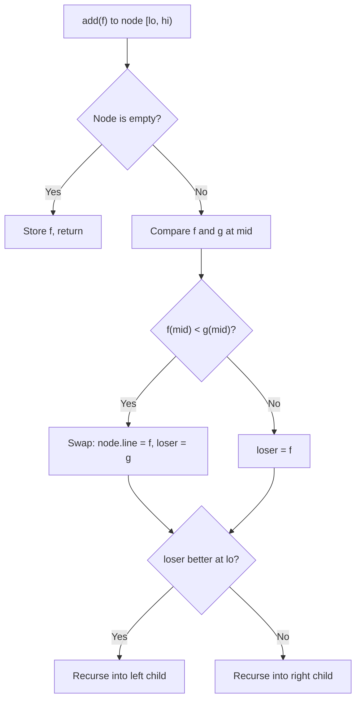

## Li Chao Tree とは

Li Chao Tree (李超セグメント木) は、**直線の追加**と**任意の $x$ 座標での最小値 (最大値) クエリ**を効率的に処理するセグメント木の変種である。Convex Hull Trick の一般化とみなせる。

## 問題設定

以下の2種類の操作を処理する:

- `add(a, b)`: 直線 $y = ax + b$ を追加
- `query(x)`: 現在登録されている全直線の中で、$x$ における最小値を返す

## Convex Hull Trick の限界と Li Chao Tree の動機

### Convex Hull Trick (CHT)

CHT は直線 $y = ax + b$ の集合に対する最小値クエリを処理するテクニックである。しかし、標準的な CHT にはいくつかの制約がある:

- **傾きの単調性**: 直線の傾きが単調に増加 (または減少) する順序で追加される必要がある
- **クエリの単調性**: クエリの $x$ 座標が単調である場合にさらに効率化できる (monotone CHT)

これらの制約は多くの DP 最適化で成り立つが、**傾きがランダムな順序で追加される**場合や、**クエリの $x$ が任意の順序で来る**場合には適用できない。

### Li Chao Tree の利点

Li Chao Tree は以下の点で CHT より柔軟である:

- **追加の順序に制約なし**: 任意の順序で直線を追加できる
- **クエリの順序に制約なし**: 任意の $x$ でクエリできる
- **実装が直感的**: セグメント木の操作に帰着できる

計算量は追加・クエリともに $O(\log C)$ ($C$ は座標範囲) である。

## アルゴリズム

### 核心アイデア: セグメント木上に直線を載せる

Li Chao Tree は、座標範囲 $[\text{lo}, \text{hi})$ を管理するセグメント木の各ノードに**1本の直線**を保存する。ただし、通常のセグメント木のように「区間の集約値」を持つのではなく、「その区間で "優勢" な直線」を 1 本だけ保持する。

「ノードの区間の中点で最も小さい値を取る直線」をそのノードの代表直線とする。

### 直線の追加操作

新しい直線 $f$ をノードに追加する手順を再帰的に定義する。ノードが管理する区間を $[\text{lo}, \text{hi})$、中点を $\text{mid} = \lfloor (\text{lo} + \text{hi}) / 2 \rfloor$ とする。

1. **ノードが空の場合**: $f$ をそのノードに保存して終了
2. **ノードに既存の直線 $g$ がある場合**: 中点 $\text{mid}$ で $f$ と $g$ を比較する
   - $f(\text{mid}) < g(\text{mid})$ なら、$f$ が中点で勝つので $f$ と $g$ を入れ替える (ノードには中点で勝つ方を残す)
   - 入れ替え後、負けた方の直線 (旧 $g$ または旧 $f$) を適切な子に送る
3. **再帰先の決定**: 左端 $\text{lo}$ での大小関係を見る
   - 負けた直線が左端で勝っている → 左の子に再帰
   - 負けた直線が右端で勝っている → 右の子に再帰



**直感的な理解:** 各ノードには中点で最良の直線を保存する。中点で負けた直線でも、区間の片側では勝っている可能性がある。その片側の子に「敗者」を送り込むことで、必要な情報が失われない。

### クエリ操作

$x$ での最小値を求めるには、ルートから $x$ を含む葉まで降りていき、各ノードの代表直線で $x$ を評価して最小値を取る。

1. 現在のノードの直線が存在すれば $f(x)$ を計算
2. $x < \text{mid}$ なら左の子、$x \geq \text{mid}$ なら右の子に再帰
3. 各ノードでの値の最小値を返す

パス上のノード数は $O(\log C)$ なので、クエリも $O(\log C)$ 。

## 具体的な数値例

座標範囲 $[0, 8)$ で以下の 5 本の直線を順に追加する。最小値クエリを考える。

| 直線 | $a$ | $b$ | 式 |
|------|-----|-----|----|
| $f_1$ | 2 | 1 | $y = 2x + 1$ |
| $f_2$ | -1 | 10 | $y = -x + 10$ |
| $f_3$ | 0 | 5 | $y = 5$ |
| $f_4$ | 1 | 0 | $y = x$ |
| $f_5$ | -2 | 16 | $y = -2x + 16$ |

**$f_1 = 2x + 1$ を追加:**
- ルート $[0, 8)$ が空なので、$f_1$ を保存

**$f_2 = -x + 10$ を追加:**
- ルート $[0, 8)$: mid=4, $f_1(4) = 9$, $f_2(4) = 6$ → $f_2$ が勝ち、$f_2$ をルートに、$f_1$ を子へ
- 左端 lo=0: $f_1(0) = 1 < f_2(0) = 10$ なので $f_1$ は左端で勝ち → 左の子 $[0, 4)$ に $f_1$ を追加

**$f_3 = 5$ を追加:**
- ルート $[0, 8)$: mid=4, $f_2(4) = 6$, $f_3(4) = 5$ → $f_3$ が勝ち、$f_3$ をルートに、$f_2$ を子へ
- 左端 lo=0: $f_2(0) = 10 > f_3(0) = 5$ なので $f_2$ は左端で負け → 右の子 $[4, 8)$ に $f_2$ を追加

**$f_4 = x$ を追加:**
- ルート $[0, 8)$: mid=4, $f_3(4) = 5$, $f_4(4) = 4$ → $f_4$ が勝ち、$f_4$ をルートに、$f_3$ を子へ
- 左端 lo=0: $f_3(0) = 5 > f_4(0) = 0$ なので $f_3$ は左端で負け → 右の子 $[4, 8)$ に $f_3$ を追加

**クエリ例:**
- `query(1)`: ルート $f_4(1) = 1$, 左の子 $f_1(1) = 3$ → 最小値 $= 1$
- `query(6)`: ルート $f_4(6) = 6$, 右の子 ... → 経路上の各ノードの直線を評価して最小値を取る

## 実装

```python title="li_chao_tree.py"
class LiChaoTree:
    def __init__(self, lo: int, hi: int):
        self.lo, self.hi = lo, hi
        self.line = None
        self.left = self.right = None

    def add(self, a: int, b: int):
        self._add(a, b, self.lo, self.hi)

    def _add(self, a, b, lo, hi):
        mid = (lo + hi) // 2
        if self.line is None:
            self.line = (a, b)
            return

        ca, cb = self.line
        left_better = a * lo + b < ca * lo + cb
        mid_better = a * mid + b < ca * mid + cb

        if mid_better:
            # New line wins at mid: swap
            self.line, (a, b) = (a, b), (ca, cb)
            left_better = not left_better

        if lo + 1 >= hi:
            return

        # Send the loser to the appropriate child
        if left_better:
            if self.left is None:
                self.left = LiChaoTree(lo, mid)
            self.left._add(a, b, lo, mid)
        else:
            if self.right is None:
                self.right = LiChaoTree(mid, hi)
            self.right._add(a, b, mid, hi)

    def query(self, x: int) -> float:
        return self._query(x, self.lo, self.hi)

    def _query(self, x, lo, hi):
        mid = (lo + hi) // 2
        val = float('inf')
        if self.line:
            a, b = self.line
            val = a * x + b
        if lo + 1 >= hi:
            return val
        # Descend to the child containing x
        if x < mid and self.left:
            val = min(val, self.left._query(x, lo, mid))
        elif x >= mid and self.right:
            val = min(val, self.right._query(x, mid, hi))
        return val
```

## 線分の追加への拡張

直線全体ではなく、区間 $[l, r)$ に限定した**線分**を追加したい場合がある。これは通常のセグメント木の区間更新と同様に、対象区間を $O(\log C)$ 個のノードに分割して、各ノードに直線を追加すればよい。

```python title="li_chao_tree_segment.py"
def add_segment(self, a, b, ql, qr):
    """Add line y = ax + b restricted to [ql, qr)."""
    self._add_segment(a, b, ql, qr, self.lo, self.hi)

def _add_segment(self, a, b, ql, qr, lo, hi):
    if qr <= lo or hi <= ql:
        return
    if ql <= lo and hi <= qr:
        self._add(a, b, lo, hi)
        return
    mid = (lo + hi) // 2
    if self.left is None:
        self.left = LiChaoTree(lo, mid)
    if self.right is None:
        self.right = LiChaoTree(mid, hi)
    self.left._add_segment(a, b, ql, qr, lo, mid)
    self.right._add_segment(a, b, ql, qr, mid, hi)
```

線分追加の計算量は $O(\log^2 C)$ である (区間分割に $O(\log C)$、各ノードへの追加に $O(\log C)$)。

## 永続化

Li Chao Tree はセグメント木ベースであるため、**永続化** (persistent) が自然にできる。追加操作でノードを書き換える代わりにパス上のノードをコピーすれば、過去のバージョンを保持できる。

永続 Li Chao Tree の計算量は:
- 追加: $O(\log C)$ (パスコピーのコストも $O(\log C)$)
- クエリ: $O(\log C)$
- 空間: 追加 1 回あたり $O(\log C)$ のノードを新規作成

## 計算量

| 操作 | 計算量 |
|------|--------|
| add (直線) | $O(\log C)$ ($C$ は座標範囲) |
| add (線分) | $O(\log^2 C)$ |
| query | $O(\log C)$ |

## Convex Hull Trick との比較

| 項目 | Convex Hull Trick | Li Chao Tree |
|------|------------------|--------------|
| 追加の順序 | 傾きが単調 (動的 CHT を除く) | 任意 |
| クエリの順序 | 単調なら $O(1)$ (amortized) | 任意 |
| 追加の計算量 | $O(\log N)$ (動的 CHT) | $O(\log C)$ |
| クエリの計算量 | $O(\log N)$ | $O(\log C)$ |
| 実装の容易さ | やや複雑 | 比較的簡単 |
| 線分への拡張 | 困難 | 自然 ($O(\log^2 C)$) |
| 永続化 | 困難 | 自然 |

Li Chao Tree は CHT より柔軟性が高く、実装も直感的である。ただし、座標範囲 $C$ に依存するため、$C$ が極めて大きい場合は座標圧縮やマージソート木との組み合わせが必要になる。

## まとめ

| 項目 | 内容 |
|------|------|
| 操作 | 直線追加、最小値クエリ |
| 時間計算量 | $O(\log C)$ per operation |
| 空間計算量 | $O(N \log C)$ |
| 核心 | 中点での比較による勝者/敗者の分離 |
| 利点 | 追加・クエリの順序制約なし |
| 拡張 | 線分追加 ($O(\log^2 C)$)、永続化 |
