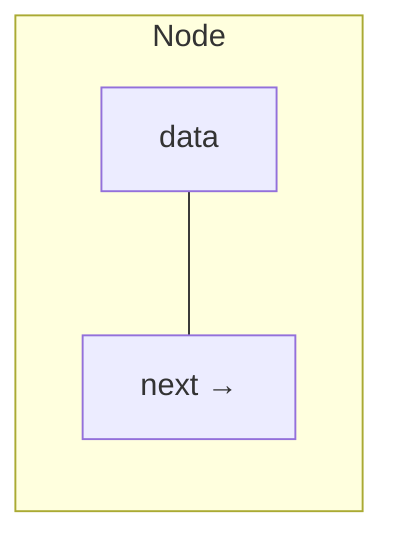

## Linked List とは

Linked List (連結リスト) は、各要素 (ノード) がデータと次のノードへのポインタ (参照) を持つデータ構造である。配列と異なり、メモリ上で連続していなくてもよい。

### 種類

| 種類 | 特徴 |
|------|------|
| 単方向連結リスト (Singly Linked List) | 各ノードが次のノードへのポインタを持つ |
| 双方向連結リスト (Doubly Linked List) | 各ノードが前後のポインタを持つ |
| 循環連結リスト (Circular Linked List) | 末尾が先頭を指す |

### ノードの構造



## 単方向連結リストの実装

```python title="singly_linked_list.py"
class Node:
    def __init__(self, val, next_node=None):
        self.val = val
        self.next = next_node

class SinglyLinkedList:
    def __init__(self):
        self.head = None
        self._size = 0

    def push_front(self, val):
        self.head = Node(val, self.head)
        self._size += 1

    def push_back(self, val):
        if not self.head:
            self.head = Node(val)
        else:
            curr = self.head
            while curr.next:
                curr = curr.next
            curr.next = Node(val)
        self._size += 1

    def pop_front(self):
        if not self.head:
            raise IndexError("List is empty")
        val = self.head.val
        self.head = self.head.next
        self._size -= 1
        return val

    def insert_at(self, index, val):
        if index == 0:
            self.push_front(val)
            return
        curr = self.head
        for _ in range(index - 1):
            if not curr:
                raise IndexError("Index out of range")
            curr = curr.next
        if not curr:
            raise IndexError("Index out of range")
        curr.next = Node(val, curr.next)
        self._size += 1

    def delete_at(self, index):
        if not self.head:
            raise IndexError("List is empty")
        if index == 0:
            return self.pop_front()
        curr = self.head
        for _ in range(index - 1):
            if not curr.next:
                raise IndexError("Index out of range")
            curr = curr.next
        if not curr.next:
            raise IndexError("Index out of range")
        val = curr.next.val
        curr.next = curr.next.next
        self._size -= 1
        return val

    def search(self, val):
        curr = self.head
        idx = 0
        while curr:
            if curr.val == val:
                return idx
            curr = curr.next
            idx += 1
        return -1

    def size(self):
        return self._size
```

## 双方向連結リストの実装

双方向連結リストでは、各ノードが前のノードへのポインタも持つ。これにより末尾からの操作や削除が $O(1)$ で行える。

```python title="doubly_linked_list.py"
class DNode:
    def __init__(self, val, prev_node=None, next_node=None):
        self.val = val
        self.prev = prev_node
        self.next = next_node

class DoublyLinkedList:
    def __init__(self):
        # Use sentinel nodes to simplify edge cases
        self.head = DNode(None)  # dummy head
        self.tail = DNode(None)  # dummy tail
        self.head.next = self.tail
        self.tail.prev = self.head
        self._size = 0

    def push_front(self, val):
        node = DNode(val, self.head, self.head.next)
        self.head.next.prev = node
        self.head.next = node
        self._size += 1

    def push_back(self, val):
        node = DNode(val, self.tail.prev, self.tail)
        self.tail.prev.next = node
        self.tail.prev = node
        self._size += 1

    def pop_front(self):
        if self._size == 0:
            raise IndexError("List is empty")
        node = self.head.next
        self.head.next = node.next
        node.next.prev = self.head
        self._size -= 1
        return node.val

    def pop_back(self):
        if self._size == 0:
            raise IndexError("List is empty")
        node = self.tail.prev
        self.tail.prev = node.prev
        node.prev.next = self.tail
        self._size -= 1
        return node.val
```

番兵ノード (sentinel/dummy node) を使うと、先頭・末尾の特殊処理が不要になりコードが簡潔になる。

## 計算量

| 操作 | 単方向 | 双方向 | 配列 |
|------|--------|--------|------|
| 先頭への挿入 | $O(1)$ | $O(1)$ | $O(n)$ |
| 末尾への挿入 | $O(n)$ | $O(1)$ | 償却 $O(1)$ |
| 先頭の削除 | $O(1)$ | $O(1)$ | $O(n)$ |
| 末尾の削除 | $O(n)$ | $O(1)$ | $O(1)$ |
| インデックスアクセス | $O(n)$ | $O(n)$ | $O(1)$ |
| 探索 | $O(n)$ | $O(n)$ | $O(n)$ |
| 任意位置への挿入 (位置既知) | $O(1)$ | $O(1)$ | $O(n)$ |

連結リストの強みは**任意位置への挿入・削除が $O(1)$** であること (ただし、その位置のノードが既にわかっている場合)。弱みは**ランダムアクセスができない** ($O(n)$) こと。

## 配列 vs 連結リスト

| 観点 | 配列 | 連結リスト |
|------|------|------------|
| メモリ配置 | 連続 (キャッシュに優しい) | 分散 |
| ランダムアクセス | $O(1)$ | $O(n)$ |
| 先頭への挿入/削除 | $O(n)$ | $O(1)$ |
| メモリ使用量 | データのみ | データ + ポインタ |
| サイズ変更 | 再確保が必要 | 不要 |

実際のプログラミングでは、キャッシュ効率の良さから配列 (動的配列) が好まれることが多い。連結リストは、要素の挿入・削除が頻繁に行われる場面で有効である。

## 応用

### LRU キャッシュ

Least Recently Used (LRU) キャッシュは、双方向連結リストとハッシュテーブルの組み合わせで実装される。アクセスされた要素を先頭に移動し、キャッシュが満杯のとき末尾を削除する。

### 多項式の表現

係数と次数をノードに持つ連結リストで多項式を表現し、加算や乗算を効率的に行うことができる。

### フリーリスト

メモリアロケータで未使用メモリブロックを管理するために連結リストが使われる。

## まとめ

| 項目 | 内容 |
|------|------|
| データ構造 | Linked List (連結リスト) |
| 種類 | 単方向、双方向、循環 |
| 先頭挿入/削除 | $O(1)$ |
| 探索 | $O(n)$ |
| ランダムアクセス | $O(n)$ |
| 空間計算量 | $O(n)$ (ポインタ分のオーバーヘッドあり) |
| 主な応用 | LRU キャッシュ、メモリ管理、隣接リスト |
