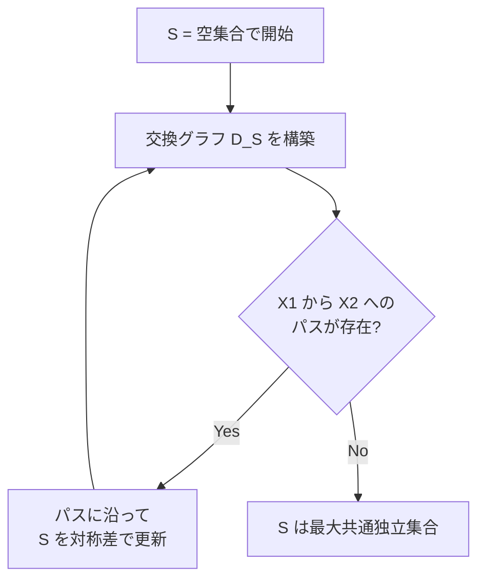
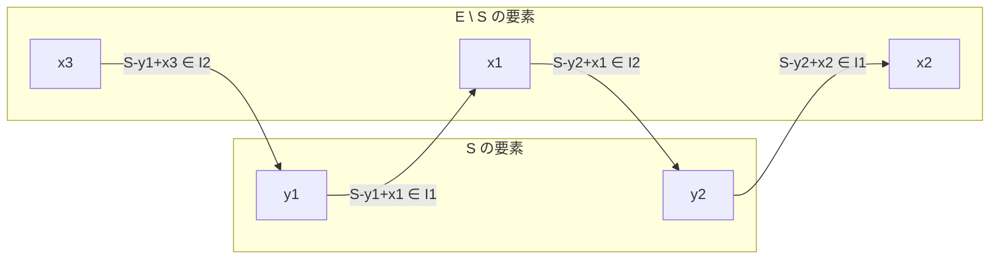

## Matroid Intersection とは

Matroid Intersection は、2つのマトロイド $M_1 = (E, \mathcal{I}_1)$ と $M_2 = (E, \mathcal{I}_2)$ の**最大共通独立集合** (maximum common independent set) を求める問題である。

$$
\max \{ |S| \mid S \in \mathcal{I}_1 \cap \mathcal{I}_2 \}
$$

すなわち、同じ台集合 $E$ 上の2つのマトロイドで、両方の意味で独立な集合のうち最大のものを見つける問題である。

## 重要性

### 単一マトロイドとの対比

マトロイド1つの場合、最大重み独立集合は**貪欲法**で解ける。しかし2つのマトロイドの交差は**貪欲法では解けない**。にもかかわらず、Edmonds (1970) は多項式時間アルゴリズムが存在することを示した。

### 3つ以上のマトロイドの交差

3つ以上のマトロイドの交差問題は **NP困難** であることが知られている。実際、多くのNP困難な組合せ最適化問題 (例: ハミルトンパス問題) が3つのマトロイドの交差問題に帰着される。したがって、2つのマトロイドの交差は多項式時間で解ける境界線上にある注目すべき問題である。

## アルゴリズム: 増大法

Matroid Intersection の標準的なアルゴリズムは、最大マッチングの増大パスアルゴリズムと類似した**増大法** (augmentation method) である。

### 概要

1. 空集合 $S = \emptyset$ から開始する
2. 現在の共通独立集合 $S$ に対して交換グラフを構築する
3. 交換グラフ上で増大パスを探索する
4. 増大パスが見つかれば $S$ を更新し、$|S|$ を1増やす
5. 増大パスが見つからなければ $S$ は最大



### 交換グラフの構築

現在の共通独立集合 $S$ に対して、**交換グラフ** (exchange graph) $D_S = (E, A)$ を次のように構築する。これは頂点集合が $E$ の有向グラフである。

辺の定義:

- **$M_1$ に基づく辺** (後方辺): $S$ 内の要素 $y$ から $S$ 外の要素 $x$ への辺。条件: $S - y + x \in \mathcal{I}_1$ (つまり $y$ を $x$ に交換しても $M_1$ で独立)
- **$M_2$ に基づく辺** (前方辺): $S$ 外の要素 $x$ から $S$ 内の要素 $y$ への辺。条件: $S - y + x \in \mathcal{I}_2$ (つまり $y$ を $x$ に交換しても $M_2$ で独立)

直感的には、この交換グラフは「ある要素を別の要素に入れ替えても独立性が壊れない」関係を有向辺として表現したものである。



### ソース集合とシンク集合

増大パスの始点と終点を定義する:

- **ソース集合** $X_1 = \{x \in E \setminus S \mid S + x \in \mathcal{I}_1\}$: $S$ に追加しても $M_1$ で独立が保たれる要素
- **シンク集合** $X_2 = \{x \in E \setminus S \mid S + x \in \mathcal{I}_2\}$: $S$ に追加しても $M_2$ で独立が保たれる要素

$X_1 \cap X_2 \neq \emptyset$ のとき、その共通要素 $x$ を $S$ に追加するだけで $|S|$ を1増やせる (長さ1の増大パス)。

### 増大パスの探索

$X_1$ から $X_2$ への**最短パス**を BFS で見つける。パスが $x_0, y_1, x_1, y_2, x_2, \ldots, x_k$ ($x_i \in E \setminus S$, $y_i \in S$) のとき:

$$
S' = S \oplus \{x_0, y_1, x_1, y_2, \ldots, x_k\} = (S \setminus \{y_1, y_2, \ldots\}) \cup \{x_0, x_1, \ldots, x_k\}
$$

$S'$ は $M_1$ と $M_2$ の両方で独立であり、$|S'| = |S| + 1$ となる。

### 正当性の直感

増大パスに沿った対称差で独立性が保たれる理由を直感的に説明する:

- パスの最初の要素 $x_0 \in X_1$ は $S + x_0 \in \mathcal{I}_1$ を満たす
- パスの最後の要素 $x_k \in X_2$ は $S + x_k \in \mathcal{I}_2$ を満たす
- 中間の各交換 $(y_i, x_i)$ は、一方のマトロイドでの独立性を保つ交換操作に対応する
- 最短パスを使うことで、これらの交換操作が「干渉」しないことが保証される

## 実装

```python title="matroid_intersection.py"
from collections import deque

def matroid_intersection(E, ind1, ind2):
    """
    Find maximum common independent set of two matroids.
    E: ground set (list)
    ind1, ind2: independence oracles (callable, takes a set, returns bool)
    """
    E = list(E)
    S = set()

    while True:
        # Compute source and sink sets
        X1 = {x for x in E if x not in S and ind1(S | {x})}
        X2 = {x for x in E if x not in S and ind2(S | {x})}

        # Trivial augmentation
        common = X1 & X2
        if common:
            S.add(common.pop())
            continue

        if not X1 or not X2:
            break

        # Build exchange graph and BFS for shortest augmenting path
        parent = {x: None for x in X1}
        queue = deque(X1)
        found = None

        while queue and found is None:
            v = queue.popleft()
            if v in S:
                # v is in S: add edges to E\S via M1 exchange
                for x in E:
                    if x not in S and x not in parent:
                        if ind1((S - {v}) | {x}):
                            parent[x] = v
                            if x in X2:
                                found = x
                                break
                            queue.append(x)
            else:
                # v is in E\S: add edges to S via M2 exchange
                for y in S:
                    if y not in parent:
                        if ind2((S - {y}) | {v}):
                            parent[y] = v
                            queue.append(y)

        if found is None:
            break

        # Trace augmenting path and apply symmetric difference
        path = []
        v = found
        while v is not None:
            path.append(v)
            v = parent[v]
        S = S.symmetric_difference(set(path))

    return S
```

### 実装のポイント

- BFS は $S$ の要素と $E \setminus S$ の要素を交互に訪問する
- $S$ の要素からは $M_1$ の交換で到達可能な $E \setminus S$ の要素へ辺を張る
- $E \setminus S$ の要素からは $M_2$ の交換で到達可能な $S$ の要素へ辺を張る
- 最短パスを使うことが正当性の鍵

## 計算量の解析

### 増大回数

各増大で $|S|$ が1増えるため、増大回数は高々 $r = \min(r_1, r_2)$ 回 ($r_1, r_2$ は各マトロイドのランク)。

### 各増大の計算量

交換グラフの構築には全ての辺候補 $(y, x)$ について独立性判定が必要なため:

- 辺の候補数: $O(|S| \cdot |E \setminus S|) = O(n^2)$ (ただし $n = |E|$)
- 各判定の計算量: $f$ (独立性オラクルの計算量)
- BFS: $O(n^2)$

### 全体の計算量

$$
T = O(r \cdot n^2 \cdot f) = O(r \cdot n \cdot (n \cdot f))
$$

一般的には $O(r \cdot n \cdot (n + f))$ と書かれることが多い ($n$ は BFS の計算量、$f$ は独立性判定)。

## 重み付きマトロイド交差

重み関数 $w: E \to \mathbb{R}$ が与えられたとき、**最大重み共通独立集合**を求める問題も多項式時間で解ける。

$$
\max \{ w(S) \mid S \in \mathcal{I}_1 \cap \mathcal{I}_2,\ |S| = k \}
$$

アルゴリズムの概要:

1. まずサイズ $k$ の最大共通独立集合 $S$ を求める
2. 交換グラフの辺に重みを付ける: 要素 $x$ を追加する辺には $+w(x)$、要素 $y$ を削除する辺には $-w(y)$
3. 負の閉路がある限り、最小重み負閉路に沿って $S$ を更新する
4. 負の閉路がなくなれば $S$ は最適

## 応用例

### 二部グラフの最大マッチング

二部グラフ $G = (L, R; E)$ の最大マッチングは、2つの**分割マトロイド**の交差問題として定式化できる。

- $M_1$: 各左頂点 $l \in L$ について、$l$ に接続する辺から高々1本 (分割マトロイド)
- $M_2$: 各右頂点 $r \in R$ について、$r$ に接続する辺から高々1本 (分割マトロイド)

共通独立集合はマッチング (各頂点に高々1本の辺) に対応する。

ただし実用上は、Hopcroft-Karp 法など専用アルゴリズムの方が効率的である ($O(\sqrt{n} \cdot m)$ vs $O(n^3)$)。

### カラフル全域木

グラフの各辺に色が付いており、**各色から高々1本ずつ選んだ全域木** (colorful spanning tree) を求める問題。

- $M_1$: **グラフィックマトロイド** (森である辺集合が独立)
- $M_2$: **分割マトロイド** (各色から高々1辺が独立)

共通独立集合は「森であり、かつ各色から高々1辺」という条件を満たす辺集合である。サイズ $|V| - 1$ の共通独立集合が存在すればカラフル全域木が存在する。

### 有向グラフの素なパス

有向グラフにおいて、$s$ から $t$ への辺素なパスの最大本数も、適切なマトロイドの交差問題として定式化できる。

### 共通横断マトロイド

2つの二部グラフに対して、両方で横断可能な共通の頂点集合を求める問題も、2つの横断マトロイドの交差に帰着される。

## matroid intersection の理論的意義

### min-max 定理

Matroid Intersection には以下の min-max 定理が成り立つ:

$$
\max_{S \in \mathcal{I}_1 \cap \mathcal{I}_2} |S| = \min_{A \subseteq E} (r_1(A) + r_2(E \setminus A))
$$

ここで $r_1, r_2$ はそれぞれ $M_1, M_2$ のランク関数である。この定理は、Konig の定理 (二部グラフにおける最大マッチングと最小頂点被覆の等価性) の一般化である。

### matroid union との関係

Matroid Intersection と**matroid union** (マトロイド和) は双対関係にある。マトロイド和は、$\mathcal{I}_1$ と $\mathcal{I}_2$ からそれぞれ独立集合を取り、それらの和集合として表現できる集合を独立とする。

## まとめ

| 項目 | 内容 |
|------|------|
| 入力 | 共通台集合上の2つのマトロイド |
| 出力 | 最大共通独立集合 |
| 時間計算量 | $O(r \cdot n \cdot (n + f))$ |
| 核心 | 交換グラフ上の増大パス |
| 重み付き | 負の閉路消去で多項式時間 |
| 3マトロイド以上 | NP困難 |
| 応用 | 二部マッチング、カラフル全域木、素なパス |
