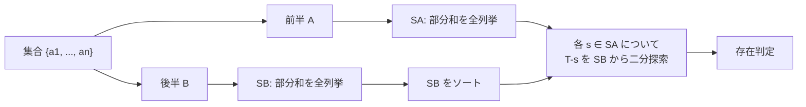

## 半分全列挙とは

半分全列挙 (Meet in the Middle) は、集合を**二等分**して各半分を独立に全列挙し、結果を組み合わせることで計算量を大幅に削減する手法である。

### 動機

$n$ 個の要素からなる集合の部分集合を全列挙すると $O(2^n)$ の計算量がかかる。$n = 40$ の場合 $2^{40} \approx 10^{12}$ となり現実的でない。

しかし集合を半分に分けると、各半分は $n/2 = 20$ 要素で $2^{20} \approx 10^6$ 通りしかない。両方を列挙して組み合わせれば全体として $O(2^{n/2} \log 2^{n/2}) = O(n \cdot 2^{n/2})$ で解ける。

## 典型問題: 部分和問題

### 問題

$n$ 個の整数 $a_1, a_2, \ldots, a_n$ が与えられる。これらの部分集合で和が $T$ になるものが存在するか判定せよ。

### 素朴なアプローチ

全ての部分集合を列挙して和を計算する。計算量は $O(n \cdot 2^n)$。

### 半分全列挙による解法

1. 集合を前半 $A = \{a_1, \ldots, a_{n/2}\}$ と後半 $B = \{a_{n/2+1}, \ldots, a_n\}$ に分ける
2. $A$ の全部分集合の和を列挙 → $S_A$
3. $B$ の全部分集合の和を列挙 → $S_B$
4. $S_B$ をソートする
5. 各 $s \in S_A$ について、$T - s$ が $S_B$ に存在するか二分探索で判定



## 実装

```python title="meet_in_the_middle.py"
from bisect import bisect_left

def meet_in_the_middle(a: list[int], target: int) -> bool:
    n = len(a)
    mid = n // 2

    # Enumerate all subset sums for each half
    def subset_sums(arr: list[int]) -> list[int]:
        sums = []
        m = len(arr)
        for mask in range(1 << m):
            s = 0
            for i in range(m):
                if mask & (1 << i):
                    s += arr[i]
            sums.append(s)
        return sums

    sa = subset_sums(a[:mid])
    sb = sorted(subset_sums(a[mid:]))

    for s in sa:
        need = target - s
        idx = bisect_left(sb, need)
        if idx < len(sb) and sb[idx] == need:
            return True
    return False
```

## 計算量の解析

### 時間計算量

- 前半の列挙: $O(2^{n/2})$
- 後半の列挙: $O(2^{n/2})$
- 後半のソート: $O(2^{n/2} \cdot n/2)$
- 二分探索: $O(2^{n/2} \cdot n/2)$

全体: $O(n \cdot 2^{n/2})$

### 空間計算量

$O(2^{n/2})$ (部分和の列挙結果を保持)

### 計算量の改善度

| $n$ | 素朴: $O(2^n)$ | 半分全列挙: $O(n \cdot 2^{n/2})$ |
|-----|----------------|----------------------------------|
| 20 | $\approx 10^6$ | $\approx 2 \times 10^4$ |
| 30 | $\approx 10^9$ | $\approx 5 \times 10^5$ |
| 40 | $\approx 10^{12}$ | $\approx 2 \times 10^7$ |

$n = 40$ の場合、約 $10^5$ 倍の高速化が得られる。

## 応用

### 4-SUM 問題

$n$ 個の整数から 4 つを選んで和が $T$ になる組み合わせを求める問題。素朴には $O(n^4)$ だが、2 つの要素の和を全列挙して半分全列挙と同様のアプローチで $O(n^2 \log n)$ に改善できる。

### 部分和が最大のものを求める

和が $T$ 以下で最大の部分和を求める場合も同様の手法が使える。$S_B$ をソートしておき、各 $s \in S_A$ について $T - s$ 以下の最大値を二分探索で求める。

### 暗号解読

Meet in the Middle 攻撃は暗号理論でも用いられる。二重暗号 (Double DES) に対して、全探索 $O(2^{2k})$ を $O(2^k)$ の空間と $O(k \cdot 2^k)$ の時間に削減できる。これが Triple DES が必要とされた理由である。

## 実装の注意点

### ハッシュテーブルを使う変種

ソート + 二分探索の代わりにハッシュテーブルを使えば、期待計算量を $O(2^{n/2})$ に改善できる。

```python title="meet_in_the_middle_hash.py"
def meet_in_the_middle_hash(a: list[int], target: int) -> bool:
    n = len(a)
    mid = n // 2

    def subset_sums(arr):
        sums = set()
        m = len(arr)
        for mask in range(1 << m):
            s = sum(arr[i] for i in range(m) if mask & (1 << i))
            sums.add(s)
        return sums

    sa = subset_sums(a[:mid])
    sb = subset_sums(a[mid:])

    for s in sa:
        if target - s in sb:
            return True
    return False
```

### 分割のバランス

集合を正確に半分に分けることが重要である。$n$ が奇数の場合は $\lfloor n/2 \rfloor$ と $\lceil n/2 \rceil$ に分ける。偏った分割では計算量の改善が小さくなる。

## まとめ

| 項目 | 内容 |
|------|------|
| 入力 | $n$ 個の要素、目標値 $T$ |
| 出力 | 条件を満たす部分集合の存在判定 |
| 時間計算量 | $O(n \cdot 2^{n/2})$ |
| 空間計算量 | $O(2^{n/2})$ |
| 核心 | 集合を半分に分けて独立に列挙 |
| 適用条件 | $n \leq 40$ 程度で全列挙が必要な場合 |
