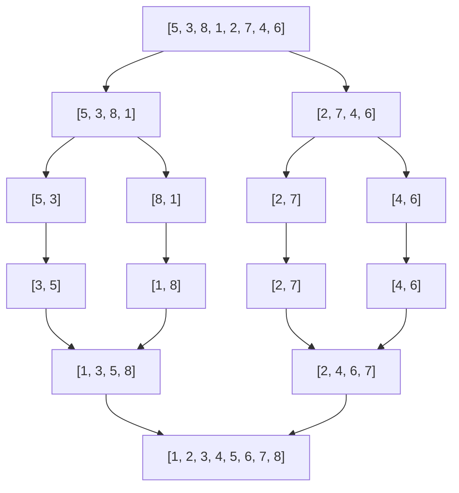

## Merge Sort とは

Merge Sort (マージソート) は、**分割統治法** (Divide and Conquer) に基づくソートアルゴリズムである。配列を再帰的に半分に分割し、それぞれをソートした後、2 つのソート済み配列をマージ (統合) することで全体を整列する。

## アルゴリズムの概要

### 分割統治法の 3 ステップ

1. **分割 (Divide):** 配列を中央で 2 つの部分配列に分割する
2. **統治 (Conquer):** 各部分配列を再帰的にソートする
3. **統合 (Combine):** 2 つのソート済み部分配列をマージする



### マージ操作

マージ操作は、2 つのソート済み配列を 1 つのソート済み配列に統合する処理である。各配列の先頭要素を比較し、小さい方を結果に追加していく。

## 実装

```python title="merge_sort.py"
def merge_sort(a: list[int]) -> list[int]:
    if len(a) <= 1:
        return a
    mid = len(a) // 2
    left = merge_sort(a[:mid])
    right = merge_sort(a[mid:])
    return merge(left, right)

def merge(left: list[int], right: list[int]) -> list[int]:
    result = []
    i, j = 0, 0
    while i < len(left) and j < len(right):
        if left[i] <= right[j]:
            result.append(left[i])
            i += 1
        else:
            result.append(right[j])
            j += 1
    result.extend(left[i:])
    result.extend(right[j:])
    return result
```

## 計算量

| ケース | 時間計算量 | 説明 |
|--------|-----------|------|
| 最良 | $O(n \log n)$ | |
| 平均 | $O(n \log n)$ | |
| 最悪 | $O(n \log n)$ | |

**空間計算量:** $O(n)$ (マージ用の一時配列)

### 計算量の導出

再帰の深さは $\log_2 n$ であり、各レベルで合計 $O(n)$ の比較が行われる。

漸化式で表すと:

$$
T(n) = 2T\left(\frac{n}{2}\right) + O(n)
$$

マスター定理 ($a = 2, b = 2, f(n) = O(n)$) を適用すると:

$$
T(n) = O(n \log n)
$$

### 比較回数の詳細

マージ操作で 2 つの長さ $n/2$ の配列をマージするとき、比較回数は最小 $n/2$ (一方が全て小さい場合)、最大 $n - 1$ (交互に選ばれる場合) である。

## 正当性の証明

### 帰納法による証明

**基底ケース:** 長さ 0 または 1 の配列は自明にソート済み。

**帰納ステップ:** 長さ $n/2$ 以下の配列に対して merge_sort が正しくソートすると仮定する。

- 分割により 2 つの部分配列が得られる
- 帰納仮説により、左右それぞれがソート済みになる
- merge 操作は 2 つのソート済み配列を正しくマージする (merge のループ不変条件: result は常にソート済み)

したがって、長さ $n$ の配列もソートされる。

## 安定性

Merge Sort は**安定ソート**である。マージ操作で等しい要素は左側 (先に出現する側) を優先する ($\text{left}[i] \leq \text{right}[j]$ の条件) ため、相対順序が保存される。

## 特徴と応用

### 長所

- 最悪計算量が $O(n \log n)$ で保証される
- 安定ソート
- 連結リストのソートに適している (追加メモリ $O(1)$ で実装可能)
- 外部ソート (ディスク上のデータのソート) に適している

### 短所

- $O(n)$ の追加メモリが必要 (配列の場合)
- 小規模データではオーバーヘッドが大きい

### 応用場面

- 安定性が要求される場合
- 外部ソート (大規模データのディスク上ソート)
- 連結リストのソート
- Python の `sorted()` や `list.sort()` の基盤 (Tim Sort の一部)

## まとめ

| 項目 | 内容 |
|------|------|
| 時間計算量 (最良/平均/最悪) | $O(n \log n)$ / $O(n \log n)$ / $O(n \log n)$ |
| 空間計算量 | $O(n)$ |
| 安定性 | 安定 |
| in-place | いいえ |
| 手法 | 分割統治法 |
