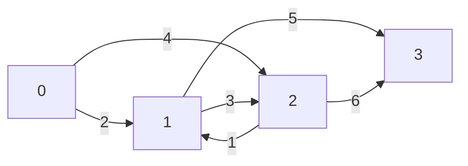
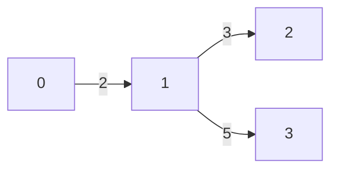

## 最小全域有向木とは

### 問題の定義

重み付き有向グラフ $G = (V, E, w)$ と根 $r \in V$ が与えられたとき、以下の条件を満たす辺の集合 $T \subseteq E$ を求める。

1. $T$ は $|V| - 1$ 本の辺からなる
2. $T$ の辺のみを使って $r$ から全ての頂点 $v \in V \setminus \{r\}$ に到達可能
3. $T$ の辺の重みの合計 $\sum_{e \in T} w(e)$ が最小

この $T$ が誘導する有向木を**最小全域有向木** (minimum spanning arborescence) あるいは**最小有向全域木**と呼ぶ。

### 無向グラフとの違い

無向グラフの最小全域木 (MST) では Kruskal 法や Prim 法が使えるが、有向グラフでは辺に向きがあるためこれらのアルゴリズムは適用できない。例えば、$r$ から全頂点に到達できる有向グラフでも、各頂点の入辺の中から最小のものを貪欲に選ぶだけでは最適解が得られない場合がある (閉路が形成される可能性がある)。

### arborescence の性質

arborescence (根付き有向木) は以下の性質を持つ。

- 根 $r$ 以外の全ての頂点はちょうど 1 つの入辺を持つ
- 根 $r$ は入辺を持たない
- $r$ から任意の頂点への有向パスが存在する

したがって、最小全域有向木は**各非根頂点に対して最適な入辺を 1 つ選ぶ**問題と見なせる。ただし、選んだ辺が閉路を形成しないことが必要である。

## Edmonds' Algorithm (Chu-Liu/Edmonds' Algorithm)

Edmonds (1967)、Chu and Liu (1965) によって独立に発見されたアルゴリズムである。

### アルゴリズムの概要

1. 各非根頂点について最小コストの入辺を選ぶ
2. 閉路がなければ完了
3. 閉路があれば、閉路を 1 頂点に縮約し、辺のコストを調整して再帰的に解く
4. 再帰の結果を展開して元のグラフ上の解を復元する

### ステップ 1: 最小入辺の選択

根 $r$ 以外の各頂点 $v$ について、$v$ への入辺のうち最小コストのものを選ぶ。

$$
\text{min\_in}(v) = \arg\min_{(u, v) \in E} w(u, v)
$$

選ばれた辺の集合を $E^*$ とする。

### ステップ 2: 閉路の検出

$E^*$ に閉路が含まれていなければ、$E^*$ 自体が最小全域有向木である (各頂点の最小入辺を選んでいるので)。

$E^*$ に閉路が含まれている場合、次のステップに進む。最小入辺の集合では、各頂点の入次数が高々 1 なので、閉路は互いに素な単純閉路のみである。

### ステップ 3: 閉路の縮約とコスト調整

閉路 $C = (v_1, v_2, \ldots, v_k, v_1)$ を 1 つの頂点 $v_C$ に縮約する。

**コスト調整のアイデア**: 閉路 $C$ を全て採用したときの合計コストを $w(C) = \sum_{e \in C} w(e)$ とする。最終的な解では $C$ のうち 1 辺だけが使われない (閉路の外から $C$ のある頂点に入る辺で置き換えられる)。したがって、閉路外から $C$ 内の頂点 $v_i$ への辺 $(u, v_i)$ のコストを次のように調整する。

$$
w'(u, v_C) = w(u, v_i) - w(\text{min\_in}(v_i))
$$

ここで $w(\text{min\_in}(v_i))$ は、$v_i$ に対して閉路内で選ばれた入辺のコストである。

**直感的な理解**: 閉路 $C$ の辺を全て採用した状態から出発する。閉路外から頂点 $v_i$ への辺 $(u, v_i)$ を新たに採用すると、$v_i$ の閉路内の入辺 $\text{min\_in}(v_i)$ が不要になる。したがって、追加コストは $w(u, v_i) - w(\text{min\_in}(v_i))$ である。

$C$ 内の頂点間の辺と $C$ から外部への辺はそのまま (コスト変更なし) 新しいグラフに引き継がれる。

### ステップ 4: 再帰

縮約後のグラフ $G'$ で同じアルゴリズムを再帰的に適用し、$G'$ の最小全域有向木 $T'$ を求める。

### ステップ 5: 解の復元

$T'$ を元のグラフ $G$ 上の解に展開する。

- $T'$ において $v_C$ への入辺が $(u, v_C)$ であったとする。これは元のグラフでは $(u, v_i)$ に対応する。
- 閉路 $C$ の辺のうち、$v_i$ への入辺 $\text{min\_in}(v_i)$ を除いた全ての辺を解に含める。
- $(u, v_i)$ を解に含める。

## 具体例での動作追跡

次のグラフで動作を追跡する (根 $r = 0$)。



辺一覧: $(0,1,2)$, $(0,2,4)$, $(1,2,3)$, $(2,1,1)$, $(1,3,5)$, $(2,3,6)$

**反復 1: 最小入辺の選択**

| 頂点 | 入辺 | 最小入辺 |
|------|------|---------|
| 1 | $(0,1,2)$, $(2,1,1)$ | $(2,1,1)$ |
| 2 | $(0,2,4)$, $(1,2,3)$ | $(1,2,3)$ |
| 3 | $(1,3,5)$, $(2,3,6)$ | $(1,3,5)$ |

選ばれた辺集合 $E^* = \{(2,1,1), (1,2,3), (1,3,5)\}$

**閉路の検出**: $1 \to 2 \to 1$ の閉路 $C$ を検出。閉路のコスト $w(C) = 1 + 3 = 4$。

**閉路の縮約**: 頂点 $\{1, 2\}$ を $v_C$ に縮約する。

コスト調整:
- 辺 $(0, 1, 2)$: $w' = 2 - w(\text{min\_in}(1)) = 2 - 1 = 1$ → $(0, v_C, 1)$
- 辺 $(0, 2, 4)$: $w' = 4 - w(\text{min\_in}(2)) = 4 - 3 = 1$ → $(0, v_C, 1)$
- 辺 $(v_C, 3, 5)$: そのまま (元は $(1, 3, 5)$)
- 辺 $(v_C, 3, 6)$: そのまま (元は $(2, 3, 6)$)

縮約後のグラフ $G'$: 頂点 $\{0, v_C, 3\}$

**反復 2: $G'$ での最小入辺の選択**

| 頂点 | 最小入辺 |
|------|---------|
| $v_C$ | $(0, v_C, 1)$ |
| 3 | $(v_C, 3, 5)$ |

閉路なし → $T' = \{(0, v_C, 1), (v_C, 3, 5)\}$ が $G'$ の最小全域有向木。

**解の復元**:

$(0, v_C, 1)$ は元の辺 $(0, 1, 2)$ または $(0, 2, 4)$ に対応する (調整後コストが同じ)。$(0, 1, 2)$ を選ぶ場合:
- 閉路 $C$ のうち、頂点 1 への入辺 $(2, 1, 1)$ を除外
- 残りの閉路辺 $(1, 2, 3)$ を含める

最終解: $\{(0, 1, 2), (1, 2, 3), (1, 3, 5)\}$、合計コスト $= 2 + 3 + 5 = 10$



## 実装

```python title="edmonds.py"
def min_spanning_arborescence(n, edges, root):
    """
    Compute minimum spanning arborescence.
    edges: list of (u, v, w) - directed edge from u to v with weight w
    Returns total weight and list of edges in the arborescence.
    """
    INF = float('inf')
    res_edges = []

    # Edge representation: (source, target, weight, original_index)
    cur_edges = [(u, v, w, i) for i, (u, v, w) in enumerate(edges)]
    id_map = list(range(n))  # vertex -> contracted vertex
    total_weight = 0

    while True:
        # Find minimum incoming edge for each non-root vertex
        min_in = {}  # vertex -> (weight, source, edge_index)
        for u, v, w, idx in cur_edges:
            mu, mv = id_map[u], id_map[v]
            if mu == mv or mv == id_map[root]:
                continue
            if mv not in min_in or w < min_in[mv][0]:
                min_in[mv] = (w, mu, idx)

        # Check if all vertices are reachable
        active_vertices = set(id_map[v] for v in range(n)) - {id_map[root]}
        for v in active_vertices:
            if v not in min_in:
                return INF, []  # not reachable

        # Build the selected edges and detect cycles
        selected = {}  # vertex -> parent
        for v, (w, u, idx) in min_in.items():
            selected[v] = u

        # Detect cycle using DFS
        visited = {}
        cycle = None
        for start in selected:
            if start in visited:
                continue
            path = []
            v = start
            while v not in visited and v in selected:
                visited[v] = start
                path.append(v)
                v = selected[v]
            if v in visited and visited[v] == start:
                # Found a cycle
                cycle_start = v
                cycle = []
                u = path[-1]
                cycle.append(u)
                while u != cycle_start:
                    idx = len(cycle)
                    u = path[path.index(u) - 1] if path.index(u) > 0 else cycle_start
                    break
                # Rebuild cycle properly
                ci = path.index(cycle_start)
                cycle = path[ci:]
                break

        if cycle is None:
            # No cycle - add all selected edges
            for v, (w, u, idx) in min_in.items():
                total_weight += w
                res_edges.append(idx)
            break

        # Contract cycle
        cycle_set = set(cycle)
        new_id = cycle[0]
        for v in cycle:
            total_weight += min_in[v][0]

        # Adjust edges and contract
        new_edges = []
        for u, v, w, idx in cur_edges:
            mu, mv = id_map[u], id_map[v]
            nu = new_id if mu in cycle_set else mu
            nv = new_id if mv in cycle_set else mv
            if nu == nv:
                continue
            if mv in cycle_set:
                # Adjust weight
                new_w = w - min_in[mv][0]
                new_edges.append((nu, nv, new_w, idx))
            else:
                new_edges.append((nu, nv, w, idx))

        cur_edges = new_edges
        for i in range(n):
            if id_map[i] in cycle_set:
                id_map[i] = new_id

    return total_weight, res_edges
```

## 計算量の解析

### 素朴な実装: $O(VE)$

各反復で少なくとも 1 つの閉路が縮約され、頂点数が少なくとも 1 減少する。したがって反復回数は $O(V)$ 回。各反復で全辺を走査するので $O(E)$。全体で $O(VE)$。

### 高速化: $O(E \log V)$

フィボナッチヒープやパス圧縮付きの Union-Find を使うことで、最小入辺の選択と閉路の縮約を効率化できる。

**アイデア**: 各頂点の入辺をヒープで管理する。閉路を縮約する際、閉路内の頂点のヒープを merge する。ヒープの merge 操作を効率的に行える**併合可能ヒープ** (mergeable heap) を使えば、全体で $O(E \log V)$ に改善できる。

具体的には、Leftist Heap や Skew Heap を使う実装が知られている。

### Tarjan (1977) の改良: $O(E + V \log V)$

密グラフ ($E = \Omega(V \log V)$) では Tarjan による改良版が最適である。フィボナッチヒープを使い、decrease-key 操作を $O(1)$ 償却で行うことで $O(E + V \log V)$ を達成する。

### 計算量の比較

| 実装 | 時間計算量 | 備考 |
|------|-----------|------|
| 素朴 | $O(VE)$ | 実装が最も簡単 |
| 併合可能ヒープ | $O(E \log V)$ | Skew Heap 等を使用 |
| Tarjan (フィボナッチヒープ) | $O(E + V \log V)$ | 密グラフで最適 |

## 正当性の証明

### 定理: Edmonds' Algorithm は最小全域有向木を出力する

**証明のスケッチ:**

**補題 1**: 最適解は、各閉路 $C$ について $C$ の辺を高々 $|C| - 1$ 本含む。

**補題 2**: 閉路 $C$ の最小入辺の合計 $w(C)$ が最適解のコストに含まれる場合、$C$ の $|C| - 1$ 本の辺が使われ、外部からの入辺で 1 本が置き換えられる。

**主張**: コスト調整後の縮約グラフ $G'$ の最適解と、元のグラフ $G$ の最適解は 1 対 1 に対応し、コストの差は $w(C)$ (閉路のコスト) である。

帰納法により、$G'$ で最適解が得られれば、展開後の $G$ でも最適解が得られる。$\square$

## 応用

- **ネットワーク設計**: 放送ネットワークの最小コスト設計。根 (放送局) から全受信機へ最小コストで信号を届ける
- **系統樹の推定**: 生物の進化的関係を表す最小コストの有向木を求める
- **依存関係の最適化**: ビルドシステムやパッケージマネージャの依存グラフの最適化
- **機械翻訳**: 依存構造解析 (dependency parsing) における最適な有向木の構築

## まとめ

| 項目 | 内容 |
|------|------|
| 入力 | 有向重み付きグラフ $G = (V, E, w)$、根 $r$ |
| 出力 | 根からの最小全域有向木 |
| 時間計算量 | $O(VE)$ (素朴)、$O(E \log V)$ (ヒープ)、$O(E + V \log V)$ (Tarjan) |
| 核心 | 最小入辺選択 + 閉路縮約 + コスト調整 + 再帰 |
| 応用 | ネットワーク設計、系統樹推定、依存構造解析 |
