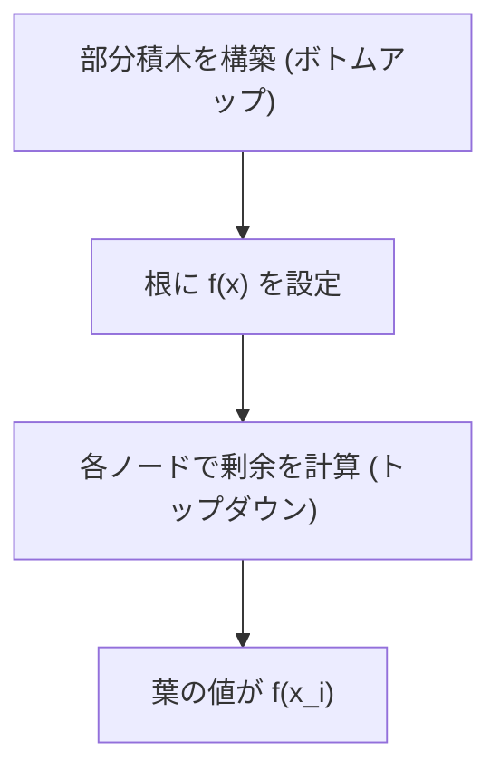

## Multipoint Evaluation とは

Multipoint Evaluation は、次数 $n-1$ 以下の多項式 $f(x)$ を $n$ 個の点 $x_0, x_1, \ldots, x_{n-1}$ で同時に評価する問題である。

素朴に各点で Horner 法を適用すると $O(n^2)$ かかるが、分割統治とFFTを組み合わせると $O(n \log^2 n)$ で計算できる。

## 素朴なアプローチ

各点 $x_i$ で Horner 法により $f(x_i)$ を $O(n)$ で計算する。$n$ 点あるので全体は $O(n^2)$。

```python title="naive.py"
def eval_naive(coeffs: list[int], points: list[int]) -> list[int]:
    """Evaluate polynomial at multiple points"""
    results = []
    for x in points:
        val = 0
        power = 1
        for c in coeffs:
            val += c * power
            power *= x
        results.append(val)
    return results
```

## 核心アイデア: 剰余定理

多項式 $f(x)$ を $(x - a)$ で割った余りは $f(a)$ に等しい (剰余定理)。

$$
f(x) = q(x)(x - a) + f(a)
$$

したがって $f(x) \bmod (x - x_i)$ を計算すれば $f(x_i)$ が得られる。

## 分割統治アルゴリズム

### 部分積木 (Subproduct Tree)

評価点 $x_0, x_1, \ldots, x_{n-1}$ に対して、部分積木を構築する。

葉は $(x - x_i)$ で、内部ノードは子の積:

```
              (x-x0)(x-x1)(x-x2)(x-x3)
              /                        \
    (x-x0)(x-x1)                (x-x2)(x-x3)
    /          \                /          \
 (x-x0)    (x-x1)         (x-x2)    (x-x3)
```

### 上から下への剰余計算

根から葉に向かって、各ノードで多項式の剰余を計算する:

1. 根: $f(x)$
2. 左の子: $f(x) \bmod M_{\text{left}}$
3. 右の子: $f(x) \bmod M_{\text{right}}$
4. 葉に到達したら: $f(x) \bmod (x - x_i) = f(x_i)$

ここで $M_{\text{left}}, M_{\text{right}}$ は部分積木の対応するノードの多項式。

### なぜ高速か

各レベルで行う多項式の剰余算出は FFT を用いて $O(n \log n)$ で計算でき、木の深さは $O(\log n)$ なので全体は $O(n \log^2 n)$。

## アルゴリズムの流れ



### ステップ 1: 部分積木の構築

ボトムアップで、葉 $(x - x_i)$ の積を計算していく。各レベルで多項式乗算 (FFT) を行う。

### ステップ 2: 剰余の伝播

トップダウンで、各ノードに到達した多項式を子ノードの部分積で割った余りを求める。

## 実装の概要

```python title="multipoint_eval.py"
def build_subproduct_tree(points: list):
    """Build subproduct tree bottom-up"""
    n = len(points)
    # Leaves: [x - xi] for each point
    tree = [None] * (4 * n)
    # ... build tree using FFT-based polynomial multiplication
    return tree

def multipoint_eval(f: list, points: list) -> list:
    """Evaluate polynomial f at all points"""
    n = len(points)
    if n == 1:
        return [eval_at_point(f, points[0])]

    tree = build_subproduct_tree(points)
    mid = n // 2

    # f mod M_left and f mod M_right
    f_left = poly_mod(f, tree.left)
    f_right = poly_mod(f, tree.right)

    # Recurse
    left_results = multipoint_eval(f_left, points[:mid])
    right_results = multipoint_eval(f_right, points[mid:])

    return left_results + right_results
```

実際の実装では多項式乗算と除算に FFT (NTT) を使い、注意深くサイズを管理する必要がある。

## 計算量

| 処理 | 時間計算量 |
|------|-----------|
| 素朴な方法 | $O(n^2)$ |
| 分割統治 + FFT | $O(n \log^2 n)$ |
| 部分積木の構築 | $O(n \log^2 n)$ |
| 剰余の伝播 | $O(n \log^2 n)$ |

定数倍はそれなりに大きいため、$n$ が小さい場合 (数千以下) は素朴な方法の方が速いことがある。

## 関連する問題

### 多点補間 (Multipoint Interpolation)

Multipoint Evaluation の逆問題: $n$ 個の点 $(x_i, y_i)$ から多項式の係数を求める。同じく $O(n \log^2 n)$ で計算可能で、部分積木と同様の分割統治を用いる。

### 多項式の GCD

多項式の GCD も $O(n \log^2 n)$ で計算でき、Multipoint Evaluation と同様のテクニックに基づく。

## 応用

- 多項式環上の高速計算
- 誤り訂正符号 (Reed-Solomon 符号)
- 暗号学 (多項式ベースのプロトコル)
- 競技プログラミングでの多項式操作

## まとめ

| 項目 | 内容 |
|------|------|
| 入力 | 多項式 $f(x)$ (次数 $< n$) と $n$ 個の評価点 |
| 出力 | $f(x_0), f(x_1), \ldots, f(x_{n-1})$ |
| 素朴 | $O(n^2)$ |
| 高速 | $O(n \log^2 n)$ |
| 核心 | 部分積木 + 剰余定理 + FFT |
