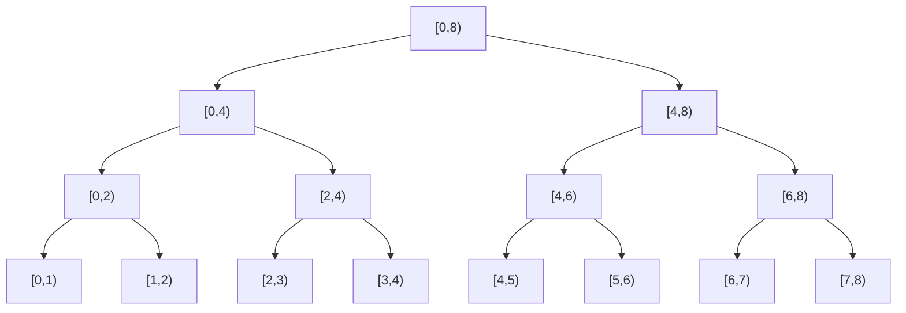

## Offline Dynamic Connectivity とは

Offline Dynamic Connectivity は、無向グラフに対する辺の追加・削除・連結性クエリをオフラインで効率的に処理する手法である。全ての操作が事前に与えられている (オフライン) という条件を活かし、**時間軸上のセグメント木** と **Rollback 可能 Union-Find** を組み合わせて解く。

## 問題設定

### 正確な定義

$N$ 頂点の無向グラフに対して、時刻 $0, 1, \ldots, Q-1$ にわたる以下の操作列が**事前に全て**与えられる。

- `add(u, v)`: 辺 $(u, v)$ を追加する
- `remove(u, v)`: 辺 $(u, v)$ を削除する (事前に追加されている辺のみ)
- `query(u, v)`: その時点で $u$ と $v$ が連結かどうかを判定する

全ての `query` に対する回答を求めよ。

### 辺の生存区間

各辺 $(u, v)$ は `add` で追加され `remove` で削除される。この間の時刻を**生存区間** $[t_{\text{add}}, t_{\text{remove}})$ と呼ぶ。最後まで削除されない辺の生存区間は $[t_{\text{add}}, Q)$ である。

例えば以下の操作列を考える。

| 時刻 | 操作 |
|------|------|
| 0 | `add(0, 1)` |
| 1 | `add(1, 2)` |
| 2 | `query(0, 2)` → 連結 |
| 3 | `remove(0, 1)` |
| 4 | `query(0, 2)` → 非連結 |
| 5 | `add(0, 2)` |
| 6 | `query(0, 2)` → 連結 |
| 7 | `remove(1, 2)` |

この場合の辺の生存区間は次の通り。

- 辺 $(0, 1)$: $[0, 3)$
- 辺 $(1, 2)$: $[1, 7)$
- 辺 $(0, 2)$: $[5, 8)$ (最後まで残存、$Q = 8$)

### なぜオフラインが必要か

Union-Find は辺の追加には対応できるが、**削除には対応できない** (パス圧縮を行うと元の構造を復元できない)。オンラインで辺の追加と削除の両方をサポートするには Link-Cut Tree などの高度なデータ構造が必要で、実装が複雑になる。

オフラインでは全操作を先読みできるため、各辺の生存区間を特定してセグメント木で管理するという巧妙な手法が使える。

## アルゴリズム

### 核心アイデア: 時間軸上のセグメント木

$Q$ 個の時刻を葉とするセグメント木を構築する。各辺を、その生存区間に対応するセグメント木のノードに登録する。セグメント木の区間分解により、各辺は $O(\log Q)$ 個のノードに分配される。



例えば、辺 $(1, 2)$ の生存区間 $[1, 7)$ は、セグメント木上で $[1, 2)$, $[2, 4)$, $[4, 6)$, $[6, 7)$ の 4 ノードに分配される。

### Rollback 可能 Union-Find

通常の Union-Find はパス圧縮を行うため、`union` 操作を取り消す (rollback) ことができない。Rollback 可能な Union-Find は以下のように設計する。

1. **rank による結合のみ** を使用し、パス圧縮は行わない
2. `union` 操作のたびに、変更した情報を**履歴スタック**に記録する
3. `rollback` 操作で履歴を巻き戻し、`union` 前の状態に復元する

パス圧縮を使わないため `find` は $O(\log N)$ だが、rollback が可能になるという大きな利点がある。

```python title="rollback_union_find.py"
class RollbackUnionFind:
    def __init__(self, n):
        self.parent = list(range(n))
        self.rank = [0] * n
        self.history = []  # stack of (vertex, old_parent, old_rank)

    def find(self, x):
        # No path compression - walk up to root
        while self.parent[x] != x:
            x = self.parent[x]
        return x

    def union(self, x, y):
        rx, ry = self.find(x), self.find(y)
        if rx == ry:
            self.history.append(None)  # no-op marker
            return False
        # Union by rank
        if self.rank[rx] < self.rank[ry]:
            rx, ry = ry, rx
        self.history.append((ry, self.parent[ry], self.rank[rx]))
        self.parent[ry] = rx
        if self.rank[rx] == self.rank[ry]:
            self.rank[rx] += 1
        return True

    def rollback(self):
        record = self.history.pop()
        if record is None:
            return
        ry, old_parent, old_rank_rx = record
        rx = self.parent[ry]
        self.parent[ry] = old_parent
        self.rank[rx] = old_rank_rx

    def connected(self, x, y):
        return self.find(x) == self.find(y)

    def snapshot(self):
        return len(self.history)

    def rollback_to(self, snap):
        while len(self.history) > snap:
            self.rollback()
```

### セグメント木への辺の配置

各辺の生存区間 $[l, r)$ をセグメント木の区間に分解して登録する。

```python title="segment_tree_add.py"
def add_edge_to_segtree(node, node_l, node_r, l, r, edge, tree):
    if l >= node_r or r <= node_l:
        return
    if l <= node_l and node_r <= r:
        tree[node].append(edge)
        return
    mid = (node_l + node_r) // 2
    add_edge_to_segtree(2 * node, node_l, mid, l, r, edge, tree)
    add_edge_to_segtree(2 * node + 1, mid, node_r, l, r, edge, tree)
```

### DFS によるクエリ処理

セグメント木を DFS で走査する。各ノードに入るときにそのノードに登録された辺を `union` し、葉に到達したらクエリに回答し、帰りがけに `rollback` する。

```python title="dfs_solve.py"
def dfs(node, node_l, node_r, tree, uf, queries, answers):
    snap = uf.snapshot()

    # Apply all edges at this node
    for u, v in tree[node]:
        uf.union(u, v)

    if node_r - node_l == 1:
        # Leaf: answer query at this time
        t = node_l
        if t in queries:
            u, v = queries[t]
            answers[t] = uf.connected(u, v)
    else:
        mid = (node_l + node_r) // 2
        dfs(2 * node, node_l, mid, tree, uf, queries, answers)
        dfs(2 * node + 1, mid, node_r, tree, uf, queries, answers)

    # Rollback all unions done at this node
    uf.rollback_to(snap)
```

### 完全なアルゴリズム

```python title="offline_dynamic_connectivity.py"
def solve(n, operations):
    Q = len(operations)
    # 1. Determine edge lifetimes
    active = {}  # (u, v) -> add_time
    edges = []   # (u, v, add_time, remove_time)
    queries = {} # time -> (u, v)

    for t, op in enumerate(operations):
        if op[0] == "add":
            u, v = op[1], op[2]
            key = (min(u, v), max(u, v))
            active[key] = t
        elif op[0] == "remove":
            u, v = op[1], op[2]
            key = (min(u, v), max(u, v))
            edges.append((key[0], key[1], active[key], t))
            del active[key]
        elif op[0] == "query":
            queries[t] = (op[1], op[2])

    # Remaining active edges
    for key, add_t in active.items():
        edges.append((key[0], key[1], add_t, Q))

    # 2. Build segment tree
    size = 1
    while size < Q:
        size *= 2
    tree = [[] for _ in range(4 * size)]

    for u, v, l, r in edges:
        add_edge_to_segtree(1, 0, size, l, r, (u, v), tree)

    # 3. DFS with rollback union-find
    uf = RollbackUnionFind(n)
    answers = {}
    dfs(1, 0, size, tree, uf, queries, answers)

    return answers
```

## 具体的な数値例

次の操作列で動作を追跡する (頂点数 $N = 4$)。

| 時刻 | 操作 |
|------|------|
| 0 | `add(0, 1)` |
| 1 | `add(1, 2)` |
| 2 | `query(0, 2)` |
| 3 | `remove(0, 1)` |
| 4 | `add(2, 3)` |
| 5 | `query(0, 3)` |
| 6 | `remove(1, 2)` |
| 7 | `query(1, 2)` |

**辺の生存区間**:
- 辺 $(0, 1)$: $[0, 3)$
- 辺 $(1, 2)$: $[1, 6)$
- 辺 $(2, 3)$: $[4, 8)$

**セグメント木への配置** (サイズ 8):
- 辺 $(0, 1)$: $[0, 3)$ → ノード $[0, 2)$ と $[2, 3)$ に登録
- 辺 $(1, 2)$: $[1, 6)$ → ノード $[1, 2)$, $[2, 4)$, $[4, 6)$ に登録
- 辺 $(2, 3)$: $[4, 8)$ → ノード $[4, 8)$ に登録

**DFS の走査**:

1. ルート $[0, 8)$ に入る → 登録辺なし
2. 左子 $[0, 4)$ に入る → 登録辺なし
3. $[0, 2)$ に入る → 辺 $(0, 1)$ を union → {0,1}
4. $[0, 1)$ 葉 → クエリなし
5. $[1, 2)$ 葉 → 辺 $(1, 2)$ を union → {0,1,2}。クエリなし
6. $[1, 2)$ を出る → rollback → {0,1}
7. $[0, 2)$ を出る → rollback → 全て独立
8. $[2, 4)$ に入る → 辺 $(1, 2)$ を union → {1,2}
9. $[2, 3)$ 葉 → 辺 $(0, 1)$ を union → {0,1,2}。時刻 2 のクエリ: `query(0,2)` → **連結** (正解)
10. $[2, 3)$ を出る → rollback → {1,2}
11. $[3, 4)$ 葉 → クエリなし
12. $[2, 4)$ を出る → rollback → 全て独立
13. 右子 $[4, 8)$ に入る → 辺 $(2, 3)$ を union → {2,3}
14. $[4, 6)$ に入る → 辺 $(1, 2)$ を union → {1,2,3}
15. $[4, 5)$ 葉 → クエリなし
16. $[5, 6)$ 葉 → 時刻 5 のクエリ: `query(0,3)` → **非連結** (0 は独立、正解)
17. $[4, 6)$ を出る → rollback → {2,3}
18. $[6, 8)$ に入る → 登録辺なし
19. $[6, 7)$ 葉 → クエリなし
20. $[7, 8)$ 葉 → 時刻 7 のクエリ: `query(1,2)` → **非連結** (1 は独立、{2,3} のみ連結、正解)
21. $[6, 8)$ を出る
22. $[4, 8)$ を出る → rollback → 全て独立

## 計算量の解析

### 命題: 全体の計算量は $O((N + Q) \log^2 Q)$

**証明:**

**セグメント木の構築**: 各辺の生存区間をセグメント木に登録する。1 つの区間 $[l, r)$ はセグメント木上で $O(\log Q)$ 個のノードに分解される。辺の総数は $O(Q)$ なので、登録の合計は $O(Q \log Q)$ 個。

**DFS の走査**: セグメント木の各ノードで、登録された辺について `union` と `rollback` を行う。

- `union` 1 回の計算量: `find` が $O(\log N)$ (パス圧縮なしの Union-Find)
- `rollback` 1 回の計算量: $O(1)$
- union の総回数: 全ノードの登録辺数の合計 = $O(Q \log Q)$

したがって union の合計計算量は $O(Q \log Q \cdot \log N)$。

`find` の呼び出しもクエリ回答時に $O(\log N)$ かかるが、クエリは $O(Q)$ 個なので $O(Q \log N)$。

全体の計算量は $O(Q \log Q \cdot \log N)$ であり、$N \leq Q$ と仮定すれば $O(Q \log^2 Q)$ となる。 $\square$

**空間計算量**: セグメント木に $O(Q \log Q)$、Union-Find に $O(N)$、履歴スタックに $O(Q \log Q)$ で、全体 $O(N + Q \log Q)$。

## オンライン版との比較

| 手法 | 計算量 | 削除対応 | 実装難度 |
|------|--------|---------|---------|
| Union-Find (素朴) | $O(Q \cdot \alpha(N))$ | 不可 | 易 |
| Offline Dynamic Connectivity | $O(Q \log^2 Q)$ | 可 (オフライン) | 中 |
| Link-Cut Tree | $O(Q \log N)$ | 可 (オンライン) | 難 |
| Euler Tour Tree | $O(Q \log^2 N)$ | 可 (オンライン) | 難 |

オフライン版は、全ての操作が事前に与えられるという制約がある代わりに、実装が比較的簡単で計算量も良好である。競技プログラミングでは「辺の削除を伴う連結性クエリ」が出題されたら、まずこの手法を検討するのが定石である。

## 応用

- **動的な連結成分の管理**: 辺の追加・削除を伴うグラフの連結性判定
- **二部グラフ性の動的判定**: Union-Find に偶奇情報を持たせることで、辺の追加・削除に伴う二部グラフ性の変化を追跡可能
- **最小全域木のオフライン更新**: 辺の重みが変わる場合の最小全域木の再計算
- **Bridge Online / Offline**: 橋の動的管理

## まとめ

| 項目 | 内容 |
|------|------|
| 入力 | 辺の追加・削除・クエリ列 (全て事前に既知) |
| 出力 | 各クエリ時点での連結性 |
| 時間計算量 | $O(Q \log^2 Q)$ |
| 空間計算量 | $O(N + Q \log Q)$ |
| 核心 | 時間軸セグメント木 + Rollback 可能 Union-Find |
| 制約 | オフライン (全操作を先読みする必要あり) |
