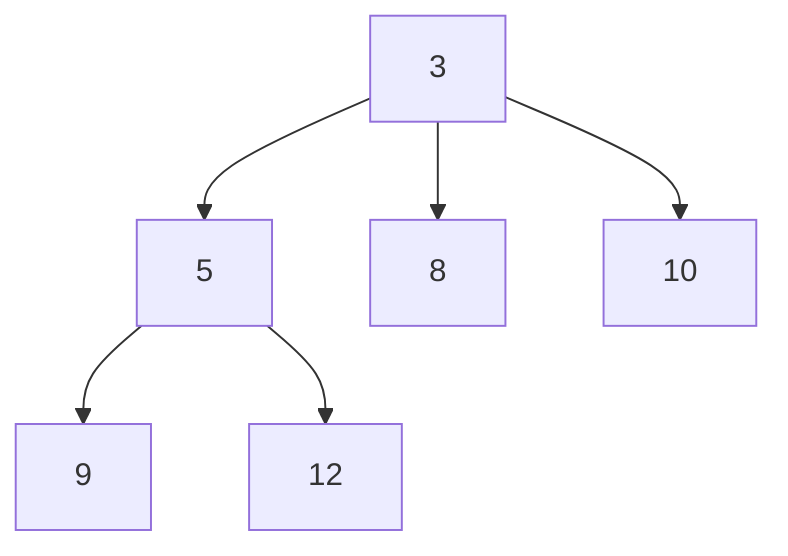

## Pairing Heap とは

Pairing Heap (ペアリングヒープ) は、1986年に Fredman, Sedgewick, Sleator, Tarjan によって提案された自己調整型ヒープである。構造が非常にシンプルでありながら、実用上は Fibonacci Heap に匹敵する性能を持つ。

### 構造

Pairing Heap はヒープ順序を持つ多分木 (multi-way tree) である。各ノードは子のリスト (左子・右兄弟表現) を持つ。根のキーが最小値となる。



## 計算量

| 操作 | 計算量 |
|------|--------|
| find-min | $O(1)$ |
| merge | $O(1)$ |
| insert | $O(1)$ |
| delete-min | 償却 $O(\log n)$ |
| decrease-key | $o(\log n)$ (正確な上界は未解決) |

decrease-key の正確な償却計算量は長年の未解決問題であり、$O(2^{2\sqrt{\log \log n}})$ であることが知られている。

## 基本操作

### Merge

2 つのヒープのマージは、根同士を比較し、キーが大きい方をもう一方の子にする。

```python title="pairing_heap.py"
def merge(h1, h2):
    if h1 is None:
        return h2
    if h2 is None:
        return h1
    if h1.key > h2.key:
        h1, h2 = h2, h1
    # h2 becomes a child of h1
    h2.next_sibling = h1.child
    h1.child = h2
    return h1
```

**計算量:** $O(1)$

### Insert

単一ノードのヒープを作成し、merge する。

```python
def insert(h, key):
    new_node = PairingNode(key)
    return merge(h, new_node)
```

**計算量:** $O(1)$

### Find-Min

根のキーを返す。

**計算量:** $O(1)$

### Delete-Min

根を削除した後、子の集合を**ペアリング** (2つずつマージ) する。これが名前の由来である。

手順:
1. 根を削除し、子のリストを取得する
2. 左から右へ 2 つずつペアにしてマージする (第1パス)
3. 右から左へ順にマージする (第2パス)

この 2 パス方式が性能の鍵である。

```python title="delete_min.py"
def delete_min(h):
    if h is None:
        return None
    children = get_children_list(h)
    if not children:
        return None
    # Pass 1: pair and merge left to right
    merged = []
    i = 0
    while i + 1 < len(children):
        merged.append(merge(children[i], children[i + 1]))
        i += 2
    if i < len(children):
        merged.append(children[i])
    # Pass 2: merge right to left
    result = merged[-1]
    for j in range(len(merged) - 2, -1, -1):
        result = merge(merged[j], result)
    return result
```

**償却計算量:** $O(\log n)$

## Delete-Min の解析

### 直感的な理解

2 パスマージが単純な左から右への逐次マージより優れている理由は、結果として得られる木の形状がバランスしやすいためである。

1パスで左から右へ 2 つずつマージすると、$\lceil k/2 \rceil$ 個のヒープが得られる ($k$ は子の数)
2パスで右から左へマージすることで、最後にマージされるヒープの大きさが均等になりやすい。

### ポテンシャル関数による証明の概略

ポテンシャル関数 $\Phi$ を各ノードの子の数に基づいて定義すると、delete-min の償却コストが $O(\log n)$ であることが示される。詳細は原論文を参照のこと。

## Decrease-Key

ノードのキーを減少させる操作:

1. ノードのキーを更新する
2. ノードが根でなければ、親から切り離して根とマージする

```python
def decrease_key(h, node, new_key):
    node.key = new_key
    if node == h:
        return h
    # Cut node from its parent
    cut(node)
    return merge(h, node)
```

## 実用上の利点

Pairing Heap の大きな利点は**実装の簡潔さ**である。Fibonacci Heap は理論的に優れた計算量を持つが、実装が複雑でポインタ操作のオーバーヘッドが大きい。Pairing Heap はこれらの問題を回避しつつ、実用上は同等以上の性能を発揮する。

実験的には、Pairing Heap は多くのベンチマークで Binary Heap や Fibonacci Heap を上回る結果が報告されている。

## まとめ

| 項目 | 内容 |
|------|------|
| データ構造 | ヒープ順序の多分木 |
| merge | $O(1)$ |
| insert | $O(1)$ |
| delete-min | 償却 $O(\log n)$ |
| decrease-key | $o(\log n)$ (正確な上界は未解決) |
| 特徴 | 実装が簡潔、実用性能が高い |
| 名前の由来 | delete-min でのペアリング (2つずつマージ) |
