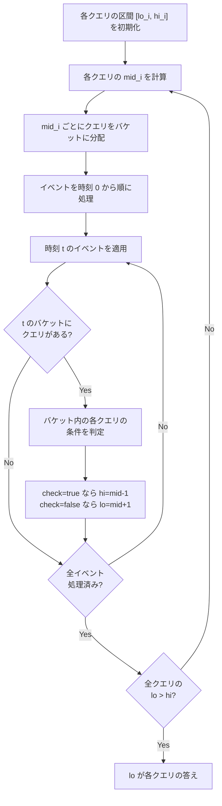

## Parallel Binary Search とは

Parallel Binary Search (並列二分探索) は、複数の独立した二分探索を同時に行う手法である。各二分探索を個別に行うと合計 $O(Q \cdot M \cdot \text{check})$ かかるところ、並列化により $O((M + Q) \log M \cdot \text{check})$ に削減できる。

直感的には、「$Q$ 個の質問に対してそれぞれ二分探索したいが、毎回状態を最初から構築し直すのは無駄なので、同じ時刻の質問をまとめて一括処理する」というアイデアである。

## 問題設定

### 一般的な定式化

$M$ 個のイベントが時刻 $0, 1, \ldots, M-1$ に順に発生する。$Q$ 個のクエリ $q_0, q_1, \ldots, q_{Q-1}$ がそれぞれ「条件 $C_i$ が初めて満たされるイベント番号 (時刻)」を求めたいとする。

各クエリ $q_i$ に対して、時刻 $t$ までのイベントを全て適用した状態で条件 $C_i$ が成り立つかどうかを判定する関数 $\text{check}(t, q_i)$ が存在する。さらに、$\text{check}(t, q_i)$ は $t$ について**単調**であることを仮定する。すなわち:

$$
\text{check}(t, q_i) = \text{true} \implies \text{check}(t', q_i) = \text{true} \quad (\forall t' \geq t)
$$

### 具体例: 連結時刻の問題

**問題**: $N$ 頂点のグラフに $M$ 本の辺が順に追加される。$Q$ 個のクエリ $(u_i, v_i)$ に対して、頂点 $u_i$ と $v_i$ が初めて連結になる時刻を答えよ。

- イベント: 辺の追加
- 条件: $u_i$ と $v_i$ が同じ連結成分に属する
- 単調性: 一度連結になったら切断されない (辺の追加のみなので)

## 素朴なアプローチ

各クエリについて個別に二分探索を行うと:

```python title="naive_binary_search.py"
def naive_approach(queries, events, check):
    answers = []
    for qi in queries:
        lo, hi = 0, len(events) - 1
        while lo <= hi:
            mid = (lo + hi) // 2
            # Rebuild state from scratch for time [0, mid]
            state = initialize()
            for t in range(mid + 1):
                apply(state, events[t])
            if check(state, qi):
                hi = mid - 1
            else:
                lo = mid + 1
        answers.append(lo)
    return answers
```

計算量: 各クエリで $O(\log M)$ 回の二分探索ステップ、各ステップで $O(M)$ の状態構築。全体で $O(Q \cdot M \cdot \log M)$。

この方法が非効率な理由は、**各クエリが独立に状態を再構築するため、同じイベント列を何度も処理する**ことにある。

## 並列二分探索のアイデア

### 核心: 中間点のバケット化

全クエリの二分探索を**同時に**進行させる。あるラウンドで、各クエリの二分探索の中間点 $\text{mid}_i$ をまとめ、時刻順にイベントを処理しながら該当するクエリの条件を一括判定する。



### ポイント

1ラウンドでイベント列を1回走査するだけで、**全クエリの中間点を同時に判定**できる。各クエリの二分探索区間は独立に半分に狭まる。$O(\log M)$ ラウンドで全クエリの答えが確定する。

## アルゴリズムの詳細

### 手順

1. 各クエリ $i$ について $lo_i = 0$, $hi_i = M - 1$ に初期化する
2. 以下を $O(\log M)$ ラウンド繰り返す:
   - 各クエリ $i$ ($lo_i \leq hi_i$) について $\text{mid}_i = \lfloor(lo_i + hi_i) / 2\rfloor$ を計算する
   - $\text{mid}_i$ の値ごとにクエリをバケットに分配する
   - 状態を初期化する
   - イベントを時刻 $t = 0, 1, \ldots, M-1$ の順に処理する
   - 時刻 $t$ の後、バケット $t$ に含まれる全クエリの条件を判定する
   - $\text{check} = \text{true}$ なら $hi_i = \text{mid}_i - 1$、$\text{false}$ なら $lo_i = \text{mid}_i + 1$
3. 全クエリで $lo_i > hi_i$ になったら終了。$lo_i$ が答え

### 実装

```python title="parallel_binary_search.py"
def parallel_binary_search(queries, events, check):
    q = len(queries)
    m = len(events)
    lo = [0] * q
    hi = [m - 1] * q

    # O(log M) rounds
    for _ in range(m.bit_length() + 1):
        # Distribute queries to buckets by their midpoint
        buckets = {}
        active = False
        for i in range(q):
            if lo[i] <= hi[i]:
                active = True
                mid = (lo[i] + hi[i]) // 2
                buckets.setdefault(mid, []).append(i)

        if not active:
            break

        # Process events in chronological order
        state = initialize()
        for t in range(m):
            apply(state, events[t])
            if t in buckets:
                for qi in buckets[t]:
                    if check(state, queries[qi]):
                        hi[qi] = t - 1
                    else:
                        lo[qi] = t + 1

    return lo  # answers[i] = lo[i]
```

## 具体例: 連結時刻の問題

### 問題の実装

$N$ 頂点のグラフに辺が順に追加され、各クエリ $(u, v)$ について $u$ と $v$ が初めて連結になる時刻を求める。

```python title="connectivity_time.py"
class UnionFind:
    def __init__(self, n):
        self.parent = list(range(n))
        self.rank = [0] * n

    def find(self, x):
        if self.parent[x] != x:
            self.parent[x] = self.find(self.parent[x])
        return self.parent[x]

    def union(self, x, y):
        rx, ry = self.find(x), self.find(y)
        if rx == ry:
            return
        if self.rank[rx] < self.rank[ry]:
            rx, ry = ry, rx
        self.parent[ry] = rx
        if self.rank[rx] == self.rank[ry]:
            self.rank[rx] += 1

    def connected(self, x, y):
        return self.find(x) == self.find(y)

def solve_connectivity(n, edges, queries):
    """
    n: number of vertices
    edges: list of (u, v) - edges added in order
    queries: list of (u, v) - pairs to check connectivity
    """
    q = len(queries)
    m = len(edges)
    lo = [0] * q
    hi = [m - 1] * q

    for _ in range(m.bit_length() + 1):
        buckets = {}
        active = False
        for i in range(q):
            if lo[i] <= hi[i]:
                active = True
                mid = (lo[i] + hi[i]) // 2
                buckets.setdefault(mid, []).append(i)

        if not active:
            break

        # Rebuild Union-Find from scratch each round
        uf = UnionFind(n)
        for t in range(m):
            u, v = edges[t]
            uf.union(u, v)
            if t in buckets:
                for qi in buckets[t]:
                    qu, qv = queries[qi]
                    if uf.connected(qu, qv):
                        hi[qi] = t - 1
                    else:
                        lo[qi] = t + 1

    return lo
```

### 計算例

4頂点のグラフに辺が順に追加される場合を考える。

| 時刻 | 追加する辺 |
|------|-----------|
| 0 | (0, 1) |
| 1 | (2, 3) |
| 2 | (1, 2) |
| 3 | (0, 3) |

クエリ: 頂点 0 と頂点 3 が初めて連結になる時刻は?

**ラウンド 1**: $lo = 0$, $hi = 3$, $\text{mid} = 1$
- 時刻 0-1 のイベントを適用: 連結成分は $\{0,1\}$, $\{2,3\}$
- 0 と 3 は非連結 → $lo = 2$

**ラウンド 2**: $lo = 2$, $hi = 3$, $\text{mid} = 2$
- 時刻 0-2 のイベントを適用: 連結成分は $\{0,1,2,3\}$
- 0 と 3 は連結 → $hi = 1$

$lo = 2 > hi = 1$ なので終了。答えは時刻 2。

## 計算量の解析

### ラウンド数

各ラウンドで各クエリの探索区間が半分になるため、$O(\log M)$ ラウンドで全クエリが確定する。

### 各ラウンドの計算量

- イベントの処理: $O(M \cdot T_{\text{event}})$ ($T_{\text{event}}$ は1イベントの処理時間)
- クエリの判定: 全クエリの判定は合計 $O(Q \cdot T_{\text{check}})$

### 全体

$$
T = O((M \cdot T_{\text{event}} + Q \cdot T_{\text{check}}) \cdot \log M)
$$

連結時刻の問題では $T_{\text{event}} = O(\alpha(N))$ (Union-Find の合併), $T_{\text{check}} = O(\alpha(N))$ (Union-Find の検索) なので:

$$
T = O((M + Q) \cdot \alpha(N) \cdot \log M)
$$

### 素朴な方法との比較

| 手法 | 計算量 |
|------|-------|
| 素朴 (個別二分探索) | $O(Q \cdot M \cdot \log M \cdot \alpha(N))$ |
| 並列二分探索 | $O((M + Q) \cdot \alpha(N) \cdot \log M)$ |

$Q$ と $M$ が大きいとき、並列化の効果は劇的である。例えば $Q = M = 10^5$ の場合、素朴な方法は約 $10^{10} \cdot 17 \approx 10^{11}$ 回の操作が必要だが、並列二分探索は約 $2 \times 10^5 \cdot 17 \approx 3.4 \times 10^6$ 回で済む。

## データ構造との組み合わせ

### Union-Find (前述)

連結性判定の問題で最もよく使われる組み合わせ。各ラウンドで Union-Find を再構築する。

### BIT / セグメント木

「累積和がある閾値を超える最初の時刻」のような問題では、BIT やセグメント木を各ラウンドで構築して区間クエリに答える。

### ロールバック可能なデータ構造

状態を毎ラウンド再構築するのが高価な場合、**永続データ構造**や**ロールバック付き Union-Find** を用いると効率化できる場合がある。ただし実装の複雑さは増す。

## 発展: オフラインクエリとの関係

### 整列済みクエリとの比較

Mo のアルゴリズムのようにクエリを並べ替える手法と比較すると:

- Mo のアルゴリズム: 区間クエリに特化、$O((N + Q) \sqrt{N})$
- 並列二分探索: 単調性を持つ「いつ条件を満たすか」型のクエリに特化

### マージソート木との組み合わせ

並列二分探索とマージソート木 (wavelet tree) を組み合わせると、より複雑なクエリにも対応できる場合がある。

## 応用

- **動的グラフの連結時刻**: 各クエリ対が初めて連結になる時刻
- **閾値問題**: 各クエリについて条件を満たす最小の閾値
- **動的な集合への追加**: 要素が順に追加される中で、各クエリの条件が満たされる最初の時刻
- **オンラインジャッジの典型問題**: 辺の追加とクエリが混在する問題で、オフライン化できる場合

## まとめ

| 項目 | 内容 |
|------|------|
| 入力 | $M$ 個のイベント、$Q$ 個のクエリ |
| 出力 | 各クエリの答え (条件を初めて満たす時刻) |
| 時間計算量 | $O((M \cdot T_{\text{event}} + Q \cdot T_{\text{check}}) \cdot \log M)$ |
| 必要条件 | 条件の単調性 (一度満たされたら以降も満たされる) |
| 核心 | 二分探索の中間点をバケットに分けて一括処理 |
| よく使うDS | Union-Find、BIT、セグメント木 |
