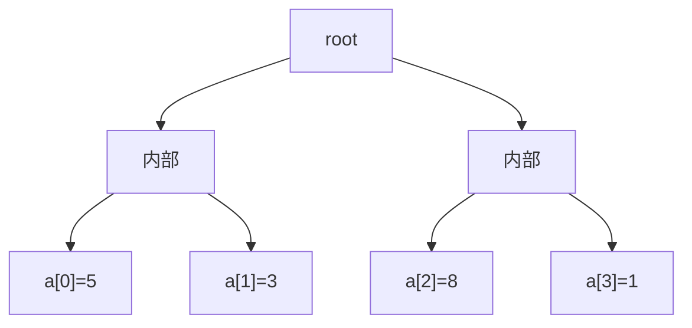
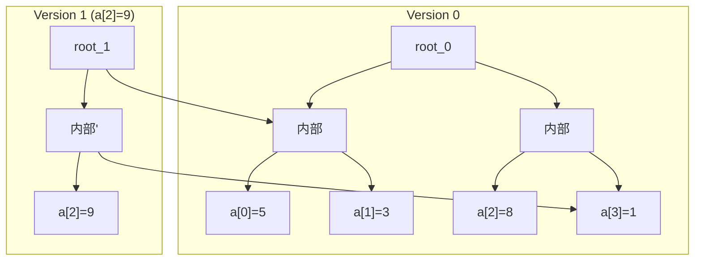

## Persistent Array とは

Persistent Array (永続配列) は、配列の更新時に過去のバージョンを破壊せず保持する**永続データ構造** (persistent data structure) の一種である。任意の過去バージョンに対して参照・更新が可能。

### 永続性の種類

- **Partial Persistence (部分永続):** 過去のバージョンの参照は可能だが、更新は最新バージョンに対してのみ
- **Full Persistence (完全永続):** 任意の過去バージョンに対して参照・更新の両方が可能

ここでは完全永続配列を扱う。

## 素朴な実装

更新のたびに配列全体をコピーすれば永続性は実現できるが、1回の更新に $O(n)$ の時間と空間がかかる。

## 完全二分木による実装

配列を完全二分木の葉に格納することで、$O(\log n)$ の更新・参照が可能になる。

### 構造

$n$ 要素の配列を高さ $\lceil \log n \rceil$ の完全二分木で表現する。葉ノードに配列の値を格納し、内部ノードは左右の子へのポインタを持つ。



### Get (参照)

位置 $i$ の値を参照するには、$i$ のビット表現に従って根から葉まで辿る。

```python title="persistent_array.py"
def get(root, index, depth):
    if depth == 0:
        return root.value
    if (index >> (depth - 1)) & 1 == 0:
        return get(root.left, index, depth - 1)
    else:
        return get(root.right, index, depth - 1)
```

**計算量:** $O(\log n)$

### Set (更新)

位置 $i$ の値を更新するとき、根から葉までのパス上のノードのみを新たに作成し、それ以外は元のバージョンと共有する。これを**パスコピー (path copying)** と呼ぶ。

```python title="persistent_set.py"
def set(root, index, value, depth):
    if depth == 0:
        new_node = Node(value=value)
        return new_node
    new_node = Node(left=root.left, right=root.right)
    if (index >> (depth - 1)) & 1 == 0:
        new_node.left = set(root.left, index, value, depth - 1)
    else:
        new_node.right = set(root.right, index, value, depth - 1)
    return new_node
```

**計算量:** 時間 $O(\log n)$、追加空間 $O(\log n)$

### パスコピーの直感

更新は根から葉までの 1 本のパスにのみ影響する。そのパス上のノードだけを新しく作り、残りは元の木と共有する。



Version 1 では root と右の内部ノードと a[2] のみが新しく作られ、残りは Version 0 と共有される。

## 計算量

| 操作 | 時間 | 追加空間 |
|------|------|----------|
| 構築 | $O(n)$ | $O(n)$ |
| get | $O(\log n)$ | $O(1)$ |
| set | $O(\log n)$ | $O(\log n)$ |

$q$ 回の更新を行った場合の総空間は $O(n + q \log n)$。

## 応用

- **関数型プログラミング:** 不変データ構造の基盤
- **バージョン管理:** 変更履歴の効率的な保持
- **永続 Union-Find:** 永続配列を基に永続 Union-Find を構築
- **オフラインクエリ:** 計算結果のキャッシュ

## 拡張

### 永続セグメント木

同じパスコピーの手法をセグメント木に適用すると、永続セグメント木が得られる。各更新が $O(\log n)$ の時間と空間で行える。

### Fat Node 法

各ノードに全バージョンの値を格納する方法。参照は $O(\log v)$ ($v$ はバージョン数) で、空間効率は良いが実装が複雑。

## まとめ

| 項目 | 内容 |
|------|------|
| データ構造 | 完全二分木 + パスコピー |
| get | $O(\log n)$ |
| set | $O(\log n)$ 時間、$O(\log n)$ 追加空間 |
| 核心 | 更新パス上のノードのみをコピー |
| 利点 | 全バージョンに $O(\log n)$ でアクセス可能 |
