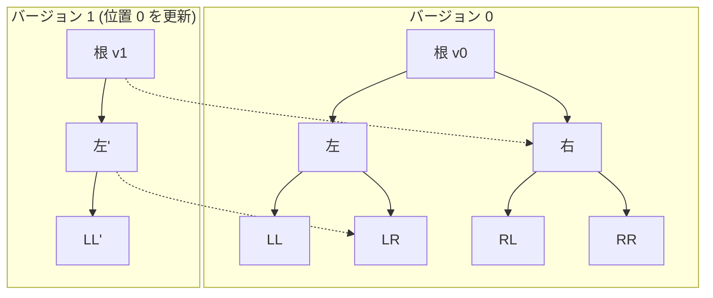

## 永続セグメント木とは

永続セグメント木 (Persistent Segment Tree) は、更新のたびに**過去のバージョンを破壊せずに保持する**セグメント木である。任意の過去バージョンに対してクエリを実行でき、任意のバージョンから新しいバージョンを派生させることができる。

### 計算量

| 操作 | 時間計算量 | 空間計算量 |
|------|-----------|-----------|
| 構築 | $O(n)$ | $O(n)$ |
| 一点更新 (新バージョン) | $O(\log n)$ | $O(\log n)$ |
| 区間クエリ | $O(\log n)$ | - |

## 核心アイデア：パス複製

### 問題

通常のセグメント木で一点更新を行うと、根から葉までのパス上のノード (高々 $O(\log n)$ 個) の値が変わる。この更新は元のデータを上書きするため、過去の状態にアクセスできなくなる。

### 解決策

更新時に、**変更が必要なノードだけを新しくコピーし、変更のないノードは元のバージョンと共有する**。



点線は「元のバージョンのノードを共有」していることを表す。バージョン 1 では、更新パス上の 3 ノードだけが新規作成され、残りの 4 ノードはバージョン 0 と共有される。

## 実装

### ノードベースの実装

配列ベースの通常のセグメント木と異なり、永続セグメント木では各ノードを明示的なオブジェクトとして管理する。

```python title="persistent_segment_tree.py"
class Node:
    def __init__(self, val=0, left=None, right=None):
        self.val = val
        self.left = left
        self.right = right

def build(arr, start, end):
    if start == end:
        return Node(val=arr[start])
    mid = (start + end) // 2
    left = build(arr, start, mid)
    right = build(arr, mid + 1, end)
    return Node(val=left.val + right.val, left=left, right=right)

def update(node, start, end, idx, val):
    if start == end:
        return Node(val=val)
    mid = (start + end) // 2
    if idx <= mid:
        new_left = update(node.left, start, mid, idx, val)
        return Node(
            val=new_left.val + node.right.val,
            left=new_left,
            right=node.right  # shared
        )
    else:
        new_right = update(node.right, mid + 1, end, idx, val)
        return Node(
            val=node.left.val + new_right.val,
            left=node.left,  # shared
            right=new_right
        )

def query(node, start, end, l, r):
    if r < start or end < l:
        return 0
    if l <= start and end <= r:
        return node.val
    mid = (start + end) // 2
    return (query(node.left, start, mid, l, r) +
            query(node.right, mid + 1, end, l, r))
```

### 使用例

```python
arr = [1, 2, 3, 4]
n = len(arr)
roots = []
roots.append(build(arr, 0, n - 1))       # v0
roots.append(update(roots[0], 0, n - 1, 1, 10))  # v1: arr[1] = 10
# v0 のクエリ: query(roots[0], 0, n-1, 0, 3) = 10
# v1 のクエリ: query(roots[1], 0, n-1, 0, 3) = 18
```

## 空間計算量の解析

### 構築

構築時のノード数は通常のセグメント木と同じ $2n - 1$ 個で、空間計算量は $O(n)$ である。

### 更新

1 回の更新で新規作成されるノードは根から葉までのパス上の $O(\log n)$ 個のみ。$Q$ 回の更新後の総ノード数は:

$$
O(n + Q \log n)
$$

これが永続セグメント木の主要な利点である。全てのバージョンを独立に保存すると $O(nQ)$ かかるところを、ノード共有により大幅に削減できる。

## 応用

### K 番目の要素 (区間 K-th smallest)

永続セグメント木の代表的な応用は、**静的な配列の区間 $[l, r]$ における $k$ 番目に小さい要素** を $O(\log \sigma)$ で求めることである ($\sigma$ は値域)。

アイデア: 値域上にセグメント木を構築し、配列の先頭から順に要素を挿入していく。$i$ 番目のバージョンは「配列の先頭 $i$ 要素を挿入した状態」を表す。区間 $[l, r]$ の情報は、バージョン $r+1$ とバージョン $l$ の差分から得られる。

### オフラインクエリの永続化

一般に、セグメント木ベースのデータ構造を永続化することで、時系列に沿った変更を全て保持しながらクエリに答えられる。

## まとめ

| 項目 | 内容 |
|------|------|
| 構築 | $O(n)$ |
| 更新 (新バージョン) | $O(\log n)$ 時間・空間 |
| クエリ | $O(\log n)$ |
| 総空間 ($Q$ 回更新後) | $O(n + Q \log n)$ |
| 核心 | パス複製によるノード共有 |
| 応用 | 区間 K-th smallest、時系列クエリ |
