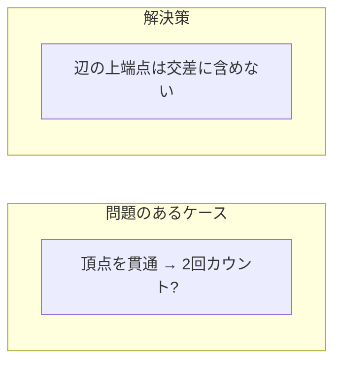
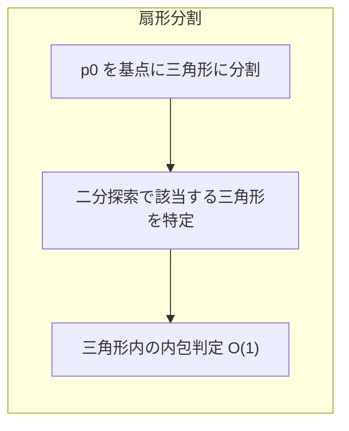

## 点の内包判定とは

与えられた点 $q$ が多角形 $P$ の内部にあるか、外部にあるか、あるいは境界上にあるかを判定する問題である。GIS、コンピュータグラフィックス、衝突判定など幅広い分野で使われる基本的な計算幾何の操作である。

## Ray Casting 法 (Crossing Number法)

### アイデア

判定点から任意の方向 (通常は水平右方向) に半直線を引き、多角形の辺との交差回数を数える。

- 交差回数が **奇数** → 内部
- 交差回数が **偶数** → 外部

### 直感的な説明

多角形の外部から内部に入るには必ず辺を1回横切る。内部から外部に出るにも辺を1回横切る。したがって、外部の点からの半直線は偶数回交差し、内部の点からの半直線は奇数回交差する。

これは **ジョルダンの曲線定理** に基づく。ジョルダンの曲線定理は、単純閉曲線は平面を「内部」と「外部」の2つの連結成分に分けることを保証する。

### 実装

```python title="point_in_polygon.py"
def point_in_polygon(polygon: list[tuple[float, float]], q: tuple[float, float]) -> bool:
    n = len(polygon)
    count = 0
    for i in range(n):
        pi = polygon[i]
        pj = polygon[(i + 1) % n]
        if ((pi[1] > q[1]) != (pj[1] > q[1])):
            x_intersect = pi[0] + (q[1] - pi[1]) / (pj[1] - pi[1]) * (pj[0] - pi[0])
            if q[0] < x_intersect:
                count += 1
    return count % 2 == 1
```

### エッジケースの詳細

Ray Casting 法で最も注意が必要なのは、半直線が多角形の頂点や辺上を通過する場合である。

#### 頂点上を通過する場合

半直線が多角形の頂点を通る場合、その頂点を共有する2つの辺と「同時に交差する」ことになり、交差回数のカウントが不正確になりうる。



**解決策:** 辺の端点のうち y 座標が大きい方 (上端点) は交差判定に含めないというルールを統一的に適用する。上記の実装では `(pi[1] > q[1]) != (pj[1] > q[1])` という条件が、等号を含まない `>` を使うことでこのルールを自然に実現している。

具体的には:
- 半直線が頂点 $v$ を通り、$v$ の前後の辺が半直線の同じ側にある場合 → 0回とカウントされるべき (接触)
- 半直線が頂点 $v$ を通り、$v$ の前後の辺が半直線の異なる側にある場合 → 1回とカウントされるべき (横断)

上端点を除外するルールにより、どちらのケースも正しく処理される。

#### 辺上の点

判定点 $q$ が多角形の辺上にある場合、「境界上」として特別に扱いたいことが多い。辺上判定を追加する実装は以下の通り:

```python title="point_on_segment.py"
def cross(o, a, b):
    return (a[0] - o[0]) * (b[1] - o[1]) - (a[1] - o[1]) * (b[0] - o[0])

def on_segment(p, a, b):
    """Check if p is on segment ab"""
    if abs(cross(a, b, p)) > 1e-9:
        return False
    return (min(a[0], b[0]) - 1e-9 <= p[0] <= max(a[0], b[0]) + 1e-9 and
            min(a[1], b[1]) - 1e-9 <= p[1] <= max(a[1], b[1]) + 1e-9)

def point_in_polygon_full(polygon, q):
    """Return: 1 (inside), -1 (outside), 0 (on boundary)"""
    n = len(polygon)
    for i in range(n):
        if on_segment(q, polygon[i], polygon[(i + 1) % n]):
            return 0
    count = 0
    for i in range(n):
        pi = polygon[i]
        pj = polygon[(i + 1) % n]
        if ((pi[1] > q[1]) != (pj[1] > q[1])):
            x_intersect = pi[0] + (q[1] - pi[1]) / (pj[1] - pi[1]) * (pj[0] - pi[0])
            if q[0] < x_intersect:
                count += 1
    return 1 if count % 2 == 1 else -1
```

## Winding Number 法

### アイデア

判定点の周りを多角形が何回回るかを計算する。

$$
w = \frac{1}{2\pi} \sum_{i=0}^{n-1} \theta_i
$$

ここで $\theta_i$ は辺 $p_i p_{i+1}$ が判定点の周りに作る角度である。

- $w \neq 0$ → 内部
- $w = 0$ → 外部

Winding Number 法はより堅牢で、自己交差する多角形にも対応できる。

### 効率的な実装

`atan2` を用いた角度計算は遅く、精度の問題もある。実際には外積の符号だけで Winding Number を計算できる。半直線の交差方向 (上向きか下向きか) に基づいてカウントする。

```python title="winding_number.py"
def winding_number(polygon, q):
    """Compute winding number of polygon around point q"""
    n = len(polygon)
    wn = 0
    for i in range(n):
        pi = polygon[i]
        pj = polygon[(i + 1) % n]
        if pi[1] <= q[1]:
            if pj[1] > q[1]:
                # Upward crossing
                if cross_val(pi, pj, q) > 0:
                    wn += 1
        else:
            if pj[1] <= q[1]:
                # Downward crossing
                if cross_val(pi, pj, q) < 0:
                    wn -= 1
    return wn

def cross_val(o, a, b):
    return (a[0] - o[0]) * (b[1] - o[1]) - (a[1] - o[1]) * (b[0] - o[0])
```

この実装は `atan2` を一切使わず、外積のみで Winding Number を計算する。計算量は $O(n)$ であり、Ray Casting 法と同等だが、自己交差する多角形でも正しく動作する利点がある。

## 凸多角形での $O(\log n)$ 判定

凸多角形の場合、二分探索を利用して $O(\log n)$ で内包判定が可能である。

### 扇形分割によるアプローチ

凸多角形 $P = p_0, p_1, \ldots, p_{n-1}$ の頂点 $p_0$ を基点として、三角形 $p_0 p_1 p_2$, $p_0 p_2 p_3$, ..., $p_0 p_{n-2} p_{n-1}$ に分割する。これにより凸多角形は $n - 2$ 個の「扇形」(三角形) に分かれる。



### アルゴリズム

1. 点 $q$ が多角形の「扇」のどの三角形に属するかを二分探索で特定する
2. 特定した三角形の内部に $q$ があるかを $O(1)$ で判定する

**二分探索の条件:** ベクトル $\vec{p_0 q}$ と $\vec{p_0 p_i}$ の外積の符号を用いて、$q$ がどの扇形に含まれるかを絞り込む。

### 実装

```python title="point_in_convex_polygon.py"
def cross2d(o, a, b):
    return (a[0] - o[0]) * (b[1] - o[1]) - (a[1] - o[1]) * (b[0] - o[0])

def point_in_convex_polygon(polygon, q):
    """O(log n) point-in-convex-polygon test using fan decomposition"""
    n = len(polygon)
    if n < 3:
        return False

    p0 = polygon[0]

    # Check if q is on the correct side of the first and last edges
    if cross2d(p0, polygon[1], q) < 0:
        return False
    if cross2d(p0, polygon[n - 1], q) > 0:
        return False

    # Binary search for the fan triangle containing q
    lo, hi = 1, n - 1
    while hi - lo > 1:
        mid = (lo + hi) // 2
        if cross2d(p0, polygon[mid], q) >= 0:
            lo = mid
        else:
            hi = mid

    # Check if q is inside triangle (p0, polygon[lo], polygon[hi])
    return cross2d(polygon[lo], polygon[hi], q) >= 0
```

**前処理:** なし (多角形が反時計回りに格納されている前提)

**クエリ:** $O(\log n)$

この方法は凸多角形に対して大量の点を判定する場合に特に有効である。

## 各手法の比較

| 手法 | 時間計算量 | 前処理 | 自己交差多角形 | 境界判定 |
|------|-----------|--------|---------------|---------|
| Ray Casting | $O(n)$ | なし | 非対応 | 追加実装が必要 |
| Winding Number | $O(n)$ | なし | 対応 | 追加実装が必要 |
| 扇形分割 (凸のみ) | $O(\log n)$ | $O(1)$ | 非対応 | 対応可能 |

**選択指針:**

- 単純多角形に対する基本的な判定 → Ray Casting 法が最もシンプル
- 自己交差する多角形を扱う → Winding Number 法
- 凸多角形に大量のクエリ → 扇形分割 + 二分探索
- 精度が重要 → 整数座標を用いた外積ベースの実装

## まとめ

| 項目 | 内容 |
|------|------|
| 入力 | 多角形と判定点 |
| 出力 | 内部/外部/境界 |
| 時間計算量 | $O(n)$、凸多角形なら $O(\log n)$ |
| 核心 | 半直線と辺の交差回数の偶奇 |
| 注意点 | 頂点通過・辺上のエッジケース処理 |
